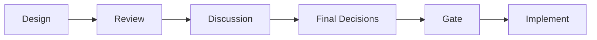
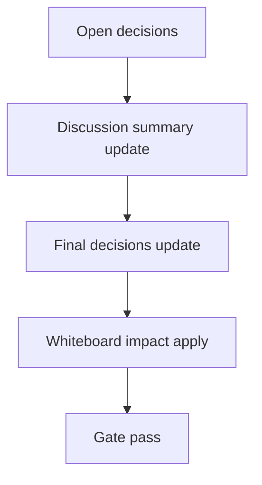

# Design: <design_id>

- Status: Draft
- Owner: <name>
- Created: <yyyy-mm-dd>
- Updated: <yyyy-mm-dd>
- Scope: <one line>

## Context
- Problem:
- Goal:
- Non-goals:

## Design diagram

## Whiteboard impact
- Now: Before: <fill>. After: <fill>.
- DoD: Before: <fill>. After: <fill>.
- Blockers:
- Risks:

## Multi-AI participation plan
- Reviewer:
  - Request:
  - Expected output format:
- QA:
  - Request:
  - Expected output format:
- Researcher:
  - Request:
  - Expected output format:
- External AI:
  - Request:
  - Expected output format:
- external_participation: optional
- external_not_required: false

## Open Decisions
- [ ] Decision 1
- [ ] Decision 2

## Final Decisions
- Decision 1 Final:
- Decision 2 Final:

## Discussion summary
- Change 1:

## Plan
1. Design
2. Review
3. Implement
4. Verify

## Risks
- Risk:
  - Mitigation:

## Test Plan
- Unit:
- E2E:

## Reviewed-by
- Reviewer / <name> / <yyyy-mm-dd> / <status>
- QA / <name> / <yyyy-mm-dd> / <status>
- Researcher / <name> / <yyyy-mm-dd> / <status optional>

## External Reviews
- <optional reviewer file path> / <status>
