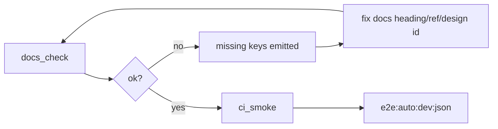

# Design: design_20260223_docs_check_diagnostics

- Status: Reviewed
- Owner: Codex
- Created: 2026-02-23
- Updated: 2026-02-23
- Scope: docs_check diagnostics hardening

## Context
- Problem:
  - docs_check failures are currently readable but not normalized for machine triage.
  - Post-failure recovery is slower because missing reasons are not key-stable.
- Goal:
  - Normalize docs_check missing keys for fast machine/human diagnosis.
  - Preserve minimal-check philosophy and existing exit/JSON contracts.
  - Optionally provide a gate-inclusive smoke JSON route for single-report use.
- Non-goals:
  - No expansion of docs_check check surface.
  - No runtime behavior changes in orchestrator/executor.

## Design diagram

## Whiteboard impact
- Now: docs_check failures expose normalized missing keys for faster repair.
- DoD: SSOT drift is machine-checked with stable keys; GitHub Actions is triggered when team usage or pre-release cadence requires hosted enforcement.
- Blockers: None.
- Risks: Over-normalization can hide context; mitigation is key+payload format (e.g., found/need counts).

## Multi-AI participation plan
- Reviewer:
  - Request: Validate missing key schema and readability.
  - Expected output format: approved/noted + risks + alternatives.
- QA:
  - Request: Validate negative/restore flow and JSON contract stability.
  - Expected output format: approved/noted + missing tests + flake risks.
- Researcher:
  - Request: Validate false-positive risk and long-term key compatibility.
  - Expected output format: noted/approved + migration cautions.
- External AI:
  - Request: Review missing-key taxonomy and ci_smoke JSON choice.
  - Expected output format: approved/noted + suggested simplifications.

## Open Decisions
- [x] Should missing entries include lightweight payload values (found/need/latest/whiteboard)?
- [x] Should we add `ci:smoke:gate:json` now?

### Open Decisions checklist
- [x] Add "Decision 1 Final:" entry with final choice.
- [x] Add "Decision 2 Final:" entry with final choice.

## Final Decisions
- Decision 1 Final: Use stable machine keys with compact payload suffixes, e.g. `heading_missing:<name>`, `mermaid_insufficient:found=<n>,need>=2`.
- Decision 2 Final: Add optional `ci:smoke:gate:json` while keeping existing `ci:smoke` and `ci:smoke:json` lightweight and unchanged in intent.

## Discussion summary
- Change 1: Normalize missing keys without increasing check scope.
- Change 2: Keep remediation fast by preserving simple string parsing.
- Change 3: Add optional gate-inclusive JSON entry for one-shot reporting.

## Plan
1. Design
2. Review
3. Implement
4. Verify

## Risks
- Risk:
  - Mitigation:

## Test Plan
- Unit:
  - Not required.
- E2E:
  - `tools/design_gate.ps1 -DesignPath docs/design/design_20260223_docs_check_diagnostics.md`
  - `npm run docs:check`
  - `npm run docs:check:json`
  - Negative test: temporary heading rename then restore; confirm exit 1 and `heading_missing:*`.
  - Optional: `npm run ci:smoke:gate:json`

## Reviewed-by
- Reviewer / codex-review / 2026-02-23 / approved
- QA / codex-qa / 2026-02-23 / approved
- Researcher / codex-research / 2026-02-23 / noted

## External Reviews
- docs/design/design_20260223_docs_check_diagnostics__reviewer.md / approved
- docs/design/design_20260223_docs_check_diagnostics__qa.md / approved
- docs/design/design_20260223_docs_check_diagnostics__researcher.md / noted
