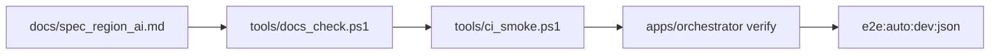

# Design: design_20260223_docs_drift_and_smoke_entry

- Status: Reviewed
- Owner: Codex
- Created: 2026-02-23
- Updated: 2026-02-23
- Scope: SSOT drift check and smoke entry

## Context
- Problem:
  - SSOT document exists but there is no machine-check to detect contract drift.
  - Smoke entrypoint is not unified at repo-root scripts.
- Goal:
  - Add `tools/docs_check.ps1` to validate minimal SSOT invariants.
  - Expose one root smoke entry (`npm run ci:smoke`) and docs check entry (`npm run docs:check`).
  - Keep existing runtime contracts unchanged.
- Non-goals:
  - No changes to orchestrator/executor behavior.
  - No expansion of acceptance/runtime semantics.

## Design diagram

## Whiteboard impact
- Now: SSOT drift is machine-checked via docs_check and included in smoke entry.
- DoD: `npm run docs:check` + `npm run ci:smoke` reliably fail on SSOT drift.
- Blockers: None.
- Risks: Overly strict docs checks could cause noisy failures; keep checks minimal and explicit.

## Multi-AI participation plan
- Reviewer:
  - Request: Validate minimal-check scope and false-positive risk.
  - Expected output format: approved/noted + key risk bullets + alternatives.
- QA:
  - Request: Validate deterministic exit code and JSON contract behavior.
  - Expected output format: approved/noted + missing tests + flaky surface.
- Researcher:
  - Request: Validate long-term maintainability of SSOT checks.
  - Expected output format: noted/approved + extension cautions.
- External AI:
  - Request: Review docs_check item set validity and missing coverage.
  - Expected output format: approved/noted + risks + alternative checks.

## Open Decisions
- [x] Should docs_check parse semantics deeply or stay string-based minimal?
- [x] Should GitHub Actions be added now?

### Open Decisions checklist
- [x] Add "Decision 1 Final:" entry with final choice.
- [x] Add "Decision 2 Final:" entry with final choice.

## Final Decisions
- Decision 1 Final: Keep docs_check minimal and deterministic (file exists, heading presence, mermaid count, references, last_design_id sync).
- Decision 2 Final: Add local smoke entrypoint (`tools/ci_smoke.ps1` + root scripts) and defer GitHub Actions as optional; document rationale.

## Discussion summary
- Change 1: Chose minimal string-based checks to avoid brittle parser dependence.
- Change 2: Unified root entrypoints (`docs:check`, `ci:smoke`) to reduce operator guesswork.
- Change 3: CI workflow deferred; local smoke remains the enforced baseline.

## Plan
1. Design
2. Review
3. Implement
4. Verify

## Risks
- Risk:
  - Mitigation:

## Test Plan
- Unit:
  - Not required; script-level integration checks are sufficient.
- E2E:
  - `tools/design_gate.ps1 -DesignPath docs/design/design_20260223_docs_drift_and_smoke_entry.md`
  - `npm run docs:check`
  - `npm run ci:smoke`
  - Negative check: temporarily break one required heading and confirm docs_check exits 1, then restore.

## Reviewed-by
- Reviewer / codex-review / 2026-02-23 / approved
- QA / codex-qa / 2026-02-23 / approved
- Researcher / codex-research / 2026-02-23 / noted

## External Reviews
- docs/design/design_20260223_docs_drift_and_smoke_entry__reviewer.md / approved
- docs/design/design_20260223_docs_drift_and_smoke_entry__qa.md / approved
- docs/design/design_20260223_docs_drift_and_smoke_entry__researcher.md / noted
