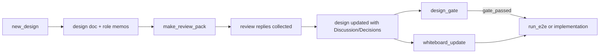

# Design: design_20260223_multi_ai_whiteboard_flow

- Status: Reviewed
- Owner: Codex
- Created: 2026-02-23
- Updated: 2026-02-23
- Scope: Multi-AI whiteboard enforced flow

## Context
- Problem:
  - Design-first and multi-role participation exist but are not fully enforced as a single mandatory loop.
  - Whiteboard/design linkage is manual and drifts from active design state.
  - External AI review participation lacks a standardized prompt pack.
- Goal:
  - Enforce `design -> discussion -> decisions finalized -> gate_passed -> implementation`.
  - Add reusable prompt-pack tooling for Reviewer/QA/Researcher and external AI roles.
  - Keep whiteboard as SSOT and auto-sync key impact fields from active design.
- Non-goals:
  - No orchestrator runtime behavior changes.
  - No acceptance/spec semantic changes in this task.

## Design diagram

## Whiteboard impact
- Now: Active design and gate status are enforced via LATEST.txt.
- DoD: Every next change follows design-first + multi-role review + gate, and whiteboard tracks latest impact.
- Blockers: None.
- Risks: Gate strictness could slow prototyping; mitigate with explicit dev-only bypass.

## Multi-AI participation plan
- Reviewer:
  - Validate decision coherence and compatibility.
  - Output format: `approved/noted`, concerns, alternatives.
- QA:
  - Validate deterministic verification and regression coverage.
  - Output format: `approved/noted`, missing tests, flake risks.
- Researcher:
  - Validate long-term maintainability and interoperability.
  - Output format: `approved/noted`, migration risks, alternatives.
- External AI:
  - Use generated prompt pack (`claude`, `gemini`) with same output contract.

## Discussion summary
- Added mandatory Mermaid and whiteboard-impact sections to template.
- Added `LATEST.txt` as design SSOT pointer.
- Gate strengthened to require discussion content and role approvals.

## Open Decisions
- [x] Should run_e2e enforce design gate by default?
- [x] Should external AI reviews be mandatory?

## Final Decisions
- Decision 1 Final: Enforce gate by default; allow explicit `-SkipDesignGate` for dev-only path.
- Decision 2 Final: External AI reviews are optional, but if present they must be listed in design doc.

## Plan
1. Design
2. Review
3. Implement
4. Verify

## Risks
- Risk:
  - Gate criteria drift from template.
  - Mitigation:
    - Keep gate checks aligned with template-required headings.

## Test Plan
- Unit:
  - `design_gate.ps1` validates Mermaid, whiteboard impact, discussion summary, reviewed-by statuses.
- E2E:
  - `npm run verify`
  - `npm run e2e:auto` (gate enforced path)
  - `npm run e2e:auto:dev` (explicit bypass path)

## Reviewed-by
- Reviewer / codex-review / 2026-02-23 / approved
- QA / codex-qa / 2026-02-23 / approved
- Researcher / codex-research / 2026-02-23 / noted
