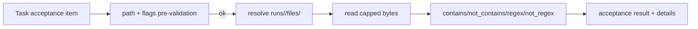
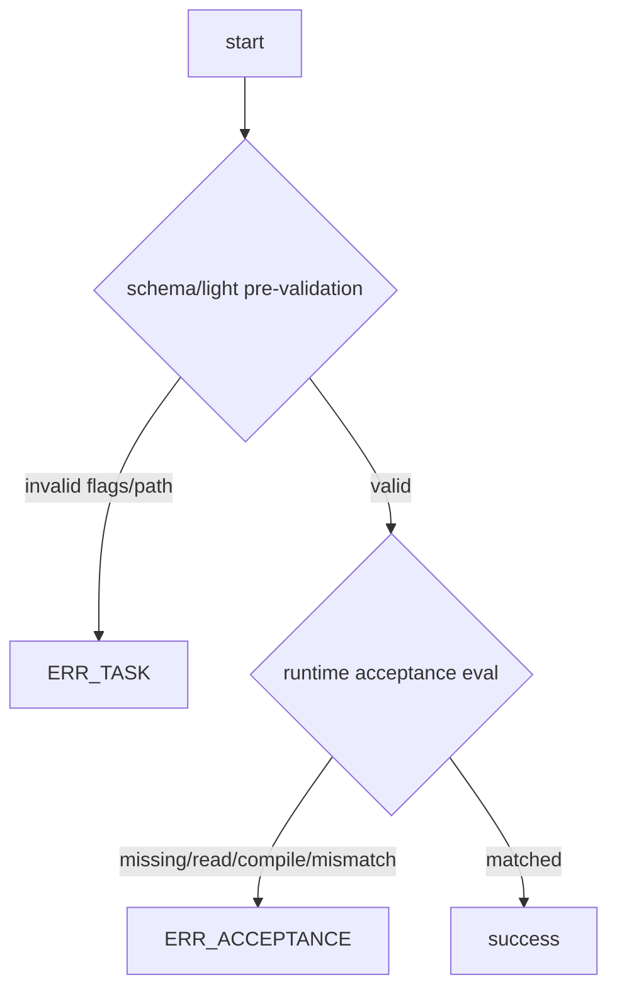

# Design: design_20260224_acceptance_artifact_file_checks

- Status: Final
- Owner: Codex
- Created: 2026-02-24
- Updated: 2026-02-24
- Scope: Acceptance: artifact file content checks (contains/regex)

## Context
- Problem: current acceptance can only verify artifact existence, not artifact content, so file_write outputs still require ad-hoc command checks.
- Goal: add artifact file content acceptance checks against `runs/<run_id>/files/<relative_path>` to stabilize audit/E2E without extra commands.
- Non-goals: workspace direct read outside run artifacts, binary decoding support, full-file unbounded reads.

## Design diagram

## Acceptance contract
- New keys:
  - `artifact_file_contains` with `{ path, contains }`
  - `artifact_file_not_contains` with `{ path, not_contains }`
  - `artifact_file_regex` with `{ path, pattern, flags? }`
  - `artifact_file_not_regex` with `{ path, pattern, flags? }`
- Path policy:
  - relative path only under `runs/<run_id>/files/`
  - absolute / UNC / traversal (`..`) rejected
- Regex flags:
  - allow only `i,m,s,u`
  - invalid/duplicate flags are pre-validation NG (`ERR_TASK`)
- Runtime read/eval:
  - read is capped (`<=256KB`)
  - truncation is reflected via details `note`
- Error split:
  - config invalid (path/flags/schema) => `ERR_TASK`
  - runtime file missing/read failure/content mismatch/regex compile mismatch => `ERR_ACCEPTANCE`
- Details payload (machine-readable):
  - `target_path`
  - `check_type`
  - `pattern_or_text`
  - `flags` (regex checks)
  - `actual_sample`
  - `note`

## Whiteboard impact
- Now: Before: artifact acceptance validated existence only. After: acceptance can validate artifact file content directly via `artifact_file_*` checks.
- DoD: Before: file_write content verification required extra commands. After: content checks are declarative and machine-readable in acceptance details.
- Blockers: none.
- Risks: truncated reads may hide matches outside cap; note must stay explicit.

## Multi-AI participation plan
- Reviewer:
  - Request: verify contract compatibility and ERR_TASK/ERR_ACCEPTANCE boundaries.
  - Expected output format: approved/noted + risks.
- QA:
  - Request: verify 3 E2E cases (success/expected NG/invalid flags NG) and determinism.
  - Expected output format: approved/noted + missing tests.
- Researcher:
  - Request: assess detail payload stability and future extension points.
  - Expected output format: noted + cautions.
- External AI:
  - Request: optional independent critique on path safety and truncation behavior.
  - Expected output format: noted.
- external_participation: optional
- external_not_required: false

## Open Decisions
- [x] Decision 1
- [x] Decision 2

### Open Decisions checklist
- [x] Add "Decision 1 Final:" entry with final choice.
- [x] Add "Decision 2 Final:" entry with final choice.

## Final Decisions
- Decision 1 Final: artifact file acceptance reads only `runs/<run_id>/files` and requires path-safe relative addressing.
- Decision 2 Final: invalid config remains `ERR_TASK`; runtime file/read/content/regex issues are `ERR_ACCEPTANCE` with machine-readable details.

## Discussion summary
- Change 1: moved path/flags rejection to pre-validation for deterministic `ERR_TASK`.
- Change 2: kept runtime regex compile failure as acceptance NG (`ERR_ACCEPTANCE`) to preserve existing regex acceptance semantics.
- Change 3: added bounded read and explicit truncation note to avoid unbounded artifact loading.

## Plan
1. Extend schema and light validation for new acceptance keys.
2. Implement evaluator branches and details payload.
3. Add E2E templates/scripts for success and negative cases.
4. Gate, whiteboard, build, and full verification.

## Risks
- Risk: false negatives when expected match exists past read cap.
  - Mitigation: clear truncation note and configurable cap in future design if needed.

## Test Plan
- success: `artifact_file_contains` matches `written/generated/hello.txt`.
- expected NG: `artifact_file_contains` mismatch returns `ERR_ACCEPTANCE`.
- invalid NG: `artifact_file_regex` with flags `g` returns `ERR_TASK`.

## Reviewed-by
- Reviewer / codex-review / 2026-02-24 / approved
- QA / codex-qa / 2026-02-24 / approved
- Researcher / codex-research / 2026-02-24 / noted

## External Reviews
- docs/design/design_20260224_acceptance_artifact_file_checks__external_claude.md / noted
