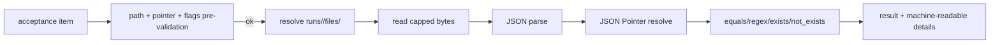
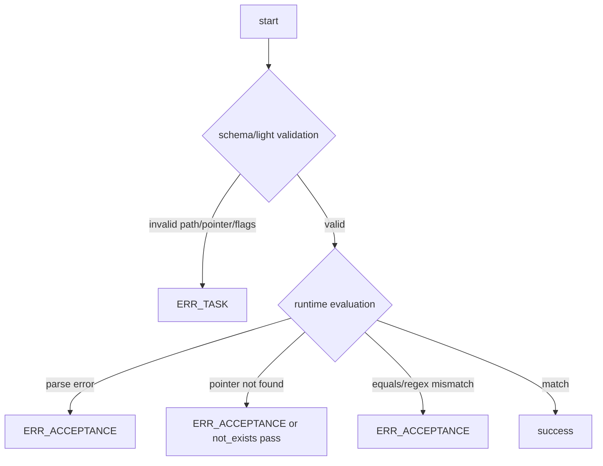

# Design: design_20260224_acceptance_artifact_json_pointer

- Status: Final
- Owner: Codex
- Created: 2026-02-24
- Updated: 2026-02-24
- Scope: Acceptance: artifact JSON checks via JSON Pointer

## Context
- Problem: artifact acceptance currently checks existence/content text only; JSON structural assertions need ad-hoc command logic.
- Goal: add declarative artifact JSON acceptance checks using JSON Pointer over `runs/<run_id>/files` artifacts.
- Non-goals: JSONPath support, workspace direct reads outside run artifacts, unbounded large-file parsing.

## Design diagram

## Contract
- New acceptance keys:
  - `artifact_json_pointer_equals` with `{ path, pointer, equals }`
  - `artifact_json_pointer_regex` with `{ path, pointer, pattern, flags? }`
  - `artifact_json_pointer_exists` with `{ path, pointer }`
  - `artifact_json_pointer_not_exists` with `{ path, pointer }`
- Path policy:
  - relative path only under `runs/<run_id>/files/`
  - absolute/UNC/traversal rejected
- Pointer policy:
  - RFC 6901 style with `/` tokens and `~0/~1` unescape
  - array index resolution supported
- Read policy:
  - UTF-8, capped to 256KB; truncation noted in details
- Error split:
  - invalid shape (path/pointer/flags) => `ERR_TASK`
  - parse/pointer/value mismatch => `ERR_ACCEPTANCE`
- Details keys:
  - `target_path`
  - `check_type`
  - `pointer`
  - `expected`
  - `flags`
  - `actual_value_type`
  - `actual_value_sample`
  - `note`

## Whiteboard impact
- Now: Before: artifact checks required text search or external commands for JSON structure. After: JSON structure checks are declarative via JSON Pointer acceptance keys.
- DoD: Before: JSON artifact validation diagnostics were ad-hoc. After: errors include machine-readable pointer/value metadata with stable keys.
- Blockers: none.
- Risks: capped read can hide values beyond truncation boundary; note must remain explicit.

## Multi-AI participation plan
- Reviewer:
  - Request: validate contract compatibility and classification boundaries.
  - Expected output format: approved/noted + risks.
- QA:
  - Request: validate 3 mandatory E2E cases and determinism.
  - Expected output format: approved/noted + missing tests.
- Researcher:
  - Request: validate JSON Pointer resolution assumptions and long-term schema fit.
  - Expected output format: noted + cautions.
- External AI:
  - Request: optional review on pointer/value edge cases.
  - Expected output format: noted.
- external_participation: optional
- external_not_required: false

## Open Decisions
- [x] Decision 1
- [x] Decision 2

### Open Decisions checklist
- [x] Add "Decision 1 Final:" entry with final choice.
- [x] Add "Decision 2 Final:" entry with final choice.

## Final Decisions
- Decision 1 Final: pointer syntax/flags/path shape invalidations are pre-validation `ERR_TASK`.
- Decision 2 Final: runtime parse/pointer/value failures are `ERR_ACCEPTANCE` with standardized details payload.

## Discussion summary
- Change 1: reused artifact file safety path from existing `artifact_file_*` checks.
- Change 2: selected RFC 6901 JSON Pointer only (no JSONPath) to keep parser surface minimal.
- Change 3: kept capped read with truncation note to preserve bounded evaluation behavior.

## Plan
1. Extend schema and light validation for new keys.
2. Implement evaluator branches for pointer/equals/regex/exists.
3. Add E2E templates/scripts (success/acceptance NG/invalid flags NG).
4. Gate + whiteboard + build + e2e + smoke/docs checks.

## Risks
- Risk: deep-equal implementation via JSON serialization may be sensitive to object key order in edge payloads.
  - Mitigation: payloads are parsed JSON; current behavior is deterministic for test contract.

## Test Plan
- success: pointer equals `"OK"` over `written/data/sample.json`.
- expected NG: pointer equals mismatch returns `ERR_ACCEPTANCE`.
- invalid NG: regex flags `g` rejected as `ERR_TASK`.

## Reviewed-by
- Reviewer / codex-review / 2026-02-24 / approved
- QA / codex-qa / 2026-02-24 / approved
- Researcher / codex-research / 2026-02-24 / noted

## External Reviews
- docs/design/design_20260224_acceptance_artifact_json_pointer__external_claude.md / noted
