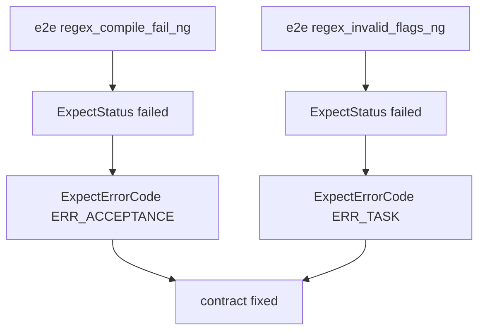

# Design: design_20260224_acceptance_edge_cases_regex_compile_flags

- Status: Reviewed
- Owner: Codex
- Created: 2026-02-24
- Updated: 2026-02-24
- Scope: acceptance edge-cases: regex compile fail + invalid flags

## Context
- Problem:
  - New regex/stderr/not_contains acceptance types exist, but edge-case contracts are not fixed by dedicated E2E.
  - Compile-fail vs invalid-flags behavior must be explicitly separated to avoid regression.
- Goal:
  - Fix contract boundaries:
    - regex compile failure => ERR_ACCEPTANCE (runtime acceptance evaluation)
    - invalid flags => ERR_TASK (schema pre-validation)
  - Add expected-NG E2E cases for both boundaries.
  - Keep existing compatibility and gate/docs/smoke contracts unchanged.
- Non-goals:
  - No protocol changes in executor/orchestrator handoff.
  - No broad expansion of docs_check scope.

## Design diagram
```mermaid
flowchart LR
  A[task schema] --> B{flags valid?}
  B -- no --> C[ERR_TASK]
  B -- yes --> D[evaluateAcceptance stdout_regex]
  D --> E{regex compiles?}
  E -- no --> F[ERR_ACCEPTANCE]
  E -- yes --> G[regex.test(stdout)]
```

## Decision diagram


## Whiteboard impact
- Now: Acceptance edge-case contracts are explicitly validated (compile-fail vs invalid-flags).
- DoD: Boundary behavior is fixed by expected-NG E2E and documented in SSOT.
- Blockers: None.
- Risks: Ambiguous templates could accidentally test wrong layer; mitigate by explicit pattern/flags setup.

## Multi-AI participation plan
- Reviewer:
  - Request: Validate boundary split consistency with existing ERR_* strategy.
  - Expected output format: approved/noted + regression risks + alternatives.
- QA:
  - Request: Validate expected-NG commands assert status+error_code only.
  - Expected output format: approved/noted + flake risks + missing tests.
- Researcher:
  - Request: Validate guard rationale for regex compile vs schema.
  - Expected output format: noted/approved + extension cautions.
- External AI:
  - Request: Review missing-key details payload and edge-case coverage sufficiency.
  - Expected output format: approved/noted + risks + alternatives.

## Open Decisions
- [x] Should regex compile-fail be ERR_ACCEPTANCE or ERR_TASK?
- [x] Should invalid flags be blocked in schema (ERR_TASK)?

### Open Decisions checklist
- [x] Add "Decision 1 Final:" entry with final choice.
- [x] Add "Decision 2 Final:" entry with final choice.

## Final Decisions
- Decision 1 Final: Regex compile failure is runtime acceptance failure (ERR_ACCEPTANCE) with details.note=regex_compile_error.
- Decision 2 Final: Invalid flags are schema-invalid and fail pre-validation as ERR_TASK (with schema_errors).

## Discussion summary
- Change 1: Added two dedicated expected-NG templates to pin compile/runtime boundary.
- Change 2: Kept failure judgment machine-driven (`status + errors[0].code`) and summary-agnostic.
- Change 3: Updated SSOT wording for details payload and edge-case contract.

## Plan
1. Design
2. Review
3. Implement
4. Verify

## Risks
- Risk:
  - Mitigation:

## Test Plan
- Unit:
  - Not required.
- E2E:
  - `npm run e2e:auto:regex_compile_fail_ng` => failed + ERR_ACCEPTANCE
  - `npm run e2e:auto:regex_invalid_flags_ng` => failed + ERR_TASK
  - `npm run e2e:auto:invalid_bad_acceptance_ng` => failed + ERR_TASK (compatibility)
  - `npm run docs:check:json`
  - `npm run ci:smoke:gate:json`

## Reviewed-by
- Reviewer / codex-review / 2026-02-24 / approved
- QA / codex-qa / 2026-02-24 / approved
- Researcher / codex-research / 2026-02-24 / noted

## External Reviews
- docs/design/design_20260224_acceptance_edge_cases_regex_compile_flags__reviewer.md / approved
- docs/design/design_20260224_acceptance_edge_cases_regex_compile_flags__qa.md / approved
- docs/design/design_20260224_acceptance_edge_cases_regex_compile_flags__researcher.md / noted
