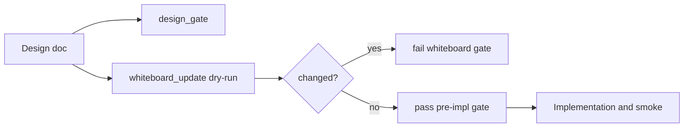
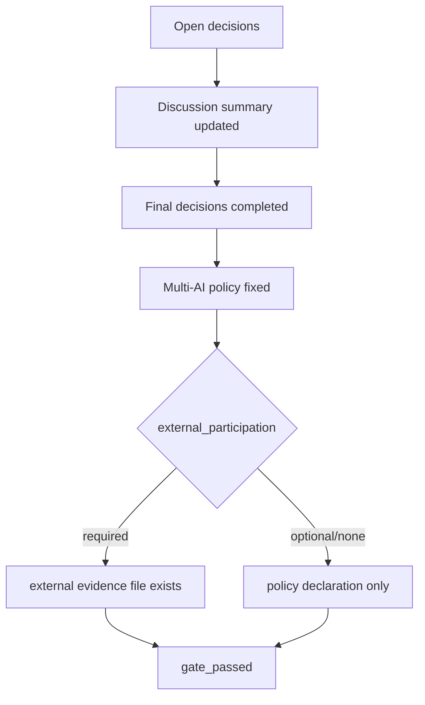

# Design: design_20260224_design_flow_hardening

- Status: Final
- Owner: Codex
- Created: 2026-02-24
- Updated: 2026-02-24
- Scope: Force design-first + multi-role discussion + whiteboard applied before implementation.

## Context
- Problem: design gate passes even when discussion/finalization/external participation and whiteboard operation are incomplete.
- Goal: fail fast unless design diagrams, discussion updates, final decisions, multi-AI policy, and whiteboard application are all complete.
- Non-goals: changing task runtime semantics in orchestrator/executor.

## Design diagram

## Whiteboard impact
- Now: Before: whiteboard updates could be skipped after design changes. After: `run_e2e` and `ci_smoke_gate` fail when `whiteboard_update -DryRun -RequireApplied` reports pending changes.
- DoD: Before: LATEST design and whiteboard drift could survive until later checks. After: docs check + smoke gate verify `last_design_id` alignment and design-first runbook references.
- Blockers: none.
- Risks: stricter gate may block rapid local iteration when design is edited frequently.

## Multi-AI participation plan
- Reviewer:
  - Request: validate gate key design and backward-compatible failure messages.
  - Expected output format: approved/noted with concrete missing-key examples.
- QA:
  - Request: validate negative path (discussion empty, whiteboard unapplied) and restore path.
  - Expected output format: approved/noted with required commands and exit codes.
- Researcher:
  - Request: evaluate long-term maintainability of policy keys (`external_participation`, `external_not_required`).
  - Expected output format: noted/approved with migration concerns.
- External AI:
  - Request: independent critique of over/under-enforcement tradeoff for external evidence requirement.
  - Expected output format: noted with optional simplification options.
- external_participation: required
- external_not_required: false

## Open Decisions
- [x] Decision 1
- [x] Decision 2
- [x] Decision 3

### Open Decisions checklist
- [x] Add "Decision 1 Final:" entry with final choice.
- [x] Add "Decision 2 Final:" entry with final choice.

## Final Decisions
- Decision 1 Final: design gate requires at least two mermaid blocks and non-empty diagram contents.
- Decision 2 Final: whiteboard apply state is enforced by `whiteboard_update -DryRun -RequireApplied` in `run_e2e` and `ci_smoke_gate`.
- Decision 3 Final: external participation policy must be explicit (`optional|required|none`) and `required` needs an external evidence file unless `external_not_required: true`.

## Discussion summary
- Change 1: moved from best-effort discussion fields to strict non-placeholder validation for Discussion summary and Final decisions.
- Change 2: added policy-level control for external AI participation so teams can choose optional/required/none without losing gate determinism.
- Change 3: separated docs consistency checks (runbook references + whiteboard design id alignment) from runtime smoke execution.

## Plan
1. Harden `design_gate.ps1` with new requirements and stable failure keys.
2. Add whiteboard applied gate to `run_e2e.ps1` and `ci_smoke_gate.ps1`.
3. Expand `docs_check.ps1` and `make_review_pack.ps1` contracts.
4. Run negative test once, restore, then run docs/smoke gate checks.

## Risks
- Risk: existing draft designs can fail after strict checks.
  - Mitigation: keep failure keys explicit in `gate_failed_summary` and update template defaults.

## Test Plan
- Unit: none.
- E2E: run gate negative (`Discussion summary` empty) -> expect exit 1 -> restore -> expect pass; then run `docs:check:json` and `ci:smoke:gate:json`.

## Reviewed-by
- Reviewer / codex-review / 2026-02-24 / approved
- QA / codex-qa / 2026-02-24 / approved
- Researcher / codex-research / 2026-02-24 / noted

## External Reviews
- docs/design/design_20260224_design_flow_hardening__external_claude.md / noted

