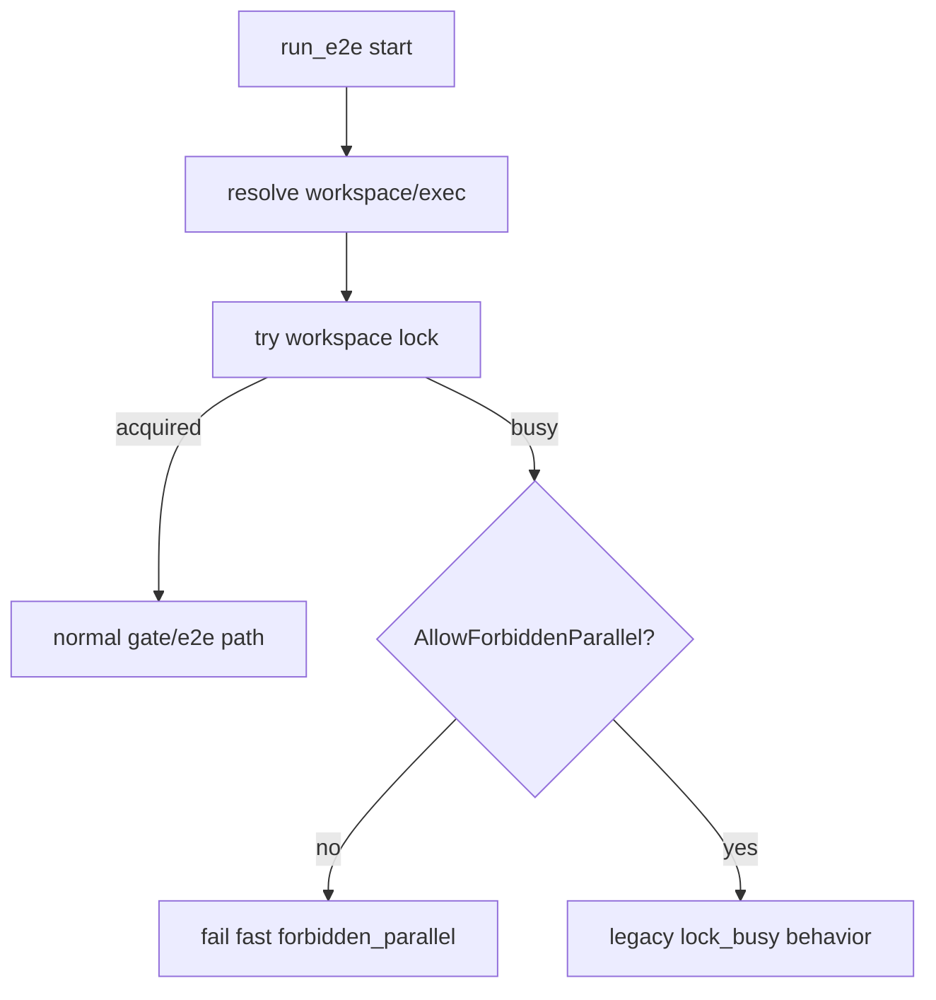
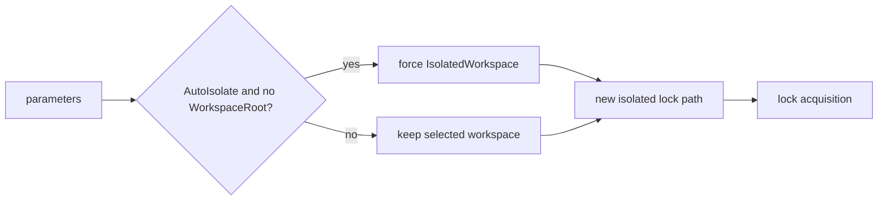

# Design: design_20260224_e2e_forbidden_parallel_guard

- Status: Final
- Owner: Codex
- Created: 2026-02-24
- Updated: 2026-02-24
- Scope: E2E forbidden parallel guard in run_e2e.ps1

## Context
- Problem: lock contention during accidental parallel E2E invocation (for example `e2e:auto` with `e2e:auto:strict`) still occurs and requires manual recovery.
- Goal: enforce forbidden parallel patterns in `run_e2e.ps1` with fail-fast diagnostics and explicit override options.
- Non-goals: replacing existing lock mechanism, changing orchestrator concurrency model.

## Design diagram

## Forbidden parallel contract
- Minimum forbidden patterns:
  - gate-required E2E mode vs gate-required E2E mode on same workspace (including auto vs strict pair).
  - gate-required flow vs dev skip-gate flow on same workspace.
- Detection source:
  - existing lock owner metadata (`owner.json`) with `mode` and `gate_required`.
- Default behavior:
  - fail-fast on lock busy with `forbidden_parallel=true` and explicit hint.
- Explicit overrides:
  - `-AllowForbiddenParallel`: suppresses forbidden classification (lock mechanism still applies).
  - `-AutoIsolate`: opt into isolated workspace selection automatically when `WorkspaceRoot` is not explicitly passed.

## Error / JSON contract
- Existing JSON fields are preserved.
- Added fields (backward compatible additive):
  - `forbidden_parallel` (bool)
  - `forbidden_parallel_reason` (string)
  - `hint` (string)
  - `lock_owner_mode` (string)
  - `lock_owner_gate_required` (bool|null)
- Busy + forbidden default emits exit code `1` with reason and mitigation hint.

## Whiteboard impact
- Now: Before: forbidden parallel depended on operator discipline and post-failure recovery. After: run_e2e enforces forbidden parallel by default with deterministic fail-fast output.
- DoD: Before: lock conflicts were generic workspace busy failures. After: JSON diagnostics expose forbidden reason, owner mode, and remediation hints.
- Blockers: none.
- Risks: users may overuse override flag; docs must keep default-safe guidance clear.

## Multi-AI participation plan
- Reviewer:
  - Request: verify guard logic preserves lock semantics and does not break existing consumers.
  - Expected output format: approved/noted + risks.
- QA:
  - Request: verify forbidden reproduction and isolated path success.
  - Expected output format: approved/noted + gaps.
- Researcher:
  - Request: verify long-term compatibility of additive JSON fields.
  - Expected output format: noted + cautions.
- External AI:
  - Request: optional review for operator UX and override policy.
  - Expected output format: noted.
- external_participation: optional
- external_not_required: false

## Open Decisions
- [x] Decision 1
- [x] Decision 2

### Open Decisions checklist
- [x] Add "Decision 1 Final:" entry with final choice.
- [x] Add "Decision 2 Final:" entry with final choice.

## Final Decisions
- Decision 1 Final: default path enforces forbidden parallel fail-fast unless `-AllowForbiddenParallel` is explicitly set.
- Decision 2 Final: `-AutoIsolate` provides safe automation path without changing lock internals; explicit `-WorkspaceRoot` is never overridden.

## Discussion summary
- Change 1: re-used existing lock owner metadata and extended payload with gate-required marker.
- Change 2: kept lock mechanism unchanged to satisfy non-goal and minimize regression risk.
- Change 3: standardized remediation hints (`wait/stop/isolate`) in JSON and error message.

## Plan
1. Add guard/override parameters and owner metadata in run_e2e.
2. Extend JSON diagnostics with forbidden fields.
3. Update runbook concurrency contract.
4. Verify with forbidden reproduction + isolated path + standard smoke/docs checks.

## Risks
- Risk: override may be misunderstood as bypassing lock entirely.
  - Mitigation: keep message explicit that lock still applies.

## Test Plan
- Case A: reproduce forbidden parallel (one run holds lock, second run fails fast with forbidden fields).
- Case B: isolated workspace (`-IsolatedWorkspace` or `-AutoIsolate`) succeeds without shared lock conflict.

## Reviewed-by
- Reviewer / codex-review / 2026-02-24 / approved
- QA / codex-qa / 2026-02-24 / approved
- Researcher / codex-research / 2026-02-24 / noted

## External Reviews
- docs/design/design_20260224_e2e_forbidden_parallel_guard__external_claude.md / noted
