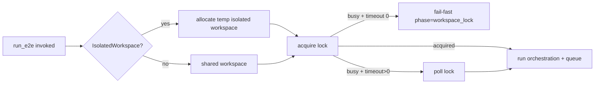

# Design: design_20260224_e2e_parallel_safety

- Status: Final
- Owner: Codex
- Created: 2026-02-24
- Updated: 2026-02-24
- Scope: eliminate shared-workspace E2E flakes by lock serialization and provide isolated workspace escape hatch.

## Context
- Problem: concurrent E2E runs against the same workspace/exec roots cause nondeterministic timeout and queue contention.
- Goal: default to deterministic serialization on same workspace while allowing explicit isolated runs.
- Non-goals: no changes to acceptance semantics or summary-based judgment.

## Design diagram

## Whiteboard impact
- Now: E2E execution safety now enforces a workspace lock by default.
- DoD: Shared workspace parallelism is deterministically blocked; optional isolated workspace path is documented and verified.
- Blockers: none
- Risks: stale lock handling must avoid false-positive unlock.

## Multi-AI participation plan
- Reviewer:
  - Request: validate lock lifecycle and JSON contract compatibility.
  - Expected output format: approved/noted + risks + missing tests.
- QA:
  - Request: validate deterministic busy-lock negative test and isolated positive path.
  - Expected output format: approved/noted + flake risks + missing tests.
- Researcher:
  - Request: review lock ownership metadata and stale-lock recovery safety.
  - Expected output format: noted/approved + migration concerns.
- External AI:
  - Request: optional review of lock metadata portability and minimal schema impact.
  - Expected output format: noted + alternative approaches.

## Open Decisions
- [x] Decision 1: default behavior when lock is busy.
- [x] Decision 2: stale-lock handling policy.
- [x] Decision 3: isolated workspace default path contract.

### Open Decisions checklist
- [x] Add "Decision 1 Final:" entry with final choice.
- [x] Add "Decision 2 Final:" entry with final choice.

## Final Decisions
- Decision 1 Final: default is fail-fast on lock busy (`LockTimeoutSec=0`) with `phase=workspace_lock` and exit 1.
- Decision 2 Final: stale lock is auto-reclaimed only when owner pid is dead; `-ForceUnlock` overrides owner check.
- Decision 3 Final: `-IsolatedWorkspace` with no explicit `-WorkspaceRoot` creates `%TEMP%/region_ai/workspaces/<run_id>/workspace` and uses `<workspace>/exec`.

## Discussion summary
- Change 1: remove ambiguous parallel behavior by explicit lock enforcement before orchestration starts.
- Change 2: expose lock diagnostics (`lock_mode`, `lock_acquired`, `lock_path`, `lock_owner_pid`) in JSON output for triage.
- Change 3: keep default behavior conservative while preserving opt-in isolated parallel path.

## Plan
1. Update SSOT docs for concurrency contract.
2. Implement lock manager in `tools/run_e2e.ps1`.
3. Add optional isolated workspace path and JSON fields.
4. Verify lock-busy negative and isolated positive paths.

## Risks
- Risk: lock owner PID reuse could falsely look alive.
  - Mitigation: include commandline/workspace metadata in owner.json and keep `-ForceUnlock` explicit.

## Test Plan
- Unit: script-level deterministic lock acquisition/release.
- E2E: lock busy expected fail + isolated workspace success + regression set.

## Reviewed-by
- Reviewer / codex-review / 2026-02-24 / approved
- QA / codex-qa / 2026-02-24 / approved
- Researcher / codex-research / 2026-02-24 / noted

## External Reviews
- docs/design/packs/design_20260224_e2e_parallel_safety/prompt_external_claude.md / noted
- docs/design/packs/design_20260224_e2e_parallel_safety/prompt_external_gemini.md / noted
