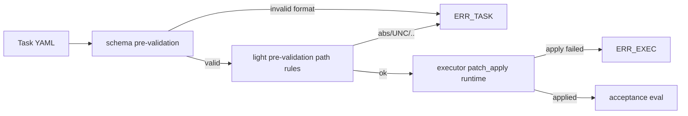

# Design: design_20260224_patch_apply_apply_fail_contract

- Status: Final
- Owner: Codex
- Created: 2026-02-24
- Updated: 2026-02-24
- Scope: patch_apply apply-failure classification contract (`ERR_EXEC`).

## Context
- Problem: `patch_apply` runtime apply failures are currently surfaced as task-level failure (`ERR_TASK`), making pre-validation vs execution failure indistinguishable.
- Goal: classify syntactically valid but non-applicable patch failures as `ERR_EXEC` while preserving `ERR_TASK` for invalid/pre-validation inputs.
- Non-goals: changing acceptance semantics or introducing new patch formats.

## Design diagram


```mermaid
%% title: runtime mapping
flowchart TD
  X[executor result] --> Y{exitCode != 0}
  Y -- no --> S[success]
  Y -- yes --> Z{error_code provided?}
  Z -- ERR_EXEC --> R1[orchestrator errors[0].code=ERR_EXEC]
  Z -- empty --> R2[fallback ERR_TASK]
  R1 --> O[result details include reason_key/stderr_sample]
  R2 --> O
```

## Whiteboard impact
- Now: Before: patch_apply failures were broadly reported as ERR_TASK. After: runtime apply failures are explicitly reported as ERR_EXEC with reason key and stderr sample.
- DoD: Before: invalid format/path NG existed, but runtime apply-failure semantics were ambiguous. After: one dedicated E2E verifies apply-failure NG as ERR_EXEC.
- Blockers: none.
- Risks: if pre-validation parser diverges from executor parser, edge-case classification drift can occur.

## Multi-AI participation plan
- Reviewer:
  - Request: validate code mapping boundary between ERR_TASK and ERR_EXEC.
  - Expected output format: approved/noted with compatibility risks.
- QA:
  - Request: validate new apply-failure NG E2E and error code assertions.
  - Expected output format: approved/noted with deterministic evidence requirements.
- Researcher:
  - Request: review machine-readable error details shape and long-term stability.
  - Expected output format: noted/approved with migration cautions.
- External AI:
  - Request: optional critique on runtime error taxonomy.
  - Expected output format: noted.
- external_participation: optional
- external_not_required: false

## Open Decisions
- [x] Decision 1
- [x] Decision 2

### Open Decisions checklist
- [x] Add "Decision 1 Final:" entry with final choice.
- [x] Add "Decision 2 Final:" entry with final choice.

## Final Decisions
- Decision 1 Final: invalid format and path-policy violations remain ERR_TASK and are rejected before executor apply stage.
- Decision 2 Final: syntactically valid but non-applicable patch failures (hunk mismatch/target missing/apply conflict) are mapped to ERR_EXEC with machine-readable details.

## Discussion summary
- Change 1: introduced explicit executor error payload (`error_code`, `reason_key`, `stderr_sample`, `tool_exit_code`, `note`) for apply failures.
- Change 2: added orchestrator mapping to consume executor error_code and preserve details in Result.
- Change 3: added dedicated E2E (`task_e2e_patch_apply_apply_fail_ng.yaml`) to lock regression behavior.

## Plan
1. Update spec docs for ERR_EXEC apply-failure semantics.
2. Implement pre-validation path classification and executor runtime error payload.
3. Add and run apply-failure E2E.
4. Gate, whiteboard, docs/smoke validation.

## Risks
- Risk: ambiguous parser errors might be misclassified.
  - Mitigation: consistent reason keys and explicit fallback rules.

## Test Plan
- E2E apply-failure case: valid unified diff targeting missing file -> expected failed + ERR_EXEC.
- Regression: existing invalid format/path cases remain ERR_TASK.

## Reviewed-by
- Reviewer / codex-review / 2026-02-24 / approved
- QA / codex-qa / 2026-02-24 / approved
- Researcher / codex-research / 2026-02-24 / noted

## External Reviews
- docs/design/design_20260224_patch_apply_apply_fail_contract__external_claude.md / noted
