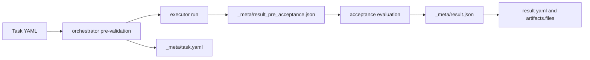
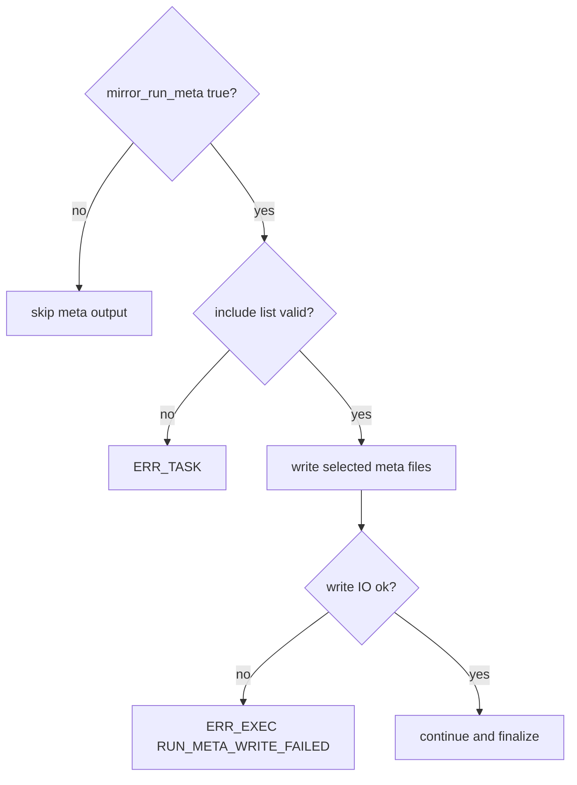

# Design: design_20260224_run_meta_artifacts

- Status: Approved
- Owner: Codex
- Created: 2026-02-24
- Updated: 2026-02-24
- Scope: Run meta artifacts: task + result snapshots (optional)

## Context
- Problem: Task and Result snapshots are hard to audit from artifacts only.
- Goal: When `mirror_run_meta=true`, write `_meta/task.yaml`, `_meta/result_pre_acceptance.json`, and `_meta/result.json` under `runs/<run_id>/files/`.
- Non-goals: secret masking automation, artifact contract changes, executor redesign.

## Design diagram

## Whiteboard impact
- Now: Before: run evidence was mainly stdout/stderr and command artifacts. After: optional `_meta/*` snapshots are generated and can be validated by acceptance checks.
- DoD: Before: snapshot verification required manual inspection. After: snapshot structure is verified by artifact checks in E2E.
- Blockers: none.
- Risks: `_meta/result.json` is created as pre-acceptance placeholder, then overwritten with final post-acceptance result.

## Multi-AI participation plan
- Reviewer:
  - Request: verify contract compatibility and error boundary (`ERR_TASK` vs `ERR_EXEC`).
  - Expected output format: findings with severity and path.
- QA:
  - Request: verify success / expected NG / invalid NG E2E coverage.
  - Expected output format: command and expected outputs.
- Researcher:
  - Request: verify auditability and 256KB cap tradeoff.
  - Expected output format: note with accept/reject.
- External AI:
  - Request: optional for this design; internal 3-role review is primary.
  - Expected output format: optional risk comments.
- external_participation: optional
- external_not_required: true

## Open Decisions
- [x] Keep pre-acceptance snapshot in Result-compatible JSON shape.
- [x] Create `_meta/result.json` before acceptance as placeholder, then overwrite after acceptance.

### Open Decisions checklist
- [x] Add "Decision 1 Final:" entry with final choice.
- [x] Add "Decision 2 Final:" entry with final choice.

## Final Decisions
- Decision 1 Final: add `spec.artifact.mirror_run_meta` and `spec.artifact.mirror_run_meta_include` (enum: `task_yaml|result_pre_acceptance_json|result_final_json`).
- Decision 2 Final: meta write failure is `ERR_EXEC` with `reason_key=RUN_META_WRITE_FAILED` and `failed_path`.

## Discussion summary
- Keep `artifacts.files` relative-only by relying on `collectRunArtifactFiles` without special casing.
- Write pre/post snapshots in both immediate and deferred completion paths to avoid behavior drift.
- Support acceptance-time inspection of `_meta/result.json` by writing placeholder first and replacing with final result later.

## Plan
1. Implement schema and orchestrator updates.
2. Update SSOT docs.
3. Add 3 E2E templates and scripts.
4. Run gate, whiteboard, build, E2E, docs/smoke checks.

## Risks
- Risk: meta files can grow.
  - Mitigation: cap each file at 256KB with truncation note.

## Test Plan
- Unit: none.
- E2E:
  - `run_meta_artifacts_success` => success.
  - `run_meta_artifacts_acceptance_ng` => expected NG (`ERR_ACCEPTANCE`).
  - `run_meta_artifacts_invalid_ng` => expected NG (`ERR_TASK`).

## Reviewed-by
- Reviewer / codex-review / 2026-02-24 / approved
- QA / codex-qa / 2026-02-24 / approved
- Researcher / codex-research / 2026-02-24 / noted

## External Reviews
- optional / external_not_required=true
