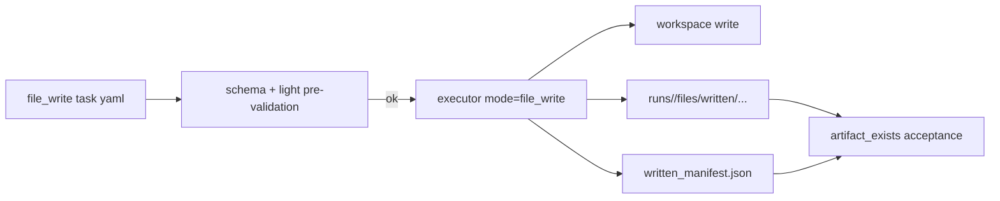
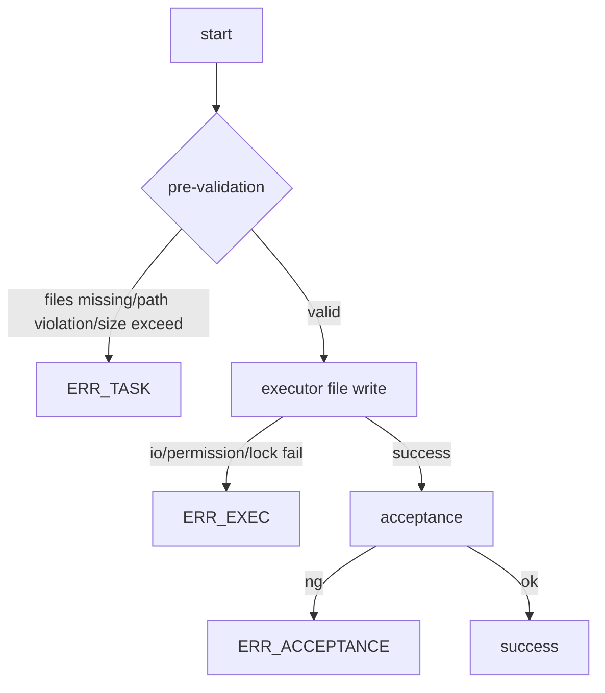

# Design: design_20260224_task_file_write

- Status: Final
- Owner: Codex
- Created: 2026-02-24
- Updated: 2026-02-24
- Scope: add `file_write` task kind for safe text generation with artifact mirror.

## Context
- Problem: text file generation requires ad-hoc command execution and does not guarantee machine-readable written-file artifacts.
- Goal: provide `file_write` as a schema-first command that writes only under workspace and always emits artifact evidence for E2E.
- Non-goals: binary/base64 payloads, network fetch, absolute path writes, and pipeline variable injection.

## Design diagram

## Whiteboard impact
- Now: Before: pipeline was the latest task-kind extension and safe text generation was not explicit. After: `file_write` is a first-class task kind with workspace-safe text output and artifact mirror.
- DoD: Before: text write evidence depended on command-specific behavior. After: `written/<path>` and `written_manifest.json` are consistently machine-readable for acceptance and audits.
- Blockers: none.
- Risks: write limits may require future tuning for larger generated documents.

## Multi-AI participation plan
- Reviewer:
  - Request: validate command contract and `ERR_TASK`/`ERR_EXEC` boundaries.
  - Expected output format: approved/noted + risks.
- QA:
  - Request: validate mandatory 3 E2E cases and artifact assertions.
  - Expected output format: approved/noted + missing tests.
- Researcher:
  - Request: validate long-term compatibility of manifest structure and limits.
  - Expected output format: noted + cautions.
- External AI:
  - Request: optional independent review of path/size safety and artifact contract.
  - Expected output format: noted.
- external_participation: optional
- external_not_required: false

## Open Decisions
- [x] Decision 1
- [x] Decision 2
- [x] Decision 3

### Open Decisions checklist
- [x] Add "Decision 1 Final:" entry with final choice.
- [x] Add "Decision 2 Final:" entry with final choice.

## Final Decisions
- Decision 1 Final: `file_write` remains `kind: Task` + `spec.command=file_write` + `spec.files[]`; no top-level task kind split is introduced.
- Decision 2 Final: path violation, mode invalid, and limit excess are pre-validation errors (`ERR_TASK`); runtime I/O failures are `ERR_EXEC`.
- Decision 3 Final: executor writes workspace files and mirrors to `runs/<run_id>/files/written/...` with `written_manifest.json`, and exposes artifact paths in `files`.

## Discussion summary
- Change 1: chose executor-based write path so artifacts are produced atomically with runtime output and reused by current waiting/result path.
- Change 2: fixed limits to `maxItems=20`, `256KB` per file, `1MB` total for deterministic guardrails.
- Change 3: added machine-readable runtime details (`reason_key`, `failed_path`, `stderr_sample`, `tool_exit_code`, `note`) for triage.

## Plan
1. Update schema + SSOT for `file_write`.
2. Implement orchestrator pre-validation and executor `mode=file_write`.
3. Add E2E templates/scripts (success/path NG/invalid NG).
4. Gate, whiteboard, build, full E2E, final smoke/docs checks.

## Risks
- Risk: append mode with large repeated writes may hit limits unexpectedly.
  - Mitigation: enforce byte limits pre-validation and include reason keys in failures.

## Test Plan
- success: create `generated/hello.txt`, assert stdout and artifact_exists for written file + manifest.
- expected NG: traversal path (`../evil.txt`) rejected as `ERR_TASK`.
- invalid NG: schema-invalid mode rejected as `ERR_TASK`.

## Reviewed-by
- Reviewer / codex-review / 2026-02-24 / approved
- QA / codex-qa / 2026-02-24 / approved
- Researcher / codex-research / 2026-02-24 / noted

## External Reviews
- docs/design/design_20260224_task_file_write__external_claude.md / noted
