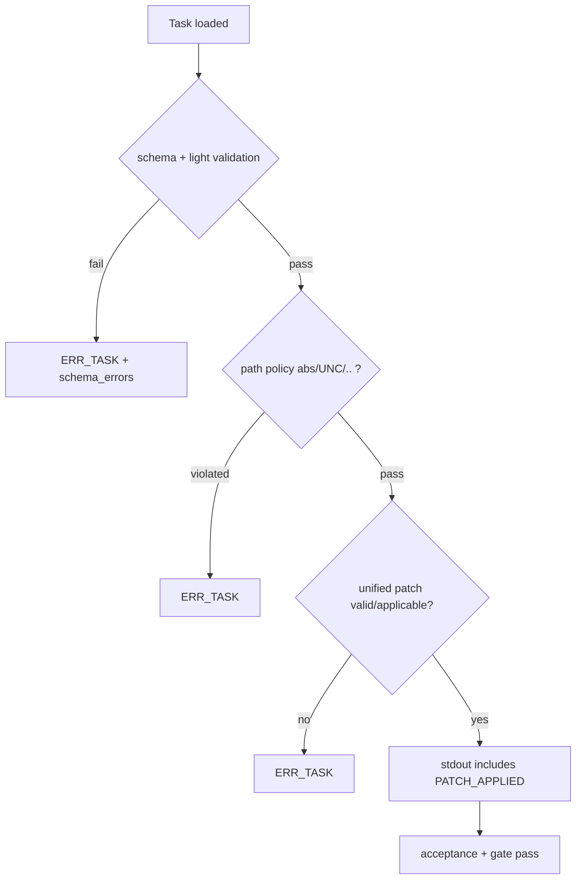

# Design: design_20260224_task_patch_apply

- Status: Final
- Owner: Codex
- Created: 2026-02-24
- Updated: 2026-02-24
- Scope: add `patch_apply` task command with schema pre-validation, executor-based application, and deterministic E2E coverage.

## Context
- Problem: current task kinds do not provide a safe workspace-scoped unified-diff apply flow.
- Goal: support `spec.command: patch_apply` with strict path constraints, machine-readable errors, and gate-protected docs/tests.
- Non-goals: arbitrary repository patching outside workspace root, binary patch formats, or three-way merge support.

## Design diagram

## Whiteboard impact
- Now: Before: whiteboard tracked design-first gate flow but did not mention patch apply capability. After: whiteboard Now references `patch_apply` pipeline with executor enforcement and schema-first rejection.
- DoD: Before: E2E covered run_command/artifact/regex families only. After: DoD requires 3 patch_apply scenarios (success + path NG + invalid format NG) with machine-readable failure codes.
- Blockers: none.
- Risks: parser complexity can introduce edge-case mismatches on uncommon unified diff variants.

## Multi-AI participation plan
- Reviewer:
  - Request: verify command contract (`spec.command=patch_apply`) and error-code consistency.
  - Expected output format: approved/noted with regressions and compatibility notes.
- QA:
  - Request: verify success/NG/invalid E2E matrix and deterministic pass/fail evidence.
  - Expected output format: approved/noted with missing tests and flakiness risks.
- Researcher:
  - Request: review security constraints and bounded-input strategy for long-term operability.
  - Expected output format: noted/approved with migration cautions.
- External AI:
  - Request: independent review of unified-diff parser scope and threat boundaries.
  - Expected output format: noted with simplification alternatives.
- external_participation: optional
- external_not_required: false

## Open Decisions
- [x] Decision 1
- [x] Decision 2
- [x] Decision 3

### Open Decisions checklist
- [x] Add "Decision 1 Final:" entry with final choice.
- [x] Add "Decision 2 Final:" entry with final choice.

## Final Decisions
- Decision 1 Final: keep top-level Task contract unchanged and add `patch_apply` as `spec.command`.
- Decision 2 Final: execute patch application in executor mode `patch_apply` and keep orchestrator as policy/contract owner.
- Decision 3 Final: reject patch targets outside workspace root (`abs`, `UNC`, traversal `..`) as `ERR_TASK` with details.

## Discussion summary
- Change 1: avoid introducing a new top-level Task YAML shape to preserve existing queue/orchestrator contracts.
- Change 2: add explicit `spec.patch.format/text` schema to enable pre-validation and richer `schema_errors` payloads.
- Change 3: apply unified diff in executor with bounded file count/size and return `files` list for artifacts continuity.

## Plan
1. Add schema/spec contract for `patch_apply` and patch payload.
2. Implement orchestrator deferred flow + executor `patch_apply` mode.
3. Add 3 E2E templates and run_e2e modes.
4. Run gate/docs/smoke/e2e and update whiteboard.

## Risks
- Risk: unsupported diff constructs (rename/binary) may be submitted.
  - Mitigation: fail-fast with clear `ERR_TASK` and parser reason in stderr/details.

## Test Plan
- Unit: parser behavior is covered by deterministic E2E templates.
- E2E:
  - success: patch applies and `stdout_contains: PATCH_APPLIED`.
  - expected NG: patch contains traversal/absolute/UNC target path.
  - invalid: unsupported patch format (schema-invalid => `ERR_TASK`).

## Reviewed-by
- Reviewer / codex-review / 2026-02-24 / approved
- QA / codex-qa / 2026-02-24 / approved
- Researcher / codex-research / 2026-02-24 / noted

## External Reviews
- docs/design/design_20260224_task_patch_apply__external_claude.md / noted
