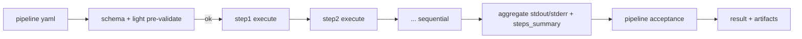
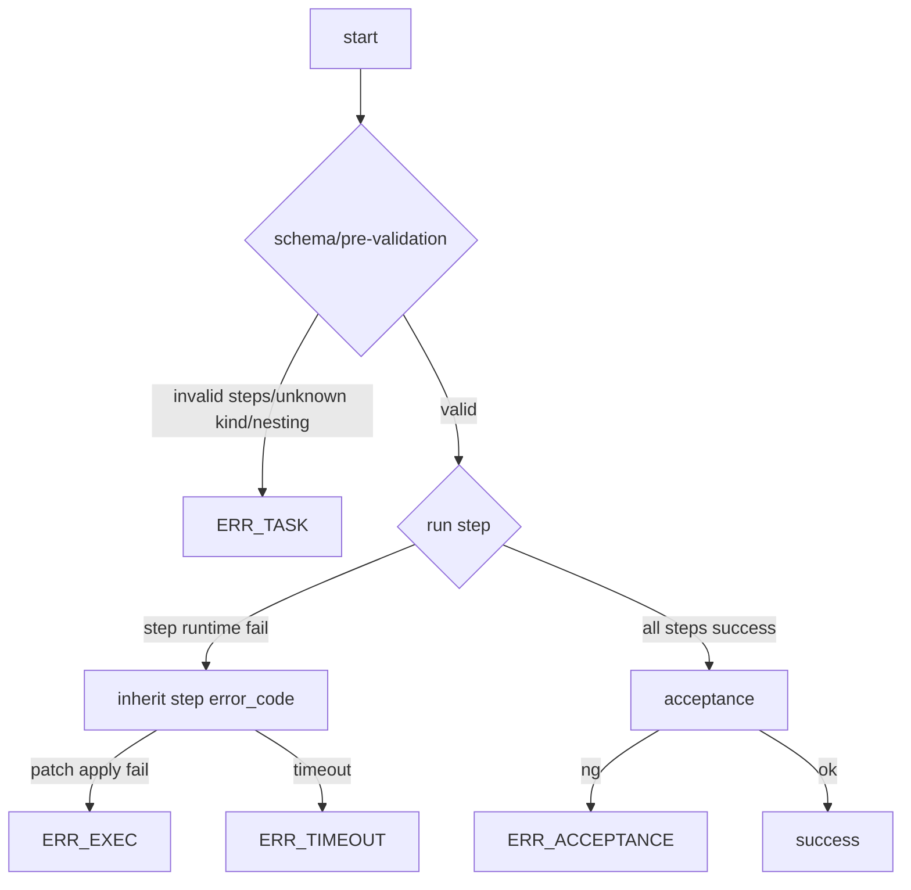

# Design: design_20260224_task_pipeline

- Status: Final
- Owner: Codex
- Created: 2026-02-24
- Updated: 2026-02-24
- Scope: add `pipeline` task kind for sequential multi-step execution with schema-first validation.

## Context
- Problem: current flow executes one task command per Task YAML; multi-step workflows require multiple queue files and lose single-result traceability.
- Goal: execute ordered steps inside one `pipeline` task with fail-fast semantics and machine-readable per-step summary.
- Non-goals: parallel steps, branching/loop/retry, or pipeline nesting.

## Design diagram

## Whiteboard impact
- Now: Before: multi-step jobs required multiple task files and fragmented evidence. After: single `pipeline` task executes ordered steps with one aggregated Result.
- DoD: Before: step-level failure context was manual correlation. After: `steps_summary`, `failed_step_id/index`, and aggregated samples are always machine-readable in Result details.
- Blockers: none.
- Risks: longer pipeline tasks can increase per-run complexity if step limits are expanded later.

## Multi-AI participation plan
- Reviewer:
  - Request: validate sequential contract and error-code propagation from step to pipeline result.
  - Expected output format: approved/noted + risks.
- QA:
  - Request: validate 3 E2E cases (success/runtime NG/invalid NG) and deterministic assertions.
  - Expected output format: approved/noted + missing tests.
- Researcher:
  - Request: evaluate long-term compatibility of step summary schema and artifact layout.
  - Expected output format: noted/approved + cautions.
- External AI:
  - Request: optional independent review of fail-fast + no-nesting policy.
  - Expected output format: noted.
- external_participation: optional
- external_not_required: false

## Open Decisions
- [x] Decision 1
- [x] Decision 2
- [x] Decision 3

### Open Decisions checklist
- [x] Add "Decision 1 Final:" entry with final choice.
- [x] Add "Decision 2 Final:" entry with final choice.

## Final Decisions
- Decision 1 Final: pipeline is a top-level `kind: pipeline` task with `steps[]` executed sequentially (fail-fast).
- Decision 2 Final: pipeline step kinds are restricted to known non-pipeline kinds; nested pipeline is rejected as ERR_TASK.
- Decision 3 Final: pipeline result keeps first failed step as representative (`failed_step_id/index`) and preserves machine-readable summaries/samples.

## Discussion summary
- Change 1: selected orchestrator-managed step loop to reuse existing command handlers and executor integration.
- Change 2: adopted schema + light validation for max steps, known step kinds, and nesting prohibition.
- Change 3: standardized pipeline details payload (`steps_summary`, failed step markers, aggregated samples, truncation note).

## Plan
1. Extend schema/docs for `kind: pipeline`.
2. Implement orchestrator sequential execution and aggregation.
3. Add E2E templates/scripts for success + runtime NG + invalid NG.
4. Gate/whiteboard/docs/smoke verification.

## Risks
- Risk: mixed step types can produce large stdout/stderr aggregation.
  - Mitigation: cap samples and include truncation note.

## Test Plan
- success: patch step + command step + acceptance pass.
- expected NG: runtime step failure via patch apply fail (`ERR_EXEC`).
- invalid NG: nested pipeline step rejected as `ERR_TASK`.

## Reviewed-by
- Reviewer / codex-review / 2026-02-24 / approved
- QA / codex-qa / 2026-02-24 / approved
- Researcher / codex-research / 2026-02-24 / noted

## External Reviews
- docs/design/design_20260224_task_pipeline__external_claude.md / noted
