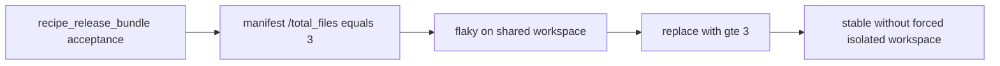

# Design: design_20260225_acceptance_json_pointer_numeric_compare

- Status: Approved
- Owner: Codex
- Created: 2026-02-25
- Updated: 2026-02-25
- Scope: Acceptance: JSON Pointer numeric comparisons (gt/gte/lt/lte)

## Context
- Problem: `artifact_json_pointer_equals` だけでは JSON の件数やサイズのような閾値判定ができず、受け入れ条件が brittle になる。
- Goal: `artifact_json_pointer_gt/gte/lt/lte` を追加し、JSON Pointer で取得した数値を宣言的に比較できるようにする。あわせて release bundle recipe guard の `total_files=3` を `gte 3` に変更し、共有 workspace でも安定化する。
- Non-goals: JSONPath や配列探索、集計、文字列長/配列長比較。

## Design diagram
```mermaid
%% title: json pointer numeric compare flow
flowchart TD
  A[acceptance item artifact_json_pointer_(gt/gte/lt/lte)] --> B[pre-validation path/pointer/value]
  B -->|invalid| C[ERR_TASK]
  B -->|valid| D[read artifact json]
  D -->|parse fail| E[ERR_ACCEPTANCE note=json_parse_error]
  D --> F[resolve pointer]
  F -->|not found| G[ERR_ACCEPTANCE note=pointer_not_found]
  F --> H{actual is number?}
  H -->|no| I[ERR_ACCEPTANCE note=non_number]
  H -->|yes| J[compare gt/gte/lt/lte]
  J -->|false| K[ERR_ACCEPTANCE mismatch]
  J -->|true| L[acceptance ok]
```



## Whiteboard impact
- Now: Before: JSON pointer acceptance supports equals/regex/exists only; threshold checks need rigid equals values. After: numeric comparator checks (`gt/gte/lt/lte`) support robust range-based acceptance.
- DoD: Before: release bundle guard uses fixed `total_files=3` and can fail in shared workspace. After: recipe guard uses `gte 3`, reducing isolation dependency while keeping contract intent.
- Blockers: none.
- Risks: number type判定やNaN/Infinity扱いが pre-validation と runtime で不整合になると ERR_TASK/ERR_ACCEPTANCE が揺れる。

## Multi-AI participation plan
- Reviewer:
  - Request: comparator semantics, error分類、既存 pointer acceptance 非破壊性のレビュー。
  - Expected output format: severity順 findings with affected section/file.
- QA:
  - Request: 3本E2E + recipes:all + auto/strict 回帰の検証観点レビュー。
  - Expected output format: command/expected status matrix.
- Researcher:
  - Request: details payload shape の運用性と将来互換性レビュー。
  - Expected output format: noted/approved with concise rationale.
- External AI:
  - Request: optional independent critique on numeric edge cases.
  - Expected output format: short bullets.
- external_participation: optional
- external_not_required: true

## Open Decisions
- [x] comparator value の型・禁止値（NaN/Infinity）の扱い。
- [x] release bundle guard の安定化方針（gte化 + isolated強制緩和）。

### Open Decisions checklist
- [x] Add "Decision 1 Final:" entry with final choice.
- [x] Add "Decision 2 Final:" entry with final choice.

## Final Decisions
- Decision 1 Final: `artifact_json_pointer_gt/gte/lt/lte` は `{path,pointer,value:number}` を受け、pre-validation で path/pointer/value 型と `Number.isFinite(value)` を検証し、違反は `ERR_TASK`。
- Decision 2 Final: runtime で parse失敗/pointer未解決/non_number/比較不一致は `ERR_ACCEPTANCE` とし、details に `target_path/check_type/pointer/expected_value/actual_value_type/actual_value_sample/note` を保持。release bundle recipe の `/total_files` は `gte 3` に変更し、`e2e:auto:recipe_release_bundle:json` の `-IsolatedWorkspace` 強制を解除する。

## Discussion summary
- 既存 `artifact_json_pointer_*` の JSON parse と pointer resolve ロジックを再利用して comparator を追加する。
- details 形式は既存 pointer acceptance と揃え、機械判定しやすい `expected_value` と `check_type` を追加する。
- recipe flaky 対策は comparator導入の実利用として同時に反映する。

## Plan
1. SSOT/spec と schema に numeric comparator keys を追加。
2. orchestrator acceptance evaluator に comparator 実装と pre-validation を追加。
3. E2E 3本と scripts を追加。
4. release bundle recipe/e2e を `gte` 化し、必要なら isolated 強制を解除。
5. gate/whiteboard/build/e2e/recipes/all/auto/strict/docs/smoke を通す。

## Risks
- Risk: JSON内値が number-like string の場合に期待とズレる。
  - Mitigation: 型厳密（numberのみ）で `note=non_number` を返す。
- Risk: comparator導入で既存 pointer checks の挙動が変わる。
  - Mitigation: 分岐追加のみで既存 equals/regex/exists を変更しない。

## Test Plan
- `npm.cmd run e2e:auto:accept_json_pointer_gte:json` => success
- `npm.cmd run e2e:auto:accept_json_pointer_gt_ng` => expected NG (`ERR_ACCEPTANCE`)
- `npm.cmd run e2e:auto:accept_json_pointer_gte_invalid_value_ng` => expected NG (`ERR_TASK`)
- `npm.cmd run recipes:all` => pass（release bundle 更新後）
- `npm.cmd run e2e:auto` / `npm.cmd run e2e:auto:strict` => pass

## Reviewed-by
- Reviewer / codex-review / 2026-02-25 / approved
- QA / codex-qa / 2026-02-25 / approved
- Researcher / codex-research / 2026-02-25 / noted

## External Reviews
- design_20260225_acceptance_json_pointer_numeric_compare__external_claude.md / noted
- design_20260225_acceptance_json_pointer_numeric_compare__external_gemini.md / noted
