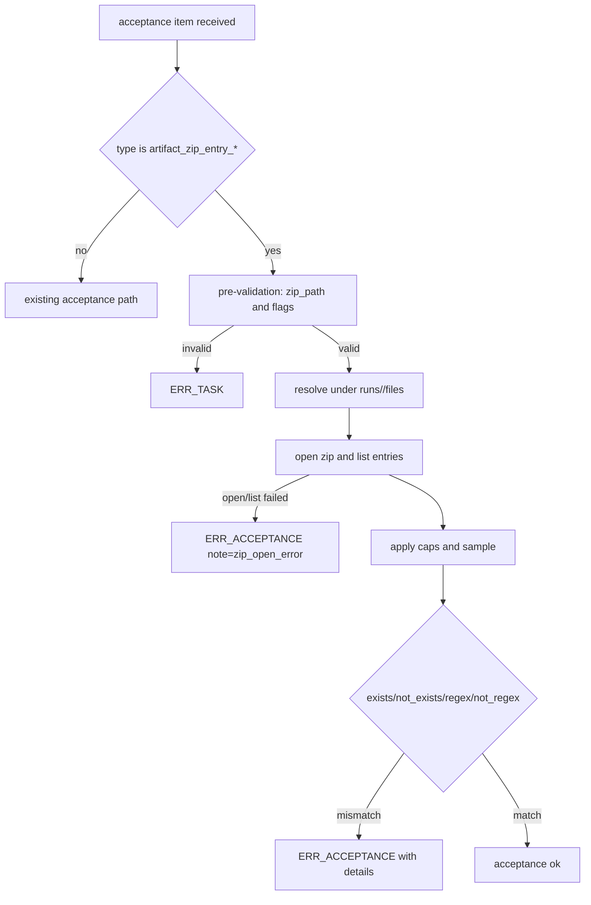
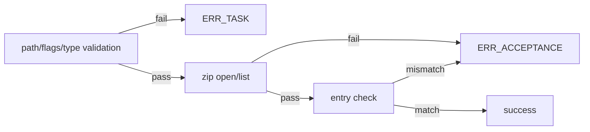

# Design: design_20260225_acceptance_zip_entry_checks

- Status: Approved
- Owner: Codex
- Created: 2026-02-25
- Updated: 2026-02-25
- Scope: Acceptance: ZIP entry checks (exists/regex)

## Context
- Problem: `archive_zip` can produce a zip artifact, but acceptance currently cannot verify whether expected entries are actually present inside the zip.
- Goal: add declarative acceptance keys for zip-entry checks so task authors can validate zip entry existence and regex matching without extraction.
- Non-goals: zip extraction, entry content inspection, direct workspace reads outside `runs/<run_id>/files`.

## Design diagram

## Whiteboard impact
- Now: Before: acceptance can only check artifact existence/file/json content, not zip-internal entries. After: acceptance can declaratively validate zip entries via `artifact_zip_entry_*`.
- DoD: Before: `archive_zip` correctness relies on indirect signals. After: expected zip entries are directly verifiable in acceptance with deterministic error details.
- Blockers: none.
- Risks: large zip entry lists can bloat details and logs if caps/truncation are not enforced consistently.

## Multi-AI participation plan
- Reviewer:
  - Request: validate acceptance key contract, path safety, and error classification consistency with existing checks.
  - Expected output format: severity-sorted findings with affected file/section and fix suggestion.
- QA:
  - Request: validate success/ng/invalid e2e coverage and regression impact to existing acceptance suites.
  - Expected output format: command + expected status/error code matrix.
- Researcher:
  - Request: review details payload shape for long-term operability and triage usefulness.
  - Expected output format: noted/approved with compatibility comments.
- External AI:
  - Request: optional independent critique of cap/truncation policy and failure semantics.
  - Expected output format: optional findings bullets.
- external_participation: optional
- external_not_required: true

## Open Decisions
- [x] ZIP entry listing caps and truncation-note policy values.
- [x] Regex compile failure classification for zip-entry regex checks.

### Open Decisions checklist
- [x] Add "Decision 1 Final:" entry with final choice.
- [x] Add "Decision 2 Final:" entry with final choice.

## Final Decisions
- Decision 1 Final: introduce acceptance keys `artifact_zip_entry_exists`, `artifact_zip_entry_not_exists`, `artifact_zip_entry_regex`, `artifact_zip_entry_not_regex` using `zip_path` scoped to `runs/<run_id>/files`; reject abs/UNC/traversal in pre-validation as `ERR_TASK`.
- Decision 2 Final: zip open/list failures and check mismatches are `ERR_ACCEPTANCE`; regex compile failure during evaluation is also `ERR_ACCEPTANCE` with `details.compile_error`, and details include capped `entries_sample`, `total_entries` (when known), and `note` (`zip_open_error`, `truncated`, etc.).

## Discussion summary
- Add pre-validation for zip acceptance keys in orchestrator acceptance light validation, reusing regex-flags policy (`imsu`, no duplicates, max length 4).
- Add zip entry lister with hard caps: max 5000 entries scanned, max 512 chars per entry, bounded sample payload with truncation note.
- Keep existing acceptance behavior untouched by adding isolated branches for new types and preserving current result format.

## Plan
1. Update SSOT (`docs/spec_task_result.md`, `docs/spec_region_ai.md`) and schema (`schemas/task.schema.json`) for new keys and error/details contracts.
2. Implement acceptance evaluator zip-entry checks with safe path resolution and capped entry listing.
3. Add e2e templates/scripts for success, acceptance NG, and invalid flags ERR_TASK.
4. Run design gate, whiteboard update, build, targeted e2e, full auto/strict, docs/smoke gate.

## Risks
- Risk: zip reading dependency or parsing logic can fail on some archive variants.
  - Mitigation: treat open/list failures as `ERR_ACCEPTANCE` with explicit `note`/`compile_error` fields for triage.
- Risk: log/detail payload growth from entry samples.
  - Mitigation: fixed caps (count/entry length/sample size) and truncation note in details.

## Test Plan
- Unit: rely on TypeScript build checks and existing acceptance evaluator behavior with added branches.
- E2E:
  - `accept_zip_entries_success` => success.
  - `accept_zip_entries_ng` => failed + `ERR_ACCEPTANCE`.
  - `accept_zip_entries_invalid_flags_ng` => failed + `ERR_TASK`.
  - regression: `e2e:auto` and `e2e:auto:strict`.

## Reviewed-by
- Reviewer / codex-review / 2026-02-25 / approved
- QA / codex-qa / 2026-02-25 / approved
- Researcher / codex-research / 2026-02-25 / noted

## External Reviews
- design_20260225_acceptance_zip_entry_checks__external_claude.md / noted
- design_20260225_acceptance_zip_entry_checks__external_gemini.md / noted
