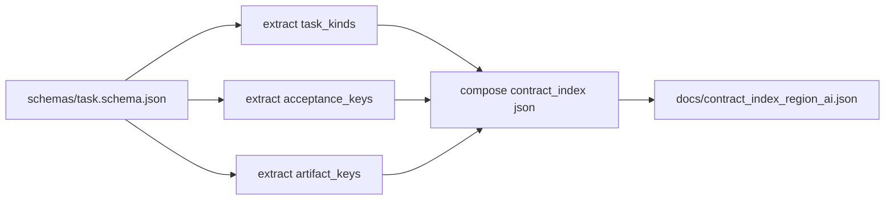
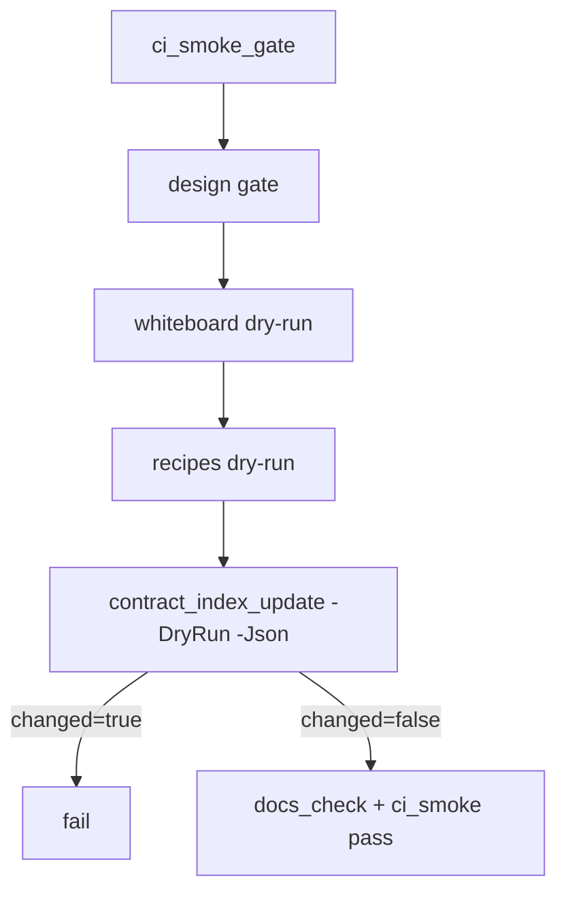

# Design: design_20260225_contract_index_ssot

- Status: Approved
- Owner: Codex
- Created: 2026-02-25
- Updated: 2026-02-25
- Scope: Contract index SSOT + drift guard (schema⇄spec)

## Context
- Problem: `schemas/task.schema.json` (machine contract) と `docs/spec_task_result.md` (human contract) のズレを CI で機械的に検知する仕組みが不足している。
- Goal: schema から contract index を抽出して `docs/contract_index_region_ai.json` を生成し、`ci_smoke_gate` で drift を検知する。
- Non-goals: schema内容の大幅変更、spec全文自動生成、UI 実装。

## Design diagram

## Whiteboard impact
- Now: Before: schema/spec の差分は人手レビュー依存。 After: contract index SSOT で機械可読の差分検知が可能。
- DoD: Before: smoke は whiteboard/recipes drift のみ監視。 After: contract index drift も監視し、SSOTズレを自動検知。
- Blockers: none.
- Risks: schema 走査ロジックが構造変更に弱いと誤検知/取りこぼしが起きる。

## Multi-AI participation plan
- Reviewer:
  - Request: extraction ロジックの妥当性と additive 互換性（ci_smoke JSON 拡張）をレビュー。
  - Expected output format: severity findings + impacted file.
- QA:
  - Request: `-Write/-DryRun/-Json` と smoke fail/pass 条件の検証観点レビュー。
  - Expected output format: command/status matrix.
- Researcher:
  - Request: contract index の将来拡張性と運用上の可読性レビュー。
  - Expected output format: noted/approved with rationale.
- External AI:
  - Request: optional independent review on schema traversal fallback policy.
  - Expected output format: short bullets.
- external_participation: optional
- external_not_required: true

## Open Decisions
- [x] 抽出対象（task_kinds / acceptance_keys / artifact_keys）の走査戦略。
- [x] ci_smoke_gate 追加フィールド設計（consumer互換）。

### Open Decisions checklist
- [x] Add "Decision 1 Final:" entry with final choice.
- [x] Add "Decision 2 Final:" entry with final choice.

## Final Decisions
- Decision 1 Final: `contract_index_update.ps1` は schema JSON を再帰走査し、acceptance配下 type const を `acceptance_keys`、`command.kind` enum を `task_kinds`、`artifact.properties` キーを `artifact_keys` として抽出する。
- Decision 2 Final: `ci_smoke_gate` は `contract_index_update.ps1 -DryRun -Json` を実行し `changed=true` なら fail。結果 JSON へ `contract_index_passed` を additive 追加する。

## Discussion summary
- whiteboard/recipes と同じ UX（`-DryRun -Json`）に揃えて運用コストを下げる。
- 抽出結果はソートして deterministic にし、不要な drift を防ぐ。
- spec_task_result.md への generated section 更新は今回は非必須として最小実装にする。

## Plan
1. `tools/contract_index_update.ps1` を追加。
2. `docs/contract_index_region_ai.json` を生成。
3. `ci_smoke_gate.ps1` に drift check を追加。
4. run/spec docs に導線追記。
5. gate/whiteboard/docs/smoke を通す。

## Risks
- Risk: schema構造変更時に抽出漏れ。
  - Mitigation: 再帰走査 + defensive fallback + 失敗時 reason を JSON 出力。
- Risk: generated JSON の差分ノイズ。
  - Mitigation: ソート済み配列、dateのみ更新、改行差分除去で changed 判定。

## Test Plan
- `powershell -File tools/contract_index_update.ps1 -Write -Json` => exit 0
- `powershell -File tools/contract_index_update.ps1 -DryRun -Json` => changed=false
- `npm.cmd run ci:smoke:gate:json` => `contract_index_passed=true`

## Reviewed-by
- Reviewer / codex-review / 2026-02-25 / approved
- QA / codex-qa / 2026-02-25 / approved
- Researcher / codex-research / 2026-02-25 / noted

## External Reviews
- design_20260225_contract_index_ssot__external_claude.md / noted
- design_20260225_contract_index_ssot__external_gemini.md / noted
