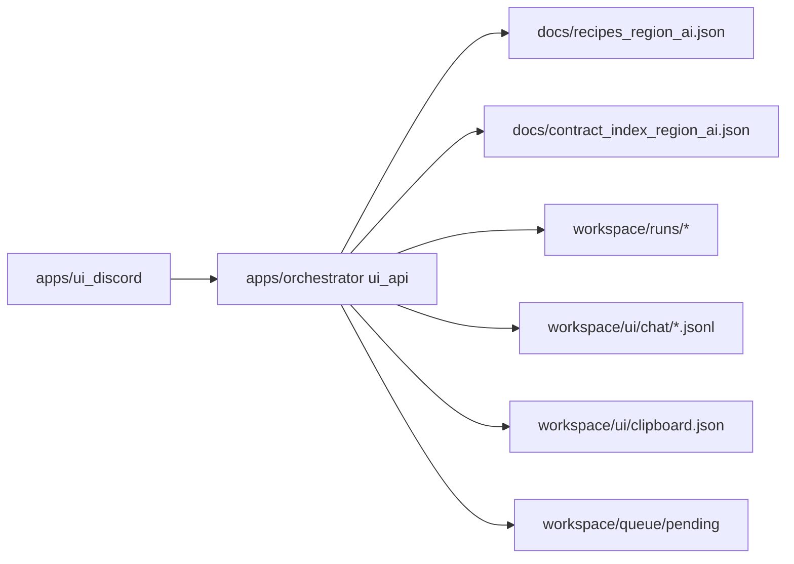
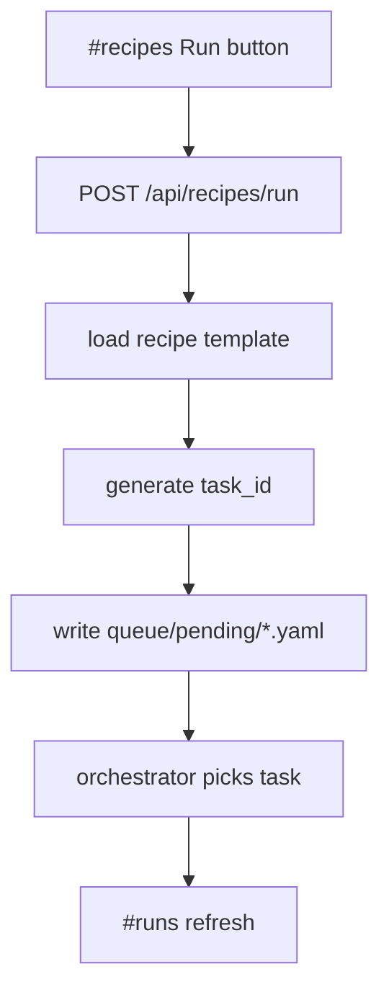

# Design: design_20260225_discord_ui_hub

- Status: Approved
- Owner: Codex
- Created: 2026-02-25
- Updated: 2026-02-25
- Scope: Discord-like UI hub: channels + role chat + context panel

## Context
- Problem: region_ai の運用は queue/events/runs のファイル参照と CLI 操作中心で、会話・実行・成果物確認が分断されている。
- Goal: Discord-like 3ペイン UI（channels / main view / context panel）を追加し、Runs/Recipes/Designs/Role chat を統合する。Clipboard Bus で API 連携なしの手動キャッチボールを最短化する。
- Non-goals: external LLM 自動送受信、desktop shell 化、認証/マルチユーザ設計。

## IA (Channels & Navigation)
- Left channels:
  - `#general` / `#codex` / `#chatgpt` / `#external`
  - `#runs`
  - `#recipes`
  - `#designs`
- Main pane:
  - chat channels: message timeline + composer + BUS bar
  - runs: run list + run detail
  - recipes: catalog cards + run action
  - designs: latest + list + markdown preview
- Right context pane:
  - selected message links (run_id/design_id/artifact paths)
  - selected run meta/artifacts/zip entries quick viewer

## Data model
- `workspace_root/ui/chat/threads.json`
  - thread metadata list (`id`, `title`, `updated_at`)
- `workspace_root/ui/chat/<thread_id>.jsonl`
  - append-only message log
- message shape:
  - `id`, `thread_id`, `role`, `kind`, `text`, `links`, `created_at`
- clipboard history (optional persistence):
  - `workspace_root/ui/clipboard.json` (max 20)

## API design
- SSOT:
  - `GET /api/ssot/recipes`
  - `GET /api/ssot/contract`
- Runs:
  - `GET /api/runs?limit=50`
  - `GET /api/runs/:run_id`
  - `GET /api/runs/:run_id/artifacts`
  - `GET /api/runs/:run_id/artifacts/file?path=...`
  - `GET /api/runs/:run_id/artifacts/zip_entries?path=...`
- Chat:
  - `GET /api/chat/threads`
  - `POST /api/chat/threads`
  - `GET /api/chat/threads/:thread_id/messages?limit=200`
  - `POST /api/chat/threads/:thread_id/messages`
- Recipes launch:
  - `POST /api/recipes/run`
- Designs:
  - `GET /api/designs`
  - `GET /api/designs/:name`

## Security & limits
- localhost only bind (`127.0.0.1`)。
- file path は absolute/UNC/`..` を拒否し、`workspace/runs/<run_id>/files` 配下のみ許可。
- text/file response cap:
  - file preview max 256KB
  - zip entries max 5000, each entry max 512 chars
  - chat message fetch limit cap 500
- simple CSP header and JSON-only API responses.

## Design diagram

## Whiteboard impact
- Now: Before: runs/recipes/designs/chat context are split across markdown/yaml/json and CLI. After: single Discord-like hub provides read + queue + message append flow.
- DoD: Before: APIなしキャッチボールは手作業で文脈崩れやすい。 After: Clipboard Bus templates and role channels reduce handoff friction to one-click copy/paste.
- Blockers: none.
- Risks: API read endpoints can accidentally expose broader filesystem if path policy drifts.

## Multi-AI participation plan
- Reviewer:
  - Request: review API surface, path restriction, and non-breaking integration with orchestrator contracts.
  - Expected output format: severity findings with affected component.
- QA:
  - Request: validate UI API smoke and existing e2e/smoke non-regression strategy.
  - Expected output format: commands + expected result matrix.
- Researcher:
  - Request: evaluate data model durability (JSONL threads + links schema).
  - Expected output format: noted/approved with rationale.
- External AI:
  - Request: optional critique for Discord-like IA and clipboard workflow.
  - Expected output format: short bullets.
- external_participation: optional
- external_not_required: true

## Open Decisions
- [x] Add ui_smoke to ci_smoke_gate now or keep manual.
- [x] spec_task_result generated contract section scope.

### Open Decisions checklist
- [x] Add "Decision 1 Final:" entry with final choice.
- [x] Add "Decision 2 Final:" entry with final choice.

## Final Decisions
- Decision 1 Final: add `tools/ui_smoke.ps1` and include it in `ci_smoke_gate` as additive `ui_passed` check.
- Decision 2 Final: implement `contract_index_update -UpdateSpec` support but keep spec auto-embed optional; this UI design does not force spec rewrite.

## Discussion summary
- keep UI app isolated as `apps/ui_discord` to avoid touching orchestrator task loop runtime.
- keep ui_api in orchestrator as separate process entrypoint (`ui:api`) for simple deployment.
- prioritize safe read-only run viewers and explicit write paths (chat append + recipe queue).

## Plan
1. scaffold design/review assets and pass gate.
2. add ui_api endpoints in orchestrator.
3. scaffold ui_discord app (3 pane layout, channel views, bus).
4. add tools/ui_smoke.ps1 + e2e template + scripts.
5. update docs and run full smoke/e2e checks.

## Risks
- Risk: new ui_api could interfere with existing orchestrator scripts.
  - Mitigation: separate entrypoint/script; no modification to task worker path.
- Risk: clipboard persistence can grow indefinitely.
  - Mitigation: hard cap 20 entries and overwrite oldest.

## Test Plan
- `tools/ui_smoke.ps1 -Json` => API boots, `/api/ssot/recipes` returns 200 JSON.
- `npm run ci:smoke:gate:json` => includes `ui_passed=true`.
- `e2e:auto` / `e2e:auto:strict` regression pass.

## Reviewed-by
- Reviewer / codex-review / 2026-02-25 / approved
- QA / codex-qa / 2026-02-25 / approved
- Researcher / codex-research / 2026-02-25 / noted

## External Reviews
- design_20260225_discord_ui_hub__external_claude.md / noted
- design_20260225_discord_ui_hub__external_gemini.md / noted
