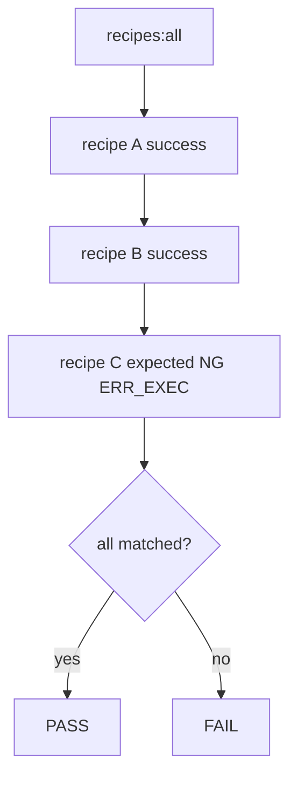

# Design: design_20260225_golden_recipes

- Status: Approved
- Owner: Codex
- Created: 2026-02-25
- Updated: 2026-02-25
- Scope: Golden recipes: production-ready task templates + E2E guard

## Context
- Problem: operators do not have a single production-ready template set that demonstrates `file_write`, `patch_apply`, `pipeline`, and artifact-based acceptance checks together.
- Goal: add 3 golden recipes and 3 recipe E2E guards so template drift is detected by one command.
- Non-goals: new task kinds, parallel runner redesign, UI work.

## Design diagram

## Whiteboard impact
- Now: Before: reusable operation examples were fragmented in e2e templates. After: recipes provide copy-ready production examples in one folder.
- DoD: Before: no regular guard for recipe drift. After: `recipes:all` and recipe E2E scripts verify success(2) + expected NG(1).
- Blockers: none.
- Risks: recipe acceptance depends on pipeline artifact checks; run files path and sequential execution must remain stable.

## Multi-AI participation plan
- Reviewer:
  - Request: validate minimal and backward-compatible changes in orchestrator, schema, and scripts.
  - Expected output format: findings with severity and file path.
- QA:
  - Request: validate 3 recipe checks and full `e2e:auto`/`e2e:auto:strict`.
  - Expected output format: command list and pass/fail evidence.
- Researcher:
  - Request: validate operational usefulness and anti-rot guard coverage.
  - Expected output format: noted/approved with short rationale.
- External AI:
  - Request: optional for this design; internal role reviews are sufficient.
  - Expected output format: optional risk notes.
- external_participation: optional
- external_not_required: true

## Open Decisions
- [x] Allow `file_write` in pipeline steps to support recipe scenarios.
- [x] Keep recipe guard as dedicated E2E modes and one sequential npm script (`recipes:all`).

### Open Decisions checklist
- [x] Add "Decision 1 Final:" entry with final choice.
- [x] Add "Decision 2 Final:" entry with final choice.

## Final Decisions
- Decision 1 Final: pipeline step kind enum is expanded with `file_write`, including schema and runtime validation.
- Decision 2 Final: recipe guard consists of 3 E2E templates and 3 `run_e2e` modes, chained by `recipes:all` in sequential order.

## Discussion summary
- The team agreed recipes should be production-copyable files under `templates/tasks/recipes/`, separate from expected-NG e2e templates.
- To support recipe acceptance on artifacts, pipeline acceptance evaluation must receive `runFilesDir` and `artifactsFiles`.
- To allow acceptance checks against `_meta/result.json` in pipeline, pre-acceptance placeholder write is kept before pipeline acceptance and replaced after finalize.

## Plan
1. Extend pipeline validation/runtime for `file_write` and artifact-based acceptance context.
2. Add recipe templates and recipe-focused e2e templates.
3. Add script/mode wiring and runbook links.
4. Run gate, whiteboard, build, recipe checks, e2e auto/strict, docs/smoke.

## Risks
- Risk: recipe scripts could accidentally run in parallel and conflict on workspace lock.
  - Mitigation: `recipes:all` is strictly sequential and runbook explicitly forbids parallel recipe execution.

## Test Plan
- E2E success:
  - `e2e:auto:recipe_generate_validate_json:json`
  - `e2e:auto:recipe_patch_apply_end_to_end:json`
- E2E expected NG:
  - `e2e:auto:recipe_pipeline_exec_fail_ng` (`ERR_EXEC`)
- Regression:
  - `e2e:auto`
  - `e2e:auto:strict`
  - `docs:check:json`
  - `ci:smoke:gate:json`

## Reviewed-by
- Reviewer / codex-review / 2026-02-25 / approved
- QA / codex-qa / 2026-02-25 / approved
- Researcher / codex-research / 2026-02-25 / noted

## External Reviews
- optional / external_not_required=true
