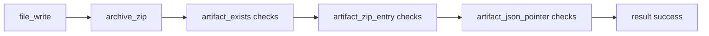
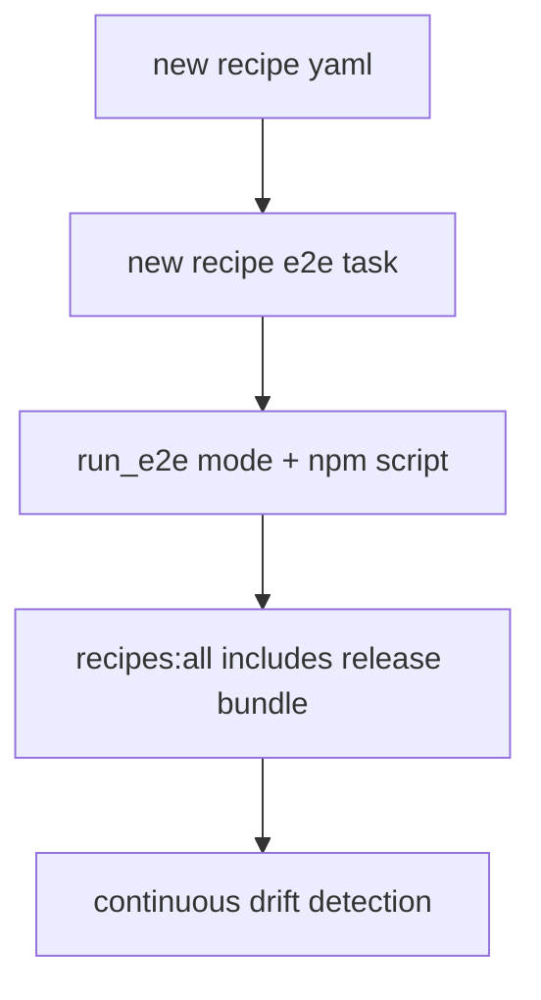

# Design: design_20260225_recipe_release_bundle

- Status: Approved
- Owner: Codex
- Created: 2026-02-25
- Updated: 2026-02-25
- Scope: Golden recipe: release bundle (archive_zip + zip entry checks)

## Context
- Problem: users need a copy-ready recipe that bundles deliverables and verifies bundle correctness declaratively, but current recipes do not provide a single release-bundle workflow with zip entry checks.
- Goal: add `recipe_release_bundle.yaml` that runs `file_write -> archive_zip -> acceptance` (artifact_exists, artifact_zip_entry_*, artifact_json_pointer_*) and integrate its E2E into `recipes:all` drift guard.
- Non-goals: extending `archive_zip` input scope to run artifacts; zip entry content validation beyond entry names.

## Design diagram

## Whiteboard impact
- Now: Before: recipes include generate/patch/apply and pipeline-fail examples, but no copy-ready release bundle with zip entry acceptance. After: `recipe_release_bundle.yaml` becomes a direct template for submission bundles with declarative zip verification.
- DoD: Before: recipes drift guard does not cover release-bundle path. After: `recipes:all` executes release-bundle success path in addition to existing recipe checks.
- Blockers: none.
- Risks: recipe path mismatches can break acceptance if generated files are not aligned to run artifact paths.

## Multi-AI participation plan
- Reviewer:
  - Request: validate recipe path correctness, acceptance completeness, and compatibility with existing orchestrator acceptance behavior.
  - Expected output format: severity-ordered findings with concrete file paths.
- QA:
  - Request: validate new e2e mode/script and recipes:all composition update.
  - Expected output format: command + expected status matrix.
- Researcher:
  - Request: validate recipe ergonomics and long-term copy-ready maintainability.
  - Expected output format: noted/approved with optional improvement bullets.
- External AI:
  - Request: optional independent review of drift-guard coverage and documentation clarity.
  - Expected output format: short findings bullets.
- external_participation: optional
- external_not_required: true

## Open Decisions
- [x] Where sample JSON should be written so JSON pointer acceptance reads from run artifacts.
- [x] Whether `recipes:all` should change from success(2)+NG(1) to success(3)+NG(1).

### Open Decisions checklist
- [x] Add "Decision 1 Final:" entry with final choice.
- [x] Add "Decision 2 Final:" entry with final choice.

## Final Decisions
- Decision 1 Final: write JSON as `written/data/sample.json` in `file_write` so it exists under `runs/<run_id>/files/` and can be validated by `artifact_json_pointer_equals`.
- Decision 2 Final: add `task_e2e_recipe_release_bundle.yaml`, `run_e2e` mode, npm script `e2e:auto:recipe_release_bundle:json`, and include it in `recipes:all` so the suite becomes success(3)+expected NG(1).

## Discussion summary
- Keep recipe copy-ready by avoiding placeholders that require manual path fixes.
- Ensure acceptance verifies zip, manifest, zip entries, run meta artifacts, and JSON pointer values in one pipeline.
- Keep concurrency policy unchanged; recipes:all remains sequential command chaining.

## Plan
1. Add design/review artifacts and pass design gate.
2. Add recipe yaml and recipe e2e yaml.
3. Update run_e2e mode and orchestrator package scripts.
4. Update docs (`docs/run_region_ai.md`) with new recipe and recipes:all breakdown.
5. Run gate/whiteboard/build/e2e/recipes/all/smoke checks.

## Risks
- Risk: `artifact_json_pointer_equals` path may target workspace path instead of artifact path.
  - Mitigation: use `written/data/sample.json` and verify against artifact-relative path only.
- Risk: recipes:all drift if mode names diverge from templates.
  - Mitigation: add explicit mode and script with deterministic template binding.

## Test Plan
- `npm.cmd run e2e:auto:recipe_release_bundle:json` => success.
- `npm.cmd run recipes:all` => success for 3 recipe success cases + expected NG case.
- Regression: `npm.cmd run e2e:auto` and `npm.cmd run e2e:auto:strict` => success.

## Reviewed-by
- Reviewer / codex-review / 2026-02-25 / approved
- QA / codex-qa / 2026-02-25 / approved
- Researcher / codex-research / 2026-02-25 / noted

## External Reviews
- design_20260225_recipe_release_bundle__external_claude.md / noted
- design_20260225_recipe_release_bundle__external_gemini.md / noted
