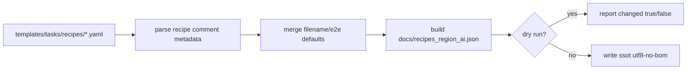
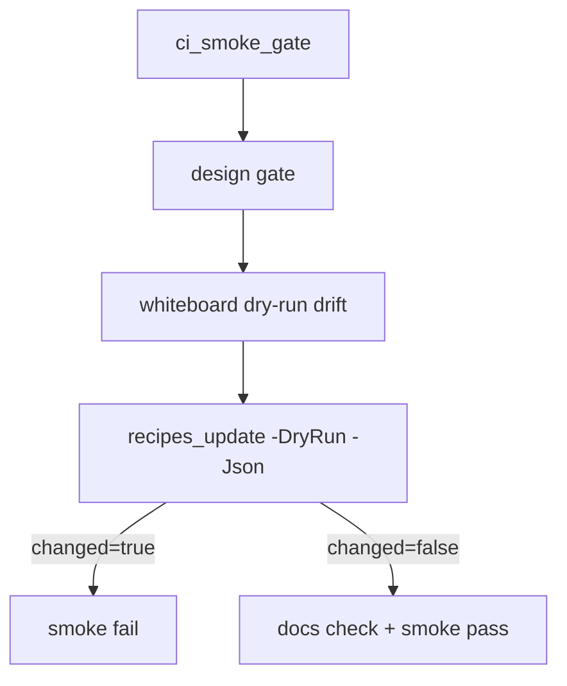

# Design: design_20260225_recipes_catalog_ssot

- Status: Approved
- Owner: Codex
- Created: 2026-02-25
- Updated: 2026-02-25
- Scope: Recipes catalog SSOT + drift guard

## Context
- Problem: recipe templates are human-readable but not managed as a machine-readable SSOT, so UI/operations/CI cannot reliably consume recipe metadata or detect drift.
- Goal: add `docs/recipes_region_ai.json` as recipes catalog SSOT, implement `tools/recipes_update.ps1` (dry-run/json aware), and enforce drift check in `ci_smoke_gate` similar to whiteboard drift guard.
- Non-goals: introducing new task kinds, large recipe behavior changes, or UI implementation.

## Design diagram

## Whiteboard impact
- Now: Before: recipes metadata is distributed in yaml files only and drift is not guarded. After: catalog SSOT is generated deterministically and CI detects drift.
- DoD: Before: no machine-readable recipes inventory for UI/ops. After: `docs/recipes_region_ai.json` is maintained by tool and validated by smoke gate.
- Blockers: none.
- Risks: metadata comment parse tolerance could produce unstable output if formatting varies.

## Multi-AI participation plan
- Reviewer:
  - Request: verify drift-guard design consistency with existing whiteboard model and backward compatibility of ci_smoke_gate output.
  - Expected output format: severity findings with affected file references.
- QA:
  - Request: verify dry-run changed detection, write mode behavior, and smoke gate pass/fail semantics.
  - Expected output format: command matrix with expected exit/status JSON.
- Researcher:
  - Request: review catalog JSON schema practicality for future UI/automation consumers.
  - Expected output format: noted/approved with short rationale.
- External AI:
  - Request: optional independent review of metadata fallback strategy.
  - Expected output format: concise bullets.
- external_participation: optional
- external_not_required: true

## Open Decisions
- [x] Metadata source strategy when recipe comment block is missing or partial.
- [x] ci_smoke_gate output extension policy (`recipes_passed` additive only).

### Open Decisions checklist
- [x] Add "Decision 1 Final:" entry with final choice.
- [x] Add "Decision 2 Final:" entry with final choice.

## Final Decisions
- Decision 1 Final: `recipes_update.ps1` parses optional `# recipe:` comment block; if missing, it falls back to filename-derived id/title and default expect=`success`, uses empty list, notes empty.
- Decision 2 Final: `ci_smoke_gate` runs `recipes_update.ps1 -DryRun -Json` and fails when `changed=true`; final JSON adds `recipes_passed` as additive field only.

## Discussion summary
- Keep parsing lightweight and deterministic to minimize maintenance overhead.
- Keep generated JSON stable ordering by filename to reduce noise and simplify drift detection.
- Reuse whiteboard drift guard style: `-DryRun -Json` and `changed` contract.

## Plan
1. Add recipe metadata comments to existing recipe yaml files.
2. Implement `tools/recipes_update.ps1` with write/dry-run/json modes.
3. Generate `docs/recipes_region_ai.json` and verify no-drift output.
4. Integrate recipes drift check into `tools/ci_smoke_gate.ps1`.
5. Update runbook/spec docs with recipes SSOT guidance.
6. Run gate/whiteboard/smoke checks.

## Risks
- Risk: comment parser fragility across formatting variants.
  - Mitigation: support both block parse and conservative defaults; never fail solely on missing metadata.
- Risk: JSON output churn from timestamps.
  - Mitigation: date-only `updated_at` and deterministic serialization order.

## Test Plan
- `powershell -File tools/recipes_update.ps1 -DryRun -Json` => changed expected based on current state.
- `powershell -File tools/recipes_update.ps1 -Json` => writes SSOT and exit 0.
- second `-DryRun -Json` => `changed=false`.
- `npm.cmd run ci:smoke:gate:json` => pass with `recipes_passed=true`.

## Reviewed-by
- Reviewer / codex-review / 2026-02-25 / approved
- QA / codex-qa / 2026-02-25 / approved
- Researcher / codex-research / 2026-02-25 / noted

## External Reviews
- design_20260225_recipes_catalog_ssot__external_claude.md / noted
- design_20260225_recipes_catalog_ssot__external_gemini.md / noted
