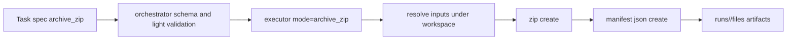
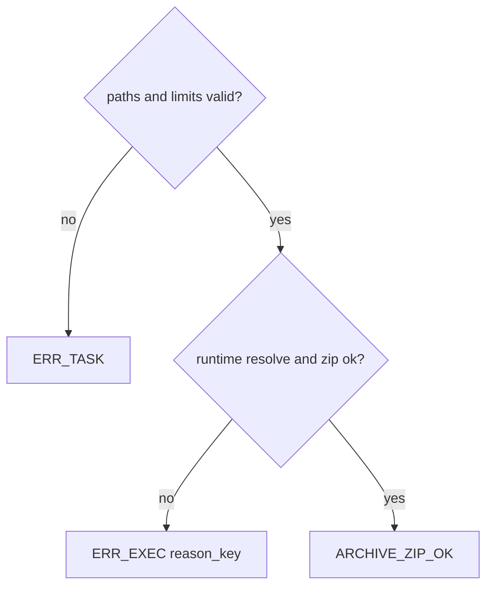

# Design: design_20260225_task_archive_zip

- Status: Approved
- Owner: Codex
- Created: 2026-02-25
- Updated: 2026-02-25
- Scope: Task kind archive_zip (safe zip bundling to run artifacts)

## Context
- Problem: there is no first-class task to bundle workspace outputs into a single deliverable archive with machine-verifiable metadata.
- Goal: add `archive_zip` that safely gathers workspace files and writes zip + manifest under `runs/<run_id>/files/`.
- Non-goals: workspace-external read, symlink escape behavior, encrypted zip.

## Design diagram

## Whiteboard impact
- Now: Before: output handoff required ad-hoc file collection. After: `archive_zip` provides one-step archive + manifest output.
- DoD: Before: no stable archive contract. After: zip and manifest are acceptance-verifiable via `artifact_exists` and `artifact_json_pointer_*`.
- Blockers: none.
- Risks: glob/symlink/limit handling can regress path safety if checks drift between orchestrator and executor.

## Multi-AI participation plan
- Reviewer:
  - Request: validate path safety and error contract (`ERR_TASK` vs `ERR_EXEC`) coherence.
  - Expected output format: findings with severity and file path.
- QA:
  - Request: validate 3 e2e cases (success/path_ng/invalid_ng) and regression (`e2e:auto`, `e2e:auto:strict`).
  - Expected output format: command + result evidence.
- Researcher:
  - Request: validate manifest shape and operational audit value.
  - Expected output format: noted/approved + short rationale.
- External AI:
  - Request: optional for this design; internal roles are primary.
  - Expected output format: optional risk notes.
- external_participation: optional
- external_not_required: true

## Open Decisions
- [x] Runtime-discovered limit exceed is classified as `ERR_EXEC` (not `ERR_TASK`).
- [x] `archive_zip` is supported as top-level command and pipeline step.

### Open Decisions checklist
- [x] Add "Decision 1 Final:" entry with final choice.
- [x] Add "Decision 2 Final:" entry with final choice.

## Final Decisions
- Decision 1 Final: `archive_zip` contract includes `inputs[]`, `output.zip_path`, `output.manifest_path`, optional `options.follow_symlinks`, and optional `limits`.
- Decision 2 Final: executor emits machine-readable failure details (`reason_key`, `failed_path`, `stderr_sample`, `tool_exit_code`, `note`) and `ARCHIVE_ZIP_OK` on success.

## Discussion summary
- Keep output path contract strict: artifacts are always relative entries under run files, no absolute outputs.
- Path and input validation is enforced in both schema/light validation and executor runtime containment checks.
- Pipeline compatibility is required so archive can be final bundling step after `file_write`/`patch_apply`.

## Plan
1. Update schema and SSOT for `archive_zip`.
2. Implement orchestrator validation/dispatch and executor `archive_zip`.
3. Add 3 E2E templates and scripts.
4. Run gate/whiteboard/build/e2e/docs/smoke.

## Risks
- Risk: wildcard input matching may include unexpected files.
  - Mitigation: workspace-relative normalization + containment check + explicit limits.

## Test Plan
- `e2e:auto:archive_zip:json` => success.
- `e2e:auto:archive_zip_path_ng` => expected NG (`ERR_TASK`).
- `e2e:auto:archive_zip_invalid_ng` => expected NG (`ERR_TASK`).
- Regression: `e2e:auto`, `e2e:auto:strict`, `docs:check:json`, `ci:smoke:gate:json`.

## Reviewed-by
- Reviewer / codex-review / 2026-02-25 / approved
- QA / codex-qa / 2026-02-25 / approved
- Researcher / codex-research / 2026-02-25 / noted

## External Reviews
- optional / external_not_required=true
