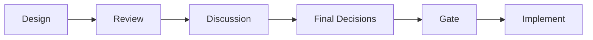
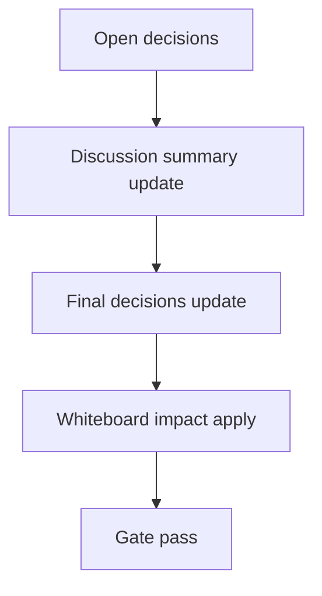

# Design: design_20260225_ui_discord_build_hardening

- Status: Approved
- Owner: Codex
- Created: 2026-02-25
- Updated: 2026-02-25
- Scope: UI Discord build hardening + smoke

## Context
- Problem: `apps/ui_discord` の依存取得が環境差で不安定で、smoke で build 可否を機械判定できない。
- Goal: lockfile 固定 + `npm ci` 導線 + `ui_build_smoke` + `ci_smoke_gate` additive 判定で再現性を上げる。
- Non-goals: UI機能変更、orchestrator/executor 契約変更。

## Design diagram

## Whiteboard impact
- Now: Before: UI build は手動確認依存。 After: `ui_build_smoke` で pass/fail/skip を JSON 化して gate で確認可能。
- DoD: Before: install/build 差分が再現しにくい。 After: lockfile + `npm ci --prefer-offline` で再現性向上。
- Blockers: 低速/閉域ネットワーク。
- Risks: 初回 `npm ci` の時間超過。

## Multi-AI participation plan
- Reviewer:
  - Request:
  - Expected output format:
- QA:
  - Request:
  - Expected output format:
- Researcher:
  - Request:
  - Expected output format:
- External AI:
  - Request: なし（optional）
  - Expected output format: なし
- external_participation: optional
- external_not_required: true

## Open Decisions
- [x] Decision 1
- [x] Decision 2

### Open Decisions checklist
- [x] Add "Decision 1 Final:" entry with final choice.
- [x] Add "Decision 2 Final:" entry with final choice.

## Final Decisions
- Decision 1 Final: `tools/ui_build_smoke.ps1` を追加し、`npm ci --no-audit --no-fund --prefer-offline` と `npm run ui:build` を実行する。
- Decision 2 Final: `REGION_AI_SKIP_UI_BUILD=1` なら gate で skip 許容し、`ui_build_passed=true` 扱いの additive フィールドを返す。

## Discussion summary
- Change 1: `ui_discord` build の不確定要素を lockfile と local npm cache で吸収する。
- Change 2: smoke への組込みは additive フィールドのみで既存 consumer 互換を維持する。

## Plan
1. lockfile 生成と `npm ci` 導線統一。
2. `ui_build_smoke.ps1` 実装。
3. `ci_smoke_gate.ps1` へ `ui_build_passed` 追加。
4. docs 更新と smoke 検証。

## Risks
- Risk: install timeout
  - Mitigation: `npm_config_cache` を workspace 配下に固定し、skip 環境変数で救済。

## Test Plan
- Smoke: `powershell -File tools/ui_build_smoke.ps1 -Json`
- Gate: `npm.cmd run ci:smoke:gate:json`

## Reviewed-by
- Reviewer / codex-review / 2026-02-25 / approved
- QA / codex-qa / 2026-02-25 / approved
- Researcher / codex-research / 2026-02-25 / approved

## External Reviews
- none / not_required
