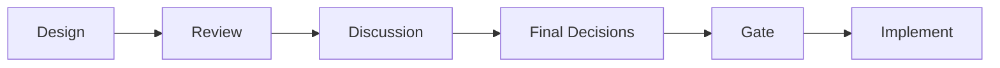
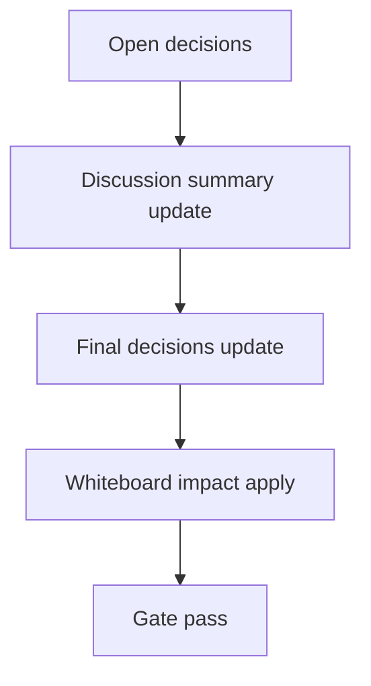

# Design: design_20260226_desktop_bridge_v1

- Status: Approved
- Owner: Codex
- Created: 2026-02-25
- Updated: 2026-02-25
- Scope: Desktop bridge v1: focus/paste/capture + hardening

## Context
- Problem: Desktop shell の bridge 操作が最小実装のままで、copy/paste/capture の運用信頼性と安全制約が不足している。
- Goal: Focus/Paste/Capture を実用化し、copy ソース優先順位・session partition・allowlist を固定する。
- Non-goals: 自動送信、自動スクレイプ、複雑なDOMセレクタ依存実装。

## Design diagram

## Whiteboard impact
- Now: Before: bridge は clipboard 直接依存で copy/capture の整合性が弱い。 After: copyソース優先順位と ui_api 保存で運用導線を安定化する。
- DoD: Before: security hardening が部分的。 After: chatgpt view の allowlist + partition + sandbox を固定する。
- Blockers: オフライン環境で desktop 依存取得が不安定。
- Risks: ChatGPT 側仕様変化で `insertText` が効かないケース。

## Multi-AI participation plan
- Reviewer:
  - Request: bridge API と安全制約（allowlist/partition）の妥当性レビュー。
  - Expected output format: severity付き箇条書き。
- QA:
  - Request: smoke skip/非skip の判定一貫性と回帰確認。
  - Expected output format: command + expected result。
- Researcher:
  - Request: capture 保存方式（ui_api連携）の将来拡張性評価。
  - Expected output format: リスク/代替案。
- External AI:
  - Request: なし（optional）
  - Expected output format: なし
- external_participation: optional
- external_not_required: true

## Open Decisions
- [x] Decision 1
- [x] Decision 2

### Open Decisions checklist
- [x] Add "Decision 1 Final:" entry with final choice.
- [x] Add "Decision 2 Final:" entry with final choice.

## Final Decisions
- Decision 1 Final: bridge API は `window.bridge` とし、`copyFor/focus/pasteToChatGPT/captureSelectionFromChatGPT` に統一する。
- Decision 2 Final: capture は `ui_api` の `/api/chat/threads/external/messages` へ保存し、失敗時のみローカルJSONLへフォールバックする。

## Discussion summary
- Change 1: paste は `insertText` 優先、失敗時 `focus+paste` のフォールバックでDOM依存を抑える。
- Change 2: chatgpt pane の navigation は allowlist外をブロックし `shell.openExternal` に逃がす。

## Plan
1. bridge bar + preload API + IPC を v1 に更新。
2. capture の ui_api 保存と fallback を追加。
3. allowlist/partition/smoke(--smoke) を強化。
4. docs と smoke を更新して gate 確認。

## Risks
- Risk: ChatGPT 入力欄に対する貼り付け挙動の差異
  - Mitigation: `insertText` と `paste` の二段フォールバックにする。

## Test Plan
- Smoke: `tools/desktop_smoke.ps1 -Json`（skipあり/なし）
- Gate: `npm.cmd run ci:smoke:gate:json`

## Reviewed-by
- Reviewer / codex-review / 2026-02-25 / approved
- QA / codex-qa / 2026-02-25 / approved
- Researcher / codex-research / 2026-02-25 / approved

## External Reviews
- none / not_required
