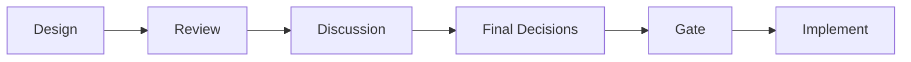
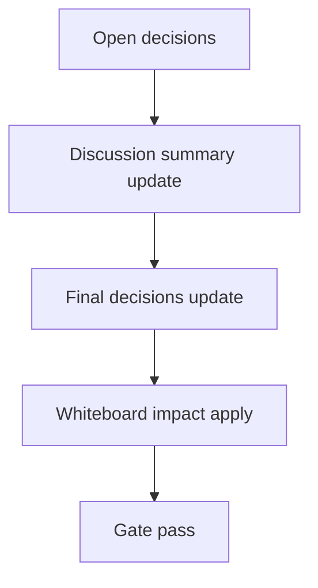

# Design: design_20260226_desktop_bridge_v2_test_harness

- Status: Approved
- Owner: Codex
- Created: 2026-02-25
- Updated: 2026-02-25
- Scope: Desktop bridge v2: test harness + selection handoff

## Context
- Problem: Desktop bridge の回帰確認が外部サイト依存で不安定。さらに copy の入力源がDOM選択依存で揺れる。
- Goal: ローカル偽Chatページでネット不要 smoke を実現し、ui_discord 選択メッセージを postMessage 経由で bridge に固定連携する。
- Non-goals: 自動送信、外部ページスクレイピング強化。

## Design diagram

## Whiteboard impact
- Now: Before: desktop smoke はネット/外部サイト依存が残る。 After: `REGION_AI_CHAT_URL=file://.../test_chat.html` でローカル決定的 smoke にする。
- DoD: Before: copy 入力元が不安定。 After: `regionai:selected` payload を最優先して bridge copy の再現性を上げる。
- Blockers: Electron 依存が未取得の環境。
- Risks: BrowserView 間メッセージ伝播の実装ずれ。

## Multi-AI participation plan
- Reviewer:
  - Request: BrowserView/message-bridge 経路と安全設定の整合確認。
  - Expected output format: severity付き箇条書き。
- QA:
  - Request: skipなし desktop smoke 判定の再現性確認。
  - Expected output format: コマンドと期待結果。
- Researcher:
  - Request: UI選択payload構造の将来互換性評価。
  - Expected output format: リスク/提案。
- External AI:
  - Request: なし（optional）
  - Expected output format: なし
- external_participation: optional
- external_not_required: true

## Open Decisions
- [x] Decision 1
- [x] Decision 2

### Open Decisions checklist
- [x] Add "Decision 1 Final:" entry with final choice.
- [x] Add "Decision 2 Final:" entry with final choice.

## Final Decisions
- Decision 1 Final: 右ペインURLは `REGION_AI_CHAT_URL` 優先、未指定時は `https://chatgpt.com`。smokeは `file://.../test_chat.html` を使用する。
- Decision 2 Final: `ui_discord` が `window.postMessage({type:'regionai:selected', payload})` を発火し、desktop側で保持した payload を copy 最優先入力にする。

## Discussion summary
- Change 1: capture/paste の自己検証を `--smoke` で main 側に実装し、テストページで完結させる。
- Change 2: allowlist は維持しつつローカル `file://test_chat.html` のみ明示許可する。

## Plan
1. test_chat.html と chat URL 切替実装。
2. smoke自己検証フロー（focus/paste/capture）を main に追加。
3. ui_discord selected payload postMessage と desktop 保持連携。
4. desktop_smoke/ci_smoke_gate/dcos を更新して検証。

## Risks
- Risk: BrowserView preload 追加時の互換性
  - Mitigation: shell preload と分離した region preload を最小責務で追加する。

## Test Plan
- Smoke: `tools/desktop_smoke.ps1 -Json`（skipなし・ローカルchat）
- Gate: `npm.cmd run ci:smoke:gate:json`

## Reviewed-by
- Reviewer / codex-review / 2026-02-25 / approved
- QA / codex-qa / 2026-02-25 / approved
- Researcher / codex-research / 2026-02-25 / approved

## External Reviews
- none / not_required
