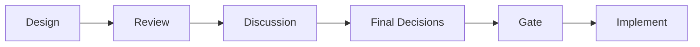
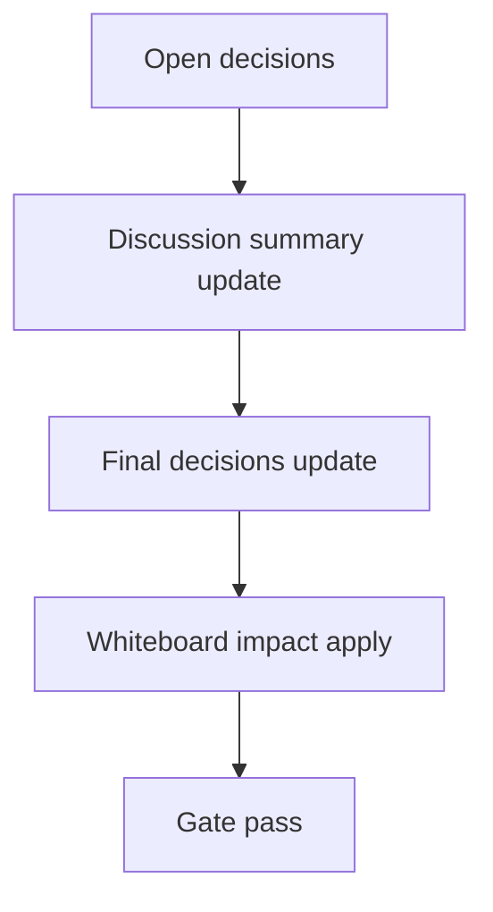

# Design: design_20260226_desktop_bridge_v3_confirm_send

- Status: Approved
- Owner: Codex
- Created: 2026-02-25
- Updated: 2026-02-25
- Scope: Desktop bridge v3: confirm send + safe DOM hook

## Context
- Problem: Bridge v2 は copy/focus/paste/capture までで、送信は最終的にユーザー手動。反復運用でクリック数が多い。
- Goal: Send(confirm) を追加し、安全な DOM hook を試行しつつ失敗時は必ず focus+paste にフォールバックする。
- Non-goals: 応答自動取得、長文分割、完全自動送信。

## Design diagram

## Whiteboard impact
- Now: Before: bridge send は手作業固定。 After: confirm付き送信で半自動化し、失敗時の手動導線を保持。
- DoD: Before: DOM依存失敗時の挙動が不明確。 After: fallback reason をUI表示し、paste完了まで保証。
- Blockers: 外部サイトDOM変更。
- Risks: ChatGPT本番で send hook が不安定。

## Multi-AI participation plan
- Reviewer:
  - Request: send hook/fallback の安全性と責務分離レビュー。
  - Expected output format: severity付き箇条書き。
- QA:
  - Request: test harness で confirm send が機械判定できるか確認。
  - Expected output format: command/result。
- Researcher:
  - Request: DOM hook 劣化時の運用継続性評価。
  - Expected output format: リスク/代替案。
- External AI:
  - Request: なし（optional）
  - Expected output format: なし
- external_participation: optional
- external_not_required: true

## Open Decisions
- [x] Decision 1
- [x] Decision 2

### Open Decisions checklist
- [x] Add "Decision 1 Final:" entry with final choice.
- [x] Add "Decision 2 Final:" entry with final choice.

## Final Decisions
- Decision 1 Final: `sendToChatGPT` は `insertText -> safe DOM hook -> success check` の順で試し、失敗時 `focus+paste` へフォールバックする。
- Decision 2 Final: `Send(confirm)` は shell modal で明示確認し、`--smoke` 時のみ auto-accept 相当で自己検証を実行する。

## Discussion summary
- Change 1: 本番サイト依存を減らすため test harness を first-class として send 成功判定を安定化する。
- Change 2: UIへ `sent/failed/fallback` を返し、失敗時の手動送信導線を常に表示する。

## Plan
1. shell に Send(confirm) modal を追加。
2. main/preload に `sendToChatGPT` と resolve API を追加。
3. smoke 自己検証を send 中心に更新。
4. docs/smoke/gate を確認。

## Risks
- Risk: DOM hook 誤動作
  - Mitigation: hook 失敗時に必ず fallback し、reason を返却。

## Test Plan
- Smoke: `tools/desktop_smoke.ps1 -Json`（test harness send 成功判定）
- Gate: `npm.cmd run ci:smoke:gate:json`

## Reviewed-by
- Reviewer / codex-review / 2026-02-25 / approved
- QA / codex-qa / 2026-02-25 / approved
- Researcher / codex-research / 2026-02-25 / approved

## External Reviews
- none / not_required
