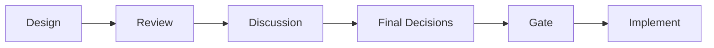
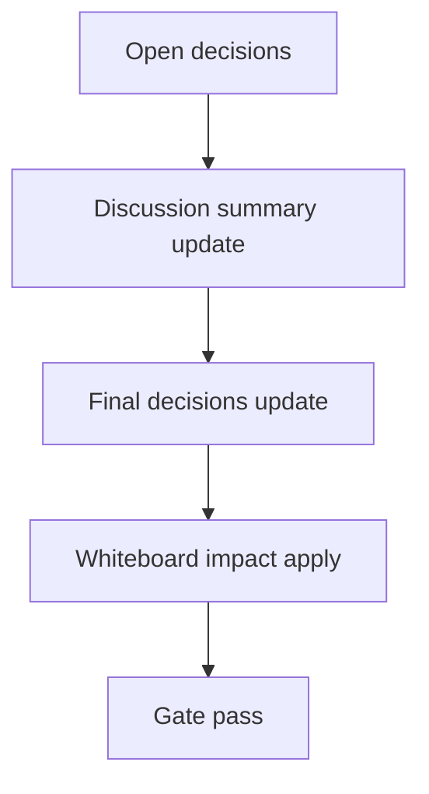

# Design: design_20260226_desktop_bridge_v4_capture_last

- Status: Approved
- Owner: Codex
- Created: 2026-02-25
- Updated: 2026-02-25
- Scope: Desktop bridge v4: capture last assistant + auto-save

## Context
- Problem: Bridge は selection capture には対応済みだが、「直近返信1件」をワンクリックで取り込めない。
- Goal: Capture last assistant を追加し、ui_api 保存と JSONL fallback で堅牢に取り込む。
- Non-goals: 常時監視、複数返信の完全解析。

## Design diagram

## Whiteboard impact
- Now: Before: capture は手動選択依存。 After: 直近assistant返信を best-effort で自動抽出できる。
- DoD: Before: 外部DOM依存は失敗時の導線が弱い。 After: capture last 失敗時は selection fallback を明示する。
- Blockers: ChatGPT DOM 変更。
- Risks: 本番DOMで抽出不一致。

## Multi-AI participation plan
- Reviewer:
  - Request: capture-last 抽出戦略（selector数制限）と fallback 妥当性を確認。
  - Expected output format: severity付き箇条書き。
- QA:
  - Request: test harness で capture-last が 100% 検証可能か確認。
  - Expected output format: command/result。
- Researcher:
  - Request: 保存payloadの将来互換性評価。
  - Expected output format: リスク/提案。
- External AI:
  - Request: なし（optional）
  - Expected output format: なし
- external_participation: optional
- external_not_required: true

## Open Decisions
- [x] Decision 1
- [x] Decision 2

### Open Decisions checklist
- [x] Add "Decision 1 Final:" entry with final choice.
- [x] Add "Decision 2 Final:" entry with final choice.

## Final Decisions
- Decision 1 Final: Capture last は `test_harness selector -> 本番候補2-3個` の順で最小DOM hookとする。
- Decision 2 Final: 取得成功時は ui_api 保存を優先し、失敗時 JSONL fallback。取得失敗時は `mode=fallback_selection` を返す。

## Discussion summary
- Change 1: smoke は `send -> captureLastAssistant` を実行し `test_harness_capture_last` モードで判定する。
- Change 2: 長文は16KB capで保存し、truncation note を links に付与する。

## Plan
1. test_chat assistant log 拡張。
2. main/preload/shell に capture-last API/UI追加。
3. smoke 自己検証を capture-last基準へ更新。
4. docs/gate/smoke を確認。

## Risks
- Risk: 本番DOM候補の劣化
  - Mitigation: selector数を絞り、失敗時 selection fallback へ即時切替。

## Test Plan
- Smoke: `tools/desktop_smoke.ps1 -Json`
- Gate: `npm.cmd run ci:smoke:gate:json`

## Reviewed-by
- Reviewer / codex-review / 2026-02-25 / approved
- QA / codex-qa / 2026-02-25 / approved
- Researcher / codex-research / 2026-02-25 / approved

## External Reviews
- none / not_required
