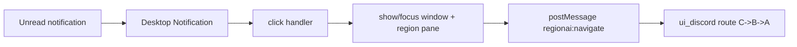
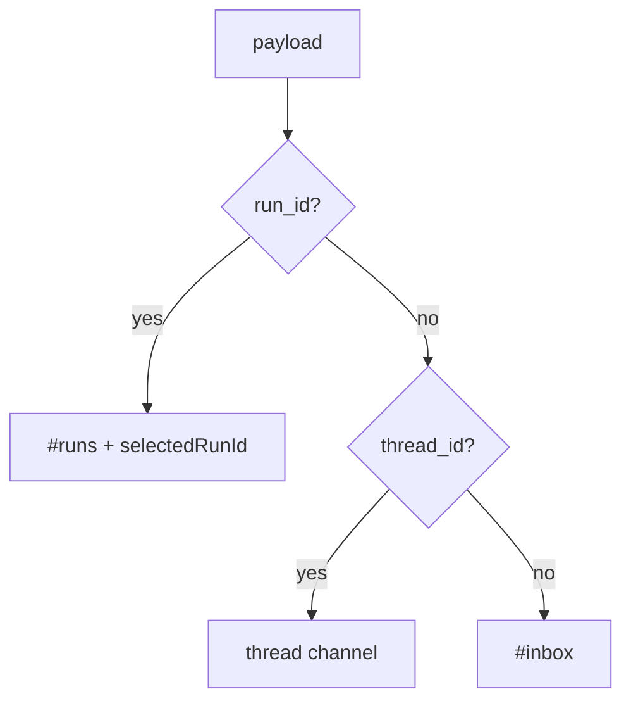

# Design: design_20260226_desktop_notify_deeplink_v1

- Status: Approved
- Owner: Codex
- Created: 2026-02-26
- Updated: 2026-02-26
- Scope: Desktop notify click deep-link to ui_discord

## Context
- Problem: Notification click only focuses ChatGPT pane and does not navigate ui_discord context.
- Goal: Clicking desktop notification brings app front and deep-links ui_discord by priority C->B->A (`run_id` -> `thread_id` -> `inbox`).
- Non-goals: Complex cross-window routing protocol, guaranteed scroll-to-message behavior.

## Design diagram

## Whiteboard impact
- Now: Before: notification click only focuses app without context jump. After: click deep-links to run/thread/inbox target automatically.
- DoD: Before: user manually locates related run or thread after notification. After: app foreground + route jump works by deterministic fallback order.
- Blockers: none.
- Risks: postMessage delivery may fail if view is not ready; must fail-safe without crash.

## Multi-AI participation plan
- Reviewer:
  - Request: Validate deep-link payload mapping and additive safety in desktop shell.
  - Expected output format: bullets with regressions and risk.
- QA:
  - Request: Validate smoke can assert deep-link handler execution without GUI flakiness.
  - Expected output format: bullets with deterministic checks and gaps.
- Researcher:
  - Request: Validate UI navigation listener does not conflict with existing message bus usage.
  - Expected output format: bullets with compatibility concerns.
- External:
  - Request: Not required for this local desktop integration.
  - Expected output format: n/a
- external_participation: optional
- external_not_required: true

## Open Decisions
- [x] Decision 1: whether to add tray fallback for last notification target.
- [x] Decision 2: smoke assertion strategy when electron deps unavailable.

### Open Decisions checklist
- [x] Add "Decision 1 Final:" entry with final choice.
- [x] Add "Decision 2 Final:" entry with final choice.

## Final Decisions
- Decision 1 Final: add tray item `Open last notification target` as best-effort fallback.
- Decision 2 Final: smoke logs deep-link self-check in `test_harness_capture_last`; fallback mode remains acceptable in dependency-limited env.

## Discussion summary
- Desktop notification click produces structured payload and calls `handleDeepLink(payload)`.
- `handleDeepLink` foregrounds window, focuses region view, and sends `window.postMessage({type:'regionai:navigate'})` into ui_discord.
- App.tsx adds listener and applies C->B->A routing with no changes to existing APIs.

## Plan
1. Finalize design and gate.
2. Implement deep-link handler + payload in desktop shell.
3. Implement `regionai:navigate` receiver in ui_discord.
4. Update runbook and smoke checks.

## Risks
- Risk: executeJavaScript postMessage can throw when view not ready.
  - Mitigation: catch/log and continue without crashing notification flow.
- Risk: unknown thread IDs route badly.
  - Mitigation: fallback to `#inbox` when thread is not a known chat channel.

## Test Plan
- Unit-ish: `node --check apps/ui_desktop_electron/main.cjs`.
- E2E: desktop smoke logs `deep_link_ok=true` and target route; UI/build/gate smoke remain green.

## Reviewed-by
- Reviewer / Codex / 2026-02-26 / approved
- QA / Codex / 2026-02-26 / approved
- Researcher / Codex / 2026-02-26 / noted

## External Reviews
- n/a / skipped
