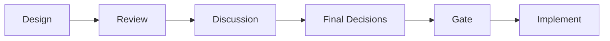
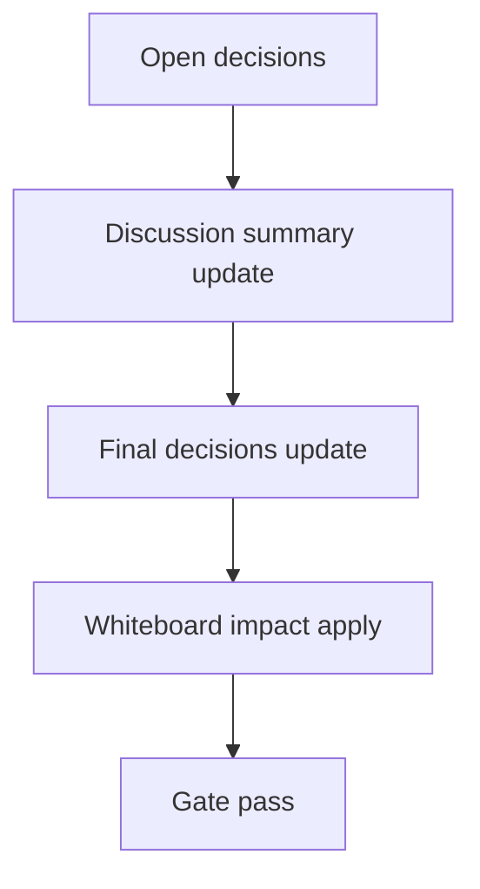

# Design: design_20260226_desktop_shell_chatgpt_bridge

- Status: Approved
- Owner: Codex
- Created: 2026-02-25
- Updated: 2026-02-25
- Scope: Desktop shell: Discord UI + ChatGPT bridge

## Context
- Problem: Browser と region_ai UI を行き来しながら手動キャッチボールする運用コストが高い。
- Goal: Electron shell で RegionAI UI と ChatGPT を同居し、Clipboard Bridge で受け渡しを 1 アクション化する。
- Non-goals: 自動送信/自動取得、認証制御、スクレイピング。

## Design diagram

## Whiteboard impact
- Now: Before: UI と ChatGPT が別アプリで文脈移動が多い。 After: 単一ウィンドウで split/tab 連携できる。
- DoD: Before: APIなし運用は転記ミスが発生しやすい。 After: bridge bar で copy/focus/paste/capture を定型化する。
- Blockers: Electron 依存の初回インストール。
- Risks: 外部サイト navigation の安全性。

## Multi-AI participation plan
- Reviewer:
  - Request:
  - Expected output format:
- QA:
  - Request:
  - Expected output format:
- Researcher:
  - Request:
  - Expected output format:
- External AI:
  - Request: なし（optional）
  - Expected output format: なし
- external_participation: optional
- external_not_required: true

## Open Decisions
- [x] Decision 1
- [x] Decision 2

### Open Decisions checklist
- [x] Add "Decision 1 Final:" entry with final choice.
- [x] Add "Decision 2 Final:" entry with final choice.

## Final Decisions
- Decision 1 Final: `apps/ui_desktop_electron` を新規追加し、main process で RegionAI pane + ChatGPT pane + bridge bar を構成する。
- Decision 2 Final: desktop smoke は additive とし、`REGION_AI_SKIP_DESKTOP=1` で skip 可能にする。

## Discussion summary
- Change 1: DOM セレクタ依存を避け、MVP は clipboard 管理と focus 移譲に限定する。
- Change 2: ChatGPT pane は `nodeIntegration=false/contextIsolation=true/sandbox=true` で固定する。

## Plan
1. Electron MVP scaffold 追加。
2. bridge IPC と allowlist 制御実装。
3. desktop scripts + smoke 追加。
4. docs/smoke 検証。

## Risks
- Risk: ChatGPT 側 DOM 変更
  - Mitigation: 自動送信しない設計に固定し、paste はユーザー操作前提にする。

## Test Plan
- Smoke: `powershell -File tools/desktop_smoke.ps1 -Json`
- Gate: `npm.cmd run ci:smoke:gate:json`

## Reviewed-by
- Reviewer / codex-review / 2026-02-25 / approved
- QA / codex-qa / 2026-02-25 / approved
- Researcher / codex-research / 2026-02-25 / approved

## External Reviews
- none / not_required
