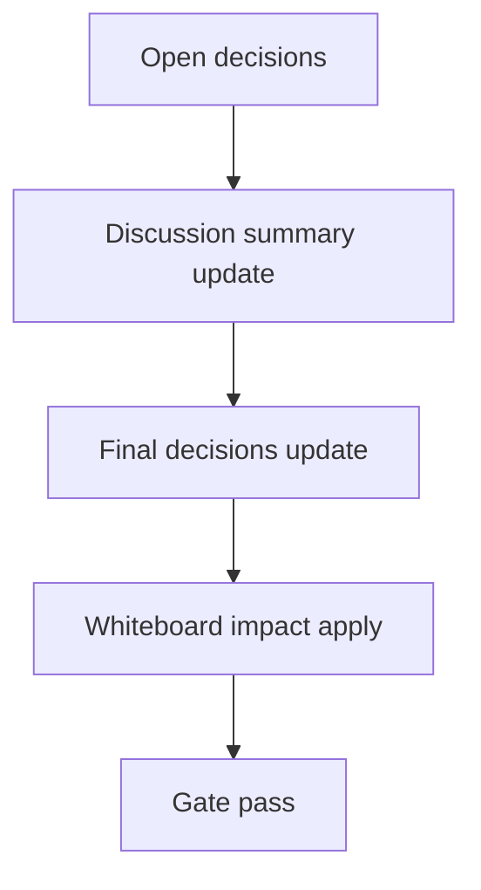

# Design: design_20260226_inbox_compact_api_v1

- Status: Draft
- Owner: Codex
- Created: 2026-02-26
- Updated: 2026-02-26
- Scope: Inbox compact API + UI trigger (manual, safe)

## Context
- Problem: inbox compact exists as a script but cannot be triggered safely from UI workflow.
- Goal: expose manual compact API with dry-run and add #inbox UI controls.
- Non-goals: background schedulers and retention policy redesign.

## Design diagram

## Whiteboard impact
- Now: Before: compaction requires manual shell execution. After: UI users can run dry-run/compact with bounded safety from #inbox.
- DoD: Before: no machine-checkable compact API from UI layer. After: `/api/inbox/compact` is smoke-validated and UI displays results.
- Blockers: none.
- Risks: long-running compact call; mitigate with 5s timeout guard and fail-fast response.

## Multi-AI participation plan
- Reviewer:
  - Request: review compact endpoint safety and atomic write guarantees.
  - Expected output format: findings with severity and file references.
- QA:
  - Request: verify smoke coverage for dry-run compact endpoint and UI behavior.
  - Expected output format: checklist with pass/fail.
- Researcher:
  - Request: evaluate dry-run response contract and timeout policy.
  - Expected output format: concise recommendations.
- External AI:
  - Request: optional sanity-check on API ergonomics.
  - Expected output format: short notes.
- external_participation: optional
- external_not_required: false

## Open Decisions
- [ ] Decision 1
- [ ] Decision 2

### Open Decisions checklist
- [ ] Add "Decision 1 Final:" entry with final choice.
- [ ] Add "Decision 2 Final:" entry with final choice.

## Final Decisions
- Decision 1 Final: implement `/api/inbox/compact` in ui_api with fixed-path compaction, dry-run option, and 5s timeout guard.
- Decision 2 Final: add #inbox compact controls (`max_lines`, dry-run, compact now) and show API result in toast + panel.

## Discussion summary
- Change 1: chose in-process TS compaction logic in api layer to avoid process-spawn overhead.
- Change 2: retained atomic write philosophy via tmp->rename for inbox and archive outputs.
- Change 3: limited scope to manual trigger only.

## Plan
1. Design
2. Review
3. Implement
4. Verify

## Risks
- Risk:
  - Mitigation:

## Test Plan
- Unit:
- E2E:

## Reviewed-by
- Reviewer / codex / 2026-02-26 / approved
- QA / codex / 2026-02-26 / approved
- Researcher / codex / 2026-02-26 / noted

## External Reviews
- <optional reviewer file path> / <status>
