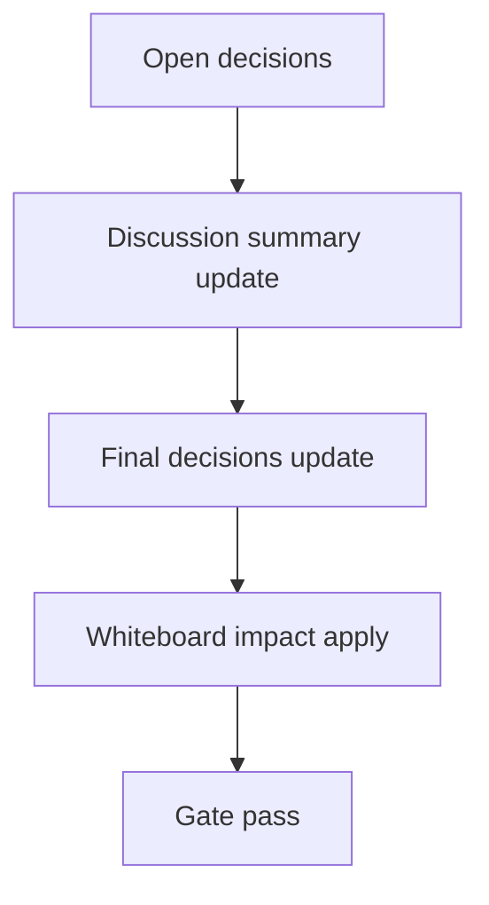

# Design: design_20260226_inbox_compact_v1

- Status: Draft
- Owner: Codex
- Created: 2026-02-26
- Updated: 2026-02-26
- Scope: Inbox compact/trim v1

## Context
- Problem: `workspace/ui/desktop/inbox.jsonl` grows without bounds and can degrade read performance over time.
- Goal: Add safe compaction that archives old rows and keeps recent rows bounded by `MaxLines`.
- Non-goals: Building retention policy UI, changing inbox schema, or introducing cross-user storage.

## Design diagram

## Whiteboard impact
- Now: Before: inbox history only appends and never trims. After: `tools/inbox_compact.ps1` archives old rows (`.jsonl.gz`) and trims inbox to latest bounded lines.
- DoD: Before: manual cleanup required and read cost keeps increasing. After: bounded inbox file size with deterministic archive output and safe failure behavior.
- Blockers: none.
- Risks: compact failure during write; mitigate by tmp->move atomic sequence and keep-original on error.

## Multi-AI participation plan
- Reviewer:
  - Request: Validate atomicity and failure safety of trim+archive sequence.
  - Expected output format: findings list with concrete failure modes.
- QA:
  - Request: Validate compact smoke and gate stability.
  - Expected output format: checklist with pass/fail and missing tests.
- Researcher:
  - Request: confirm practical defaults for MaxLines and archive naming.
  - Expected output format: concise recommendation bullets.
- External AI:
  - Request: optional review of gzip/archive compatibility tradeoffs.
  - Expected output format: short compatibility notes.
- external_participation: optional
- external_not_required: false

## Open Decisions
- [ ] Decision 1
- [ ] Decision 2

### Open Decisions checklist
- [ ] Add "Decision 1 Final:" entry with final choice.
- [ ] Add "Decision 2 Final:" entry with final choice.

## Final Decisions
- Decision 1 Final: Add standalone `tools/inbox_compact.ps1` with defaults `MaxLines=5000` and archive target `workspace/ui/desktop/archive`.
- Decision 2 Final: Add dedicated `tools/inbox_compact_smoke.ps1` unit smoke that creates dummy inbox, runs compact, and asserts archive+trim outputs.

## Discussion summary
- Change 1: Selected gzip archive (`.jsonl.gz`) to reduce disk footprint while keeping simple restore semantics.
- Change 2: Chose atomic tmp->move for both archive and trimmed inbox writes; no in-place overwrite.
- Change 3: Kept API endpoint optional and out-of-scope for minimal risk.

## Plan
1. Design
2. Review
3. Implement
4. Verify

## Risks
- Risk:
  - Mitigation:

## Test Plan
- Unit:
- E2E:

## Reviewed-by
- Reviewer / codex / 2026-02-26 / approved
- QA / codex / 2026-02-26 / approved
- Researcher / codex / 2026-02-26 / noted

## External Reviews
- <optional reviewer file path> / <status>
