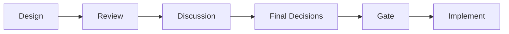
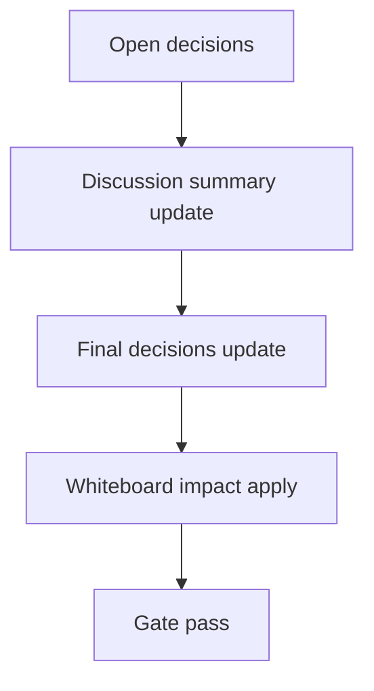

# Design: design_20260226_inbox_filters_bulk_v1

- Status: Draft
- Owner: Codex
- Created: 2026-02-26
- Updated: 2026-02-26
- Scope: Inbox filters + bulk actions v1

## Context
- Problem: #inbox list usability drops as entries increase, and read actions are too coarse.
- Goal: add client-side filters and bulk read actions for faster triage.
- Non-goals: new inbox APIs, server-side filtering, virtualization.

## Design diagram

## Whiteboard impact
- Now: Before: #inbox only supports simple text filtering and mark-all-read. After: #inbox supports mention/thread/source/has_links/search filters and scoped bulk read actions.
- DoD: Before: operators must manually inspect long inbox lists. After: operators can instantly narrow list and mark read for selected scope in one action.
- Blockers: none.
- Risks: read-state semantics remain timestamp-based and may mark broader ranges than visual subset; mitigated by explicit action labels and counts.

## Multi-AI participation plan
- Reviewer:
  - Request: validate filter logic and bulk action correctness.
  - Expected output format: severity findings with file references.
- QA:
  - Request: verify no API regression and smoke stability.
  - Expected output format: deterministic checklist.
- Researcher:
  - Request: evaluate UX defaults for filter panel.
  - Expected output format: concise recommendations.
- External AI:
  - Request: optional UX review for inbox triage ergonomics.
  - Expected output format: short suggestions.
- external_participation: optional
- external_not_required: false

## Open Decisions
- [ ] Decision 1
- [ ] Decision 2

### Open Decisions checklist
- [ ] Add "Decision 1 Final:" entry with final choice.
- [ ] Add "Decision 2 Final:" entry with final choice.

## Final Decisions
- Decision 1 Final: keep filtering client-side in `App.tsx` using existing inbox payload; no new backend endpoint.
- Decision 2 Final: bulk actions reuse existing `/api/inbox/read_state` by posting `last_read_ts` derived from max timestamp in selected set.

## Discussion summary
- Change 1: moved filter controls into right panel for persistent context while browsing list.
- Change 2: added filtered/total counters to make scope explicit before bulk actions.
- Change 3: retained mark-all-read while adding filtered/mentions-only variants.

## Plan
1. Design
2. Review
3. Implement
4. Verify

## Risks
- Risk:
  - Mitigation:

## Test Plan
- Unit:
- E2E:

## Reviewed-by
- Reviewer / codex / 2026-02-26 / approved
- QA / codex / 2026-02-26 / approved
- Researcher / codex / 2026-02-26 / noted

## External Reviews
- <optional reviewer file path> / <status>
