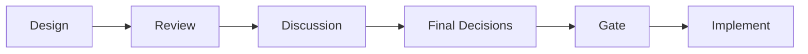
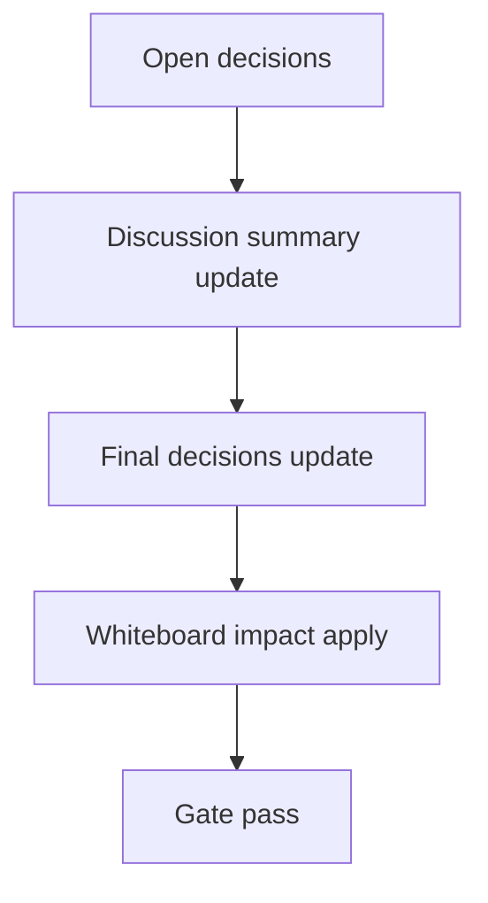

# Design: design_20260226_inbox_integration_v1

- Status: Draft
- Owner: Codex
- Created: 2026-02-26
- Updated: 2026-02-26
- Scope: Inbox integration v1: desktop notifications -> ui_discord channel

## Context
- Problem: Desktop notification events are ephemeral and cannot be audited or triaged from ui_discord.
- Goal: Persist desktop notifications into workspace inbox history and expose read/read-state APIs + #inbox UI channel.
- Non-goals: Reworking mention priority logic, introducing authN/authZ, or implementing virtualized inbox rendering.

## Design diagram

## Whiteboard impact
- Now: Before: desktop notifications are shown only by OS popup and state is not inspectable in UI. After: every emitted desktop notification is appended to `workspace/ui/desktop/inbox.jsonl` and visible in `#inbox`.
- DoD: Before: notification traceability ends at `notify_state` internals. After: operators can read inbox history, mark read state, and jump to thread/run/design from UI.
- Blockers: none expected; local Electron smoke may run in fallback mode when Electron dependency is unavailable.
- Risks: inbox growth and malformed JSONL lines; mitigated via entry-size caps, read-limit caps, and parse-fail skip counters.

## Multi-AI participation plan
- Reviewer:
  - Request: validate API safety, append semantics, and compatibility with existing chat/runs endpoints.
  - Expected output format: severity-ordered findings with file/line references and suggested fixes.
- QA:
  - Request: verify ui_smoke coverage for inbox endpoints/read-state and regression risk in ci gate.
  - Expected output format: deterministic pass/fail checklist with missing-case notes.
- Researcher:
  - Request: confirm minimal JSONL inbox schema and read-state model for future extensibility.
  - Expected output format: concise recommendation list with tradeoffs.
- External AI:
  - Request: optional second-opinion on inbox API pagination/read-state conventions.
  - Expected output format: short compatibility notes.
- external_participation: optional
- external_not_required: false

## Open Decisions
- [ ] Decision 1
- [ ] Decision 2

### Open Decisions checklist
- [ ] Add "Decision 1 Final:" entry with final choice.
- [ ] Add "Decision 2 Final:" entry with final choice.

## Final Decisions
- Decision 1 Final: Desktop app appends one JSONL inbox row per successful notify decision, capped and de-duplicated by `thread_id + msg_id` guard aligned with `notify_state.last_notified`.
- Decision 2 Final: ui_api exposes fixed-path inbox endpoints (`/api/inbox`, `/api/inbox/read_state`) with strict caps and parse-fail tolerance; ui_discord adds `#inbox` with polling and mark-all-read.

## Discussion summary
- Change 1: Added persistent inbox feed to bridge desktop-to-UI observability while keeping existing notify behavior intact.
- Change 2: Chose fixed workspace file paths and no dynamic filename parameters to avoid traversal risk.
- Change 3: Implemented read-state separately from chat unread state to avoid coupling/regression.

## Plan
1. Design
2. Review
3. Implement
4. Verify

## Risks
- Risk:
  - Mitigation:

## Test Plan
- Unit:
- E2E:

## Reviewed-by
- Reviewer / codex / 2026-02-26 / approved
- QA / codex / 2026-02-26 / approved
- Researcher / codex / 2026-02-26 / noted

## External Reviews
- <optional reviewer file path> / <status>
