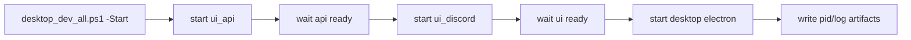
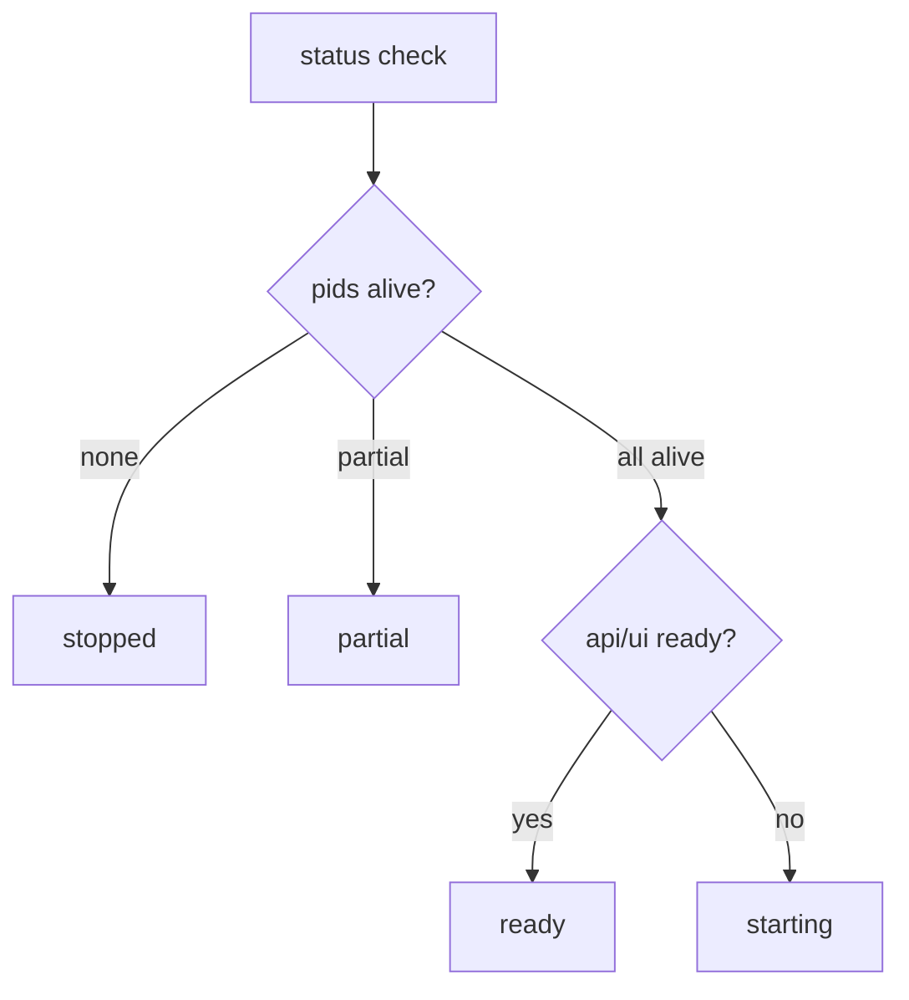

# Design: design_20260226_one_command_dev_launcher

- Status: Approved
- Owner: Codex
- Created: 2026-02-26
- Updated: 2026-02-26
- Scope: One-command dev launcher for ui_api ui_discord desktop

## Context
- Problem: Developers must start three processes manually (ui_api, ui_discord, desktop), and stop/restart is error-prone.
- Goal: Add a single PowerShell launcher with start/stop/status and reproducible PID/log artifacts.
- Non-goals: Production packaging/installer flow, CI-mandatory long-running dev startup.

## Design diagram

## Whiteboard impact
- Now: Before: dev startup requires manual multi-terminal orchestration. After: one command starts api/ui/desktop with readiness checks and PID/log bookkeeping.
- DoD: Before: stop/restart leaves orphan processes and inconsistent state. After: stop is idempotent, reverse-order kill is applied, and status is machine-readable.
- Blockers: none.
- Risks: env-specific npm/electron dependency availability may cause partial start.

## Multi-AI participation plan
- Reviewer:
  - Request: Validate process lifecycle semantics and idempotent stop behavior.
  - Expected output format: bullets with regressions and risk.
- QA:
  - Request: Validate readiness checks and JSON status contract across start/stop/status.
  - Expected output format: bullets with deterministic checks and gaps.
- Researcher:
  - Request: Validate script wiring does not interfere with existing concurrency/run_e2e rules.
  - Expected output format: bullets with compatibility concerns.
- External:
  - Request: Not required for local dev launcher.
  - Expected output format: n/a
- external_participation: optional
- external_not_required: true

## Open Decisions
- [x] Decision 1: whether to use existing start_region_ai scripts.
- [x] Decision 2: whether to start Vite dev server or static build output.

### Open Decisions checklist
- [x] Add "Decision 1 Final:" entry with final choice.
- [x] Add "Decision 2 Final:" entry with final choice.

## Final Decisions
- Decision 1 Final: implement dedicated `desktop_dev_all.ps1` to avoid coupling with executor/run_e2e process model.
- Decision 2 Final: use Vite dev server (`ui:dev`) with fixed host/port; static mode is out-of-scope for v1.

## Discussion summary
- Add `tools/desktop_dev_all.ps1` with `-Start/-Stop/-Status` and one-line JSON contract.
- Persist logs under `data/logs/dev_all_*` and PID snapshot as `data/logs/pids_dev_all_<ts>.txt` + state json pointer.
- Status computes `ready|starting|partial|stopped` from process liveness and readiness endpoints only.

## Plan
1. Finalize design and gate.
2. Implement `desktop_dev_all.ps1` and npm scripts.
3. Update runbook with one-command dev section.
4. Verify with docs/smoke gate.

## Risks
- Risk: stale pid file points to recycled PID.
  - Mitigation: verify command-line/process tree and readiness, not pid only.
- Risk: desktop process may outlive parent cmd process.
  - Mitigation: store root pid and kill descendant tree in stop flow.

## Test Plan
- Unit-ish: run `-Status -Json` without startup and verify `stopped`.
- Smoke: best-effort start/status/stop script available (optional dedicated smoke script).
- Gate: `ci:smoke:gate:json` remains green.

## Reviewed-by
- Reviewer / Codex / 2026-02-26 / approved
- QA / Codex / 2026-02-26 / approved
- Researcher / Codex / 2026-02-26 / noted

## External Reviews
- n/a / skipped
