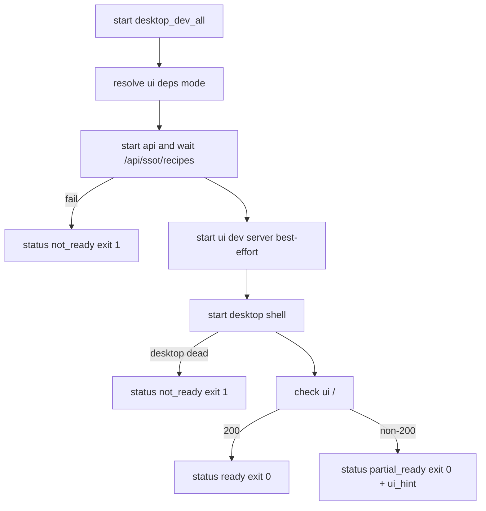
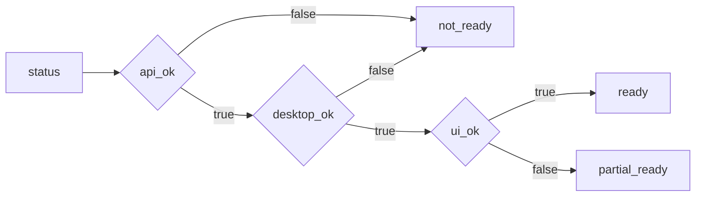

# Design: design_20260226_one_command_dev_launcher_partial_ready

- Status: Approved
- Owner: Codex
- Created: 2026-02-26
- Updated: 2026-02-26
- Scope: desktop_dev_all readiness policy update (API required, UI optional)

## Context
- Problem: `tools/desktop_dev_all.ps1 -Start` treats UI readiness as mandatory and fails with `ui_not_ready` in constrained environments.
- Goal: Make launcher resilient by requiring API + desktop only, while surfacing UI readiness as optional telemetry.
- Non-goals: Changing CI smoke policy for UI quality checks (`ui_build_smoke` remains separate), changing workspace lock behavior.

## Design diagram

## Whiteboard impact
- Now: Before: one-command launcher often fails in no-vite/no-node_modules startup paths. After: launcher reports partial readiness and continues for API+desktop workflows.
- DoD: Before: smoke fails when UI is late or unavailable. After: smoke passes on `ready` or `partial_ready` and only fails on `not_ready`.
- Blockers: none.
- Risks: users may overlook missing UI readiness unless `ui_hint` is explicit.

## Multi-AI participation plan
- Reviewer:
  - Request: confirm status taxonomy and non-breaking JSON expansion.
  - Expected output format: findings list with affected fields and risk.
- QA:
  - Request: confirm smoke pass/fail matrix (`ready`, `partial_ready`, `not_ready`).
  - Expected output format: deterministic scenario matrix.
- Researcher:
  - Request: check telemetry shape compatibility for scripts consuming status JSON.
  - Expected output format: additive compatibility notes.
- External AI:
  - Request: not required.
  - Expected output format: n/a
- external_participation: optional
- external_not_required: true

## Open Decisions
- [x] Decision 1: Should `-Start` return exit 0 when UI is not ready but API+desktop are ready?
- [x] Decision 2: Should smoke pass on `partial_ready`?

### Open Decisions checklist
- [x] Add "Decision 1 Final:" entry with final choice.
- [x] Add "Decision 2 Final:" entry with final choice.

## Final Decisions
- Decision 1 Final: Yes. `status=partial_ready` with `exit_code=0` when `api_ok=true` and `desktop_ok=true` and `ui_ok=false`.
- Decision 2 Final: Yes. `desktop_dev_all_smoke.ps1` treats `ready` and `partial_ready` as pass.

## Discussion summary
- Keep API readiness as strict gate (`api_not_ready` remains failure).
- Keep desktop process liveness as strict gate.
- Make UI readiness optional and provide actionable `ui_hint` when unavailable.
- Add `--strictPort` to UI launch for predictable URL behavior.

## Plan
1. Update `desktop_dev_all.ps1` status and start semantics.
2. Update `desktop_dev_all_smoke.ps1` pass criteria and JSON payload.
3. Update docs and run gate/smoke checks.

## Risks
- Risk: existing consumers may parse old status values only.
  - Mitigation: keep all existing fields, add new statuses additively.
- Risk: partial-ready may mask broken UI dependencies.
  - Mitigation: include `ui_hint` and keep `ui_build_smoke` in gate.

## Test Plan
- Unit-ish: `-Start -Json` returns `partial_ready` with `exit_code=0` when UI is down but API+desktop are alive.
- Smoke: `tools/desktop_dev_all_smoke.ps1 -Json` passes on `ready|partial_ready` and fails on `not_ready`.
- Gate: `npm.cmd run ci:smoke:gate:json` returns exit 0.

## Reviewed-by
- Reviewer / Codex / 2026-02-26 / approved
- QA / Codex / 2026-02-26 / approved
- Researcher / Codex / 2026-02-26 / noted

## External Reviews
- n/a / skipped
