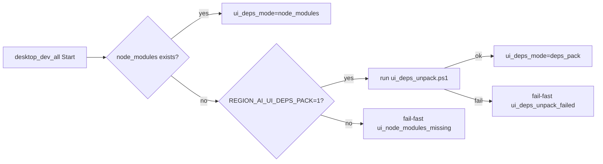
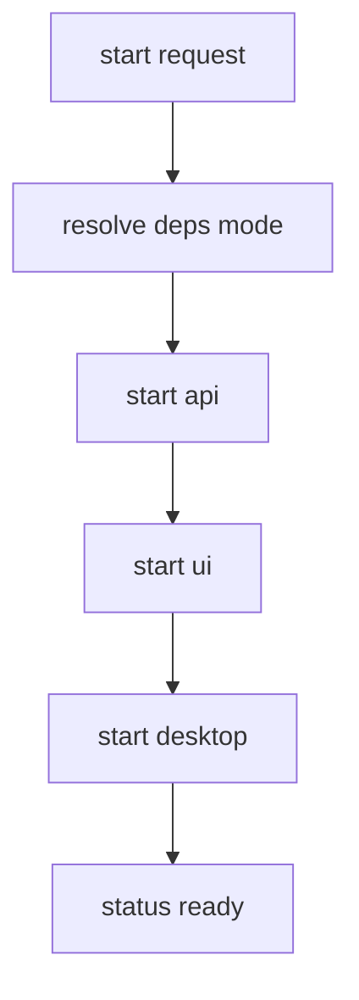

# Design: design_20260226_one_command_dev_launcher_v1_1_deps_resolve

- Status: Approved
- Owner: Codex
- Created: 2026-02-26
- Updated: 2026-02-26
- Scope: desktop_dev_all v1.1 deps resolve via deps-pack

## Context
- Problem: `desktop_dev_all_smoke` fails when `apps/ui_discord/node_modules` is missing.
- Goal: Resolve UI deps via offline deps-pack first, with no implicit `npm ci` by default.
- Non-goals: Changing CI policy to always run long-lived dev launcher, production packaging.

## Design diagram

## Whiteboard impact
- Now: Before: dev launcher fails opaquely in no-node_modules env. After: launcher provides explicit deps resolution path and actionable failure JSON.
- DoD: Before: smoke fails with generic `ui_not_ready`. After: smoke uses deps-pack mode by default and emits clear `failure_reason` when artifacts are missing.
- Blockers: none.
- Risks: unpack can pass hash check but still fail runtime due to environment mismatch.

## Multi-AI participation plan
- Reviewer:
  - Request: Validate fail-fast branches and no implicit npm install behavior.
  - Expected output format: bullets with regressions/risk.
- QA:
  - Request: Validate smoke behavior for both deps-pack available and missing cases.
  - Expected output format: bullets with deterministic checks and gaps.
- Researcher:
  - Request: Validate deps-pack contract compatibility with existing ui_build_smoke flow.
  - Expected output format: bullets with interop concerns.
- External:
  - Request: Not required.
  - Expected output format: n/a
- external_participation: optional
- external_not_required: true

## Open Decisions
- [x] Decision 1: should launcher auto-run npm ci by default.
- [x] Decision 2: smoke default for deps-pack flag.

### Open Decisions checklist
- [x] Add "Decision 1 Final:" entry with final choice.
- [x] Add "Decision 2 Final:" entry with final choice.

## Final Decisions
- Decision 1 Final: no auto npm ci by default; only explicit `REGION_AI_UI_AUTO_NPM_CI=1`.
- Decision 2 Final: smoke sets `REGION_AI_UI_DEPS_PACK=1` by default.

## Discussion summary
- Add deps preflight to `desktop_dev_all.ps1` before ui process start.
- Reuse `tools/ui_deps_unpack.ps1 -Json` when deps-pack mode is enabled.
- Extend JSON outputs with `ui_deps_mode` and `failure_reason`.

## Plan
1. Finalize design and gate.
2. Implement deps preflight + JSON fields in launcher.
3. Update smoke defaults and failure reporting.
4. Run gate/smoke verification.

## Risks
- Risk: explicit auto-ci path becomes slow/flaky.
  - Mitigation: keep opt-in via env only and bounded timeout.
- Risk: missing artifacts remain common.
  - Mitigation: return actionable hint string in fail-fast response.

## Test Plan
- Unit-ish: launcher `-Start -Json` in missing deps path returns `ui_node_modules_missing`.
- Smoke: `desktop_dev_all_smoke.ps1 -Json` succeeds when deps pack artifacts exist.
- Gate: `ci:smoke:gate:json` remains green.

## Reviewed-by
- Reviewer / Codex / 2026-02-26 / approved
- QA / Codex / 2026-02-26 / approved
- Researcher / Codex / 2026-02-26 / noted

## External Reviews
- n/a / skipped
