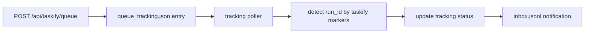
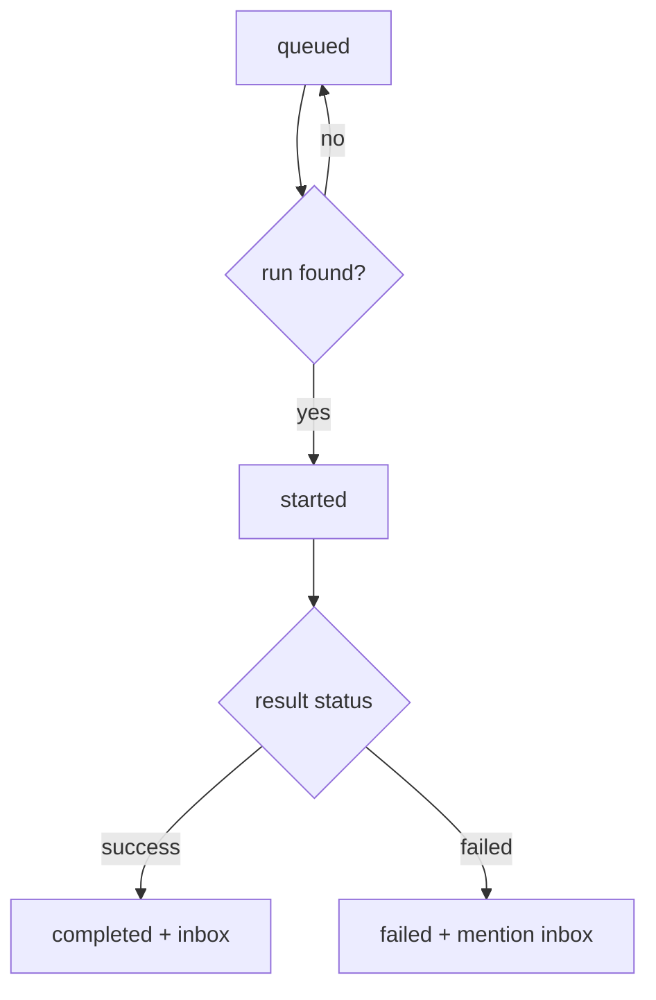

# Design: design_20260226_taskify_queue_tracking_v1

- Status: Approved
- Owner: Codex
- Created: 2026-02-26
- Updated: 2026-02-26
- Scope: Taskify queue tracking to inbox v1

## Context
- Problem: Taskify queue currently returns request_id but does not auto-follow run outcome.
- Goal: Track queued taskify requests and append completion/failure notifications into inbox.
- Non-goals: Real-time streaming status, multi-user permissions, complex retry orchestration.

## Design diagram

## Whiteboard impact
- Now: Before: queue response gives request_id only, no automatic follow-up. After: queue requests are tracked and completion/failure is pushed to #inbox.
- DoD: Before: operator manually inspects runs to know queue outcome. After: tracking state is persisted and inbox receives run-linked notifications when detected.
- Blockers: none.
- Risks: best-effort run matching can miss cases if markers are absent or malformed.

## Multi-AI participation plan
- Reviewer:
  - Request: Verify polling tracker safety, atomic tracking writes, and inbox append behavior.
  - Expected output format: bullets with regressions/risk.
- QA:
  - Request: Verify smoke can deterministically validate tracking-state creation without flaky timing.
  - Expected output format: bullets with missing tests/flaky risk.
- Researcher:
  - Request: Verify marker placement in queued YAML is schema-compatible and robust for matching.
  - Expected output format: bullets with interoperability concerns.
- External:
  - Request: Not required for localhost v1.
  - Expected output format: n/a
- external_participation: optional
- external_not_required: true

## Open Decisions
- [x] Decision 1: whether to require immediate inbox notification in smoke.
- [x] Decision 2: where to store tracking state.

### Open Decisions checklist
- [x] Add "Decision 1 Final:" entry with final choice.
- [x] Add "Decision 2 Final:" entry with final choice.

## Final Decisions
- Decision 1 Final: smoke requires tracking state creation; inbox append is best-effort due to async timing.
- Decision 2 Final: store tracking at `workspace/ui/taskify/queue_tracking.json` as atomic JSON list.

## Discussion summary
- Extend queue response with `tracking_enabled: true` and persist queued request metadata.
- Poller scans queued/started entries and resolves run by marker embedded in queued task YAML.
- On terminal detection, append taskify inbox entry; failure body includes mention token (`@shogun` default, settings token fallback).

## Plan
1. Design + gate.
2. Implement tracking state, queue marker, and poller in ui_api.
3. Add queue status read API and UI status display.
4. Extend ui_smoke with tracking-status check.

## Risks
- Risk: tracker polling loop throws and stops processing.
  - Mitigation: catch/guard each sweep and continue; never crash api server.
- Risk: duplicate inbox entries from repeated detection.
  - Mitigation: track `inbox_notified_at` and only notify once per request.

## Test Plan
- Unit: validate queue tracking record lifecycle queued->started->completed/failed.
- E2E: ui_smoke queues safe draft and checks `/api/taskify/queue/status` returns tracking entry.

## Reviewed-by
- Reviewer / Codex / 2026-02-26 / approved
- QA / Codex / 2026-02-26 / approved
- Researcher / Codex / 2026-02-26 / noted

## External Reviews
- n/a / skipped
