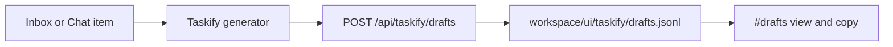
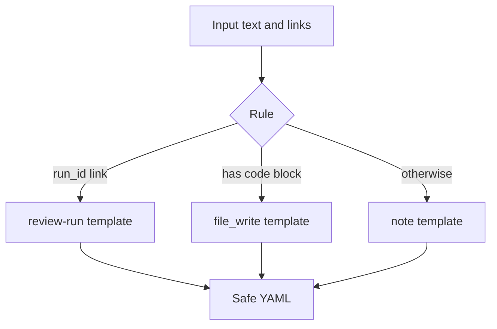

# Design: design_20260226_taskify_v1

- Status: Approved
- Owner: Codex
- Created: 2026-02-26
- Updated: 2026-02-26
- Scope: Taskify v1

## Context
- Problem: There is no fast way to create a valid task YAML from inbox/chat context.
- Goal: Add deterministic and safe Taskify draft generation from inbox/chat items in ui_discord.
- Non-goals: Free-form YAML editing, arbitrary command generation, auth/permission model.

## Design diagram

## Whiteboard impact
- Now: Before: operators manually hand-write task YAML. After: operators can generate and save safe draft YAML from inbox/chat in one click.
- DoD: Before: task authoring is error-prone and slow. After: deterministic templates generate schema-compatible drafts and smoke checks verify API behavior.
- Blockers: none.
- Risks: rule-based template choice may not always match user intent.

## Multi-AI participation plan
- Reviewer:
  - Request: Check API compatibility impact and file/path safety.
  - Expected output format: bullets with risks and regressions.
- QA:
  - Request: Check deterministic behavior and smoke coverage for drafts API.
  - Expected output format: bullets with missing tests and flaky risks.
- Researcher:
  - Request: Check schema compatibility for generated YAML templates.
  - Expected output format: bullets with interoperability concerns.
- External:
  - Request: Not required for this localhost-only v1.
  - Expected output format: n/a
- external_participation: optional
- external_not_required: true

## Open Decisions
- [x] Decision 1: Include queue integration in v1.
- [x] Decision 2: Add dedicated drafts channel in UI.

### Open Decisions checklist
- [x] Add "Decision 1 Final:" entry with final choice.
- [x] Add "Decision 2 Final:" entry with final choice.

## Final Decisions
- Decision 1 Final: Queue integration remains optional; v1 implements draft create/read endpoints and copy flow.
- Decision 2 Final: Add `#drafts` channel with draft list, YAML preview, and copy action.

## Discussion summary
- Add `/api/taskify/drafts` endpoints only; do not modify existing chat/runs/inbox contract behavior.
- Keep storage fixed to `workspace/ui/taskify/drafts.jsonl` with append-only JSONL and robust parse-skip.
- Enforce safe template generation: relative paths only, no shell command fields, and `artifact.mirror_run_meta: true`.

## Plan
1. Design and gate.
2. Implement ui_api Taskify draft endpoints and generator.
3. Implement ui_discord Taskify actions and drafts view.
4. Extend ui_smoke and run gate/smoke checks.

## Risks
- Risk: Simple code-block detection can choose a less useful template.
  - Mitigation: Keep generated YAML visible and copyable before use.
- Risk: Draft JSONL can grow over time.
  - Mitigation: Limit list reads and keep format compatible with future compaction.

## Test Plan
- Unit: Validate generated YAML keeps relative paths and `mirror_run_meta=true`.
- E2E: `tools/ui_smoke.ps1` checks POST/GET taskify drafts endpoints return 200.

## Reviewed-by
- Reviewer / Codex / 2026-02-26 / approved
- QA / Codex / 2026-02-26 / approved
- Researcher / Codex / 2026-02-26 / noted

## External Reviews
- n/a / skipped
