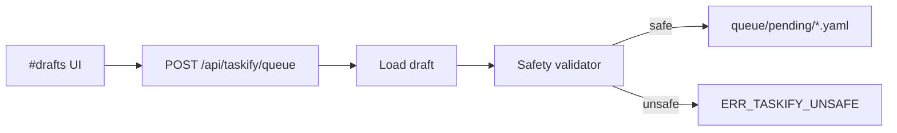
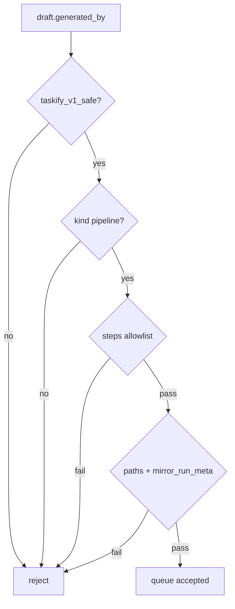

# Design: design_20260226_taskify_v1_1_safe_queue

- Status: Approved
- Owner: Codex
- Created: 2026-02-26
- Updated: 2026-02-26
- Scope: Taskify v1.1 safe queue integration

## Context
- Problem: Taskify drafts can be created/copied but cannot be safely enqueued from UI.
- Goal: Allow queue only for strict whitelisted safe Taskify templates.
- Non-goals: General-purpose queue of arbitrary YAML, external execution, permission model changes.

## Design diagram

## Whiteboard impact
- Now: Before: taskify drafts are copy-only and require manual queue handoff. After: safe drafts can be queued directly from #drafts.
- DoD: Before: operators manually move YAML into queue pending. After: UI queue button enqueues only validated safe templates and rejects unsafe ones with details.
- Blockers: none.
- Risks: validator too strict can reject legitimate drafts; too loose can admit unsafe templates.

## Multi-AI participation plan
- Reviewer:
  - Request: Verify safety checks cover command kinds, path constraints, and queue write behavior.
  - Expected output format: bullets with regressions and risk.
- QA:
  - Request: Verify smoke covers safe queue success and failure contract shape.
  - Expected output format: bullets with missing tests/flaky risks.
- Researcher:
  - Request: Verify validator aligns with existing task schema and does not conflict with pipeline contract.
  - Expected output format: bullets with interop concerns.
- External:
  - Request: Not required for localhost v1.1.
  - Expected output format: n/a
- external_participation: optional
- external_not_required: true

## Open Decisions
- [x] Decision 1: whether to expose queue button for all drafts.
- [x] Decision 2: which step kinds are allowed.

### Open Decisions checklist
- [x] Add "Decision 1 Final:" entry with final choice.
- [x] Add "Decision 2 Final:" entry with final choice.

## Final Decisions
- Decision 1 Final: Queue button is shown only when server reports `safe=true`.
- Decision 2 Final: Allow only `pipeline` with step kinds in `{file_write}` and optional `{archive_zip}`; reject all execution-capable kinds.

## Discussion summary
- Add server-side safety evaluation and enforce it again in queue endpoint (UI hint is not trusted).
- Return machine-readable unsafe details with `ERR_TASKIFY_UNSAFE` on HTTP 400.
- Reuse existing queue pending write path and generate unique queued task id to avoid overwrite.

## Plan
1. Finalize design and pass gate.
2. Implement server safety validator and `/api/taskify/queue`.
3. Add UI safe badge + queue action in #drafts.
4. Extend ui_smoke for queue success check and run full gate.

## Risks
- Risk: path rule ambiguity between task paths and artifact paths.
  - Mitigation: enforce strict relative task paths + acceptance paths limited to `written/`, `bundles/`, `_meta/`.
- Risk: duplicate queue IDs overwrite files.
  - Mitigation: queue endpoint rewrites metadata.id with unique suffix before enqueue.

## Test Plan
- Unit: validate safe/unsafe examples against queue validator.
- E2E: ui_smoke creates draft then POST `/api/taskify/queue` and checks `queued=true`.

## Reviewed-by
- Reviewer / Codex / 2026-02-26 / approved
- QA / Codex / 2026-02-26 / approved
- Researcher / Codex / 2026-02-26 / noted

## External Reviews
- n/a / skipped
