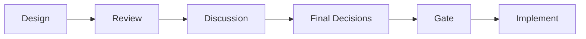
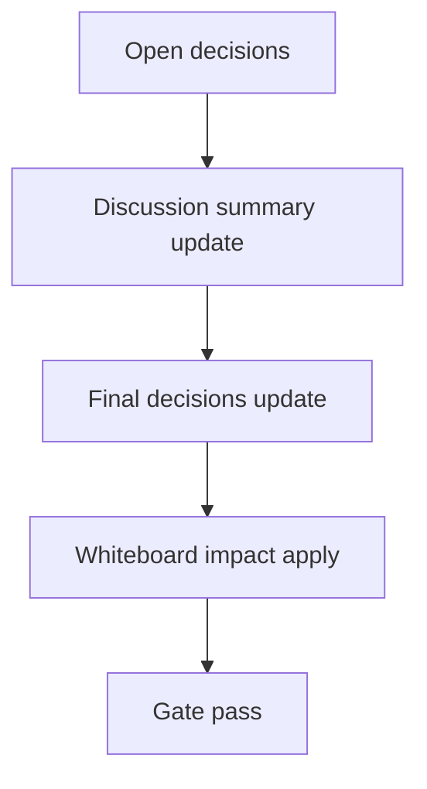

# Design: design_20260226_ui_discord_productivity_pack_v1

- Status: Approved
- Owner: Codex
- Created: 2026-02-25
- Updated: 2026-02-25
- Scope: UI Discord productivity pack v1

## Context
- Problem: ui_discord は会話閲覧中心で、検索・未読・ピン・引用・deep link が不足し運用効率が低い。
- Goal: JSONL互換を維持したまま productivity pack（search/unread/pin/quote/deep links）を追加する。
- Non-goals: websocket同期、通知常駐、保存形式の破壊的変更。

## Design diagram

## Whiteboard impact
- Now: Before: 会話参照の導線が手動で分断。 After: 検索と deep links で run/design/artifact へ即時遷移可能。
- DoD: Before: 重要メッセージ再訪が困難。 After: pin/unread/quote で継続運用しやすくする。
- Blockers: なし。
- Risks: polling回数増による負荷。

## Multi-AI participation plan
- Reviewer:
  - Request: API/UIの追加が既存JSONL契約を壊さないか確認。
  - Expected output format: severity付き箇条書き。
- QA:
  - Request: search/read_state/pins の smoke確認。
  - Expected output format: command/result。
- Researcher:
  - Request: unreadモデルの拡張性評価。
  - Expected output format: リスク/提案。
- External AI:
  - Request: なし（optional）
  - Expected output format: なし
- external_participation: optional
- external_not_required: true

## Open Decisions
- [x] Decision 1
- [x] Decision 2

### Open Decisions checklist
- [x] Add "Decision 1 Final:" entry with final choice.
- [x] Add "Decision 2 Final:" entry with final choice.

## Final Decisions
- Decision 1 Final: state追加は `pins.json`/`unread.json`/`bookmarks.json` の別ファイルで管理し JSONL本体は不変。
- Decision 2 Final: `ui_api` に `search/pins/read_state/messages?after` を追加し、UIは2秒pollingで軽量運用する。

## Discussion summary
- Change 1: deep links は `links` 構造優先 + run/design id regex 補助で実装する。
- Change 2: ui_smoke に `/api/chat/threads` と `/api/chat/search` のチェックを追加する。

## Plan
1. ui_api endpoint追加。
2. ui_discord 機能追加。
3. ui_smoke/docs更新。
4. gate/smoke最終確認。

## Risks
- Risk: pollingによるAPI過負荷
  - Mitigation: `after` パラメータで差分取得し、limitをcapする。

## Test Plan
- Smoke: `tools/ui_smoke.ps1 -Json`
- Gate: `npm.cmd run ci:smoke:gate:json`

## Reviewed-by
- Reviewer / codex-review / 2026-02-25 / approved
- QA / codex-qa / 2026-02-25 / approved
- Researcher / codex-research / 2026-02-25 / approved

## External Reviews
- none / not_required
