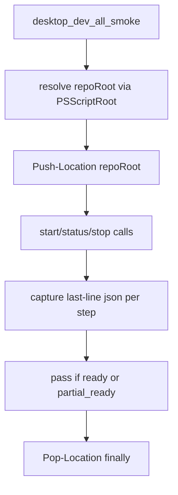
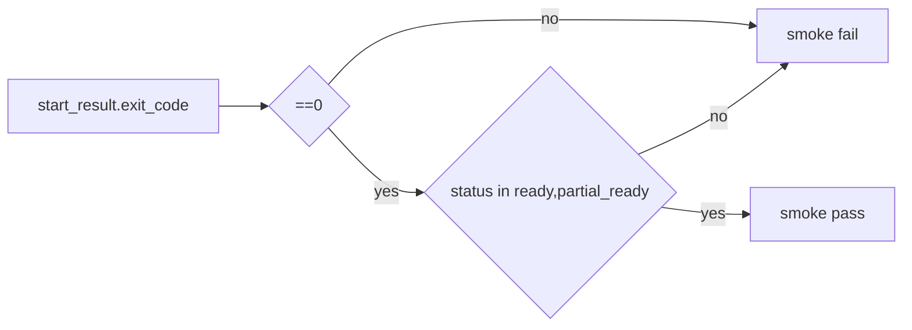

# Design: design_20260227_desktop_dev_all_smoke_repo_root_fix

- Status: Approved
- Owner: Codex
- Created: 2026-02-27
- Updated: 2026-02-27
- Scope: desktop_dev_all repo-root independent execution and smoke diagnostics expansion

## Context
- Problem: `desktop_dev_all_smoke` failures are hard to diagnose and can depend on launch location context.
- Goal: make launcher/smoke path handling repo-root stable and always return structured Start/Status/Stop JSON diagnostics.
- Non-goals: changing readiness policy (`API required / UI optional`) and changing CI smoke flow.

## Design diagram

## Whiteboard impact
- Now: Before: smoke failure reason was truncated and debugging required log diving. After: smoke JSON includes `start_result/status_result/stop_result` so failures are machine-visible.
- DoD: Before: execution context differences could be opaque. After: scripts anchor to repo root and restore caller location after execution.
- Blockers: none.
- Risks: nested JSON payload size increases.

## Multi-AI participation plan
- Reviewer:
  - Request: validate additive JSON changes and no contract break.
  - Expected output format: findings bullets.
- QA:
  - Request: validate pass/fail matrix for `ready/partial_ready/not_ready`.
  - Expected output format: scenario bullets with expected exit codes.
- Researcher:
  - Request: validate repo-root handling approach in PowerShell.
  - Expected output format: safety and compatibility notes.
- External AI:
  - Request: not required.
  - Expected output format: n/a
- external_participation: optional
- external_not_required: true

## Open Decisions
- [x] Decision 1
- [x] Decision 2

### Open Decisions checklist
- [x] Add "Decision 1 Final:" entry with final choice.
- [x] Add "Decision 2 Final:" entry with final choice.

## Final Decisions
- Decision 1 Final: add repo-root `Push-Location/Pop-Location` wrappers to both scripts.
- Decision 2 Final: include `start_result/status_result/stop_result` in smoke JSON; keep top-level summary fields for compatibility.

## Discussion summary
- Change 1: keep existing readiness policy and only improve stability/diagnostics.

## Plan
1. Patch `desktop_dev_all.ps1` for repo-root wrapper and additive `repo_root`.
2. Patch `desktop_dev_all_smoke.ps1` for repo-root wrapper and nested result capture.
3. Run docs/smoke/gate verification and report final JSON lines.

## Risks
- Risk: `Pop-Location` may run when no `Push-Location` succeeded.
  - Mitigation: guard with local boolean flag.

## Test Plan
- Unit-ish: run scripts from arbitrary cwd and verify JSON includes repo_root and stable behavior.
- E2E: `desktop_dev_all_smoke -Json` yields diagnostics fields even on failure.

## Reviewed-by
- Reviewer / Codex / 2026-02-27 / approved
- QA / Codex / 2026-02-27 / approved
- Researcher / Codex / 2026-02-27 / noted

## External Reviews
- n/a / skipped
