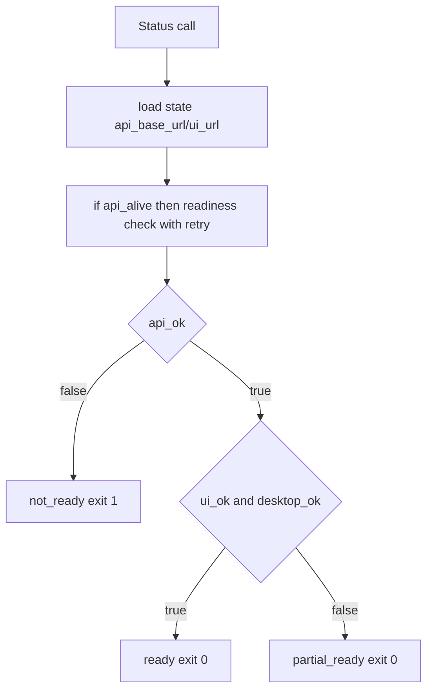
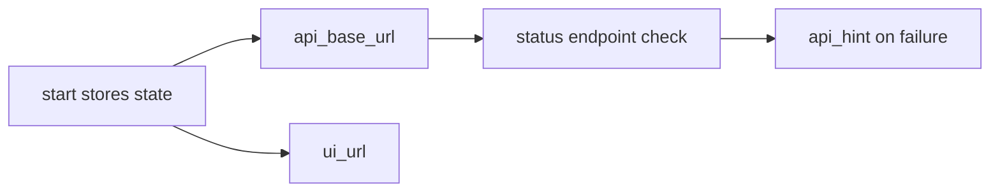

# Design: design_20260227_desktop_dev_all_status_api_consistency

- Status: Approved
- Owner: Codex
- Created: 2026-02-27
- Updated: 2026-02-27
- Scope: desktop_dev_all status reliability for api_ok under optional flags

## Context
- Problem: `-Status` can report `api_alive=true` while `api_ok=false` transiently and flip to `not_ready`, conflicting with successful `-Start`.
- Goal: make `-Status` use consistent endpoint checks with stored URL and deterministic status/exit rules.
- Non-goals: changing start dependency policy (API required, UI/desktop optional depending on flags).

## Design diagram

## Whiteboard impact
- Now: Before: status reports could conflict with start result and produce unstable smoke outcomes. After: status computes `api_ok` from stored readiness URL with retry and emits `api_hint`.
- DoD: Before: optional flags still yielded `not_ready` when API probe glitched. After: `api_ok=true` guarantees `ready|partial_ready` with exit 0.
- Blockers: none.
- Risks: slight latency increase due to retry checks.

## Multi-AI participation plan
- Reviewer:
  - Request: validate status exit rules and additive field compatibility.
  - Expected output format: bullets.
- QA:
  - Request: verify start/status/smoke matrix under desktop optional mode.
  - Expected output format: scenario table bullets.
- Researcher:
  - Request: validate endpoint retry strategy tradeoffs.
  - Expected output format: concise notes.
- External AI:
  - Request: not required.
  - Expected output format: n/a
- external_participation: optional
- external_not_required: true

## Open Decisions
- [x] Decision 1
- [x] Decision 2

### Open Decisions checklist
- [x] Add "Decision 1 Final:" entry with final choice.
- [x] Add "Decision 2 Final:" entry with final choice.

## Final Decisions
- Decision 1 Final: store `api_base_url` in state and use it in status endpoint checks.
- Decision 2 Final: status exit code depends on `api_ok` first; `api_ok=true` always maps to `ready` or `partial_ready`.

## Discussion summary
- Change 1: add endpoint-check helper returning both boolean and hint for diagnostics.

## Plan
1. Patch `desktop_dev_all.ps1` status computation and state fields.
2. Re-run start/status/smoke checks.
3. Run gate and whiteboard dry-run.

## Risks
- Risk: endpoint checks may still fail in very slow environments.
  - Mitigation: retry loop with short backoff and `api_hint` output.

## Test Plan
- Start -> Status consistency check (`api_alive=true` should align with `api_ok` if reachable).
- Smoke should remain green with desktop optional fallback.

## Reviewed-by
- Reviewer / Codex / 2026-02-27 / approved
- QA / Codex / 2026-02-27 / approved
- Researcher / Codex / 2026-02-27 / noted

## External Reviews
- n/a / skipped
