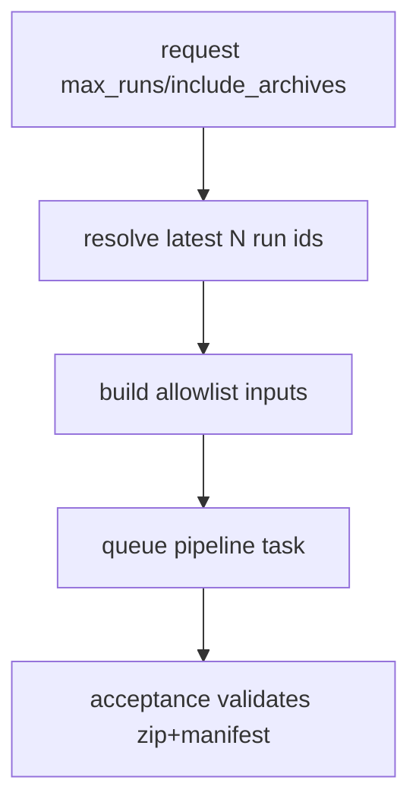

# Design: design_20260227_evidence_export_bundle_v1

- Status: Approved
- Owner: Codex
- Created: 2026-02-27
- Updated: 2026-02-27
- Scope: Evidence export bundle recipe + API trigger + UI button

## Context
- Problem: there is no one-command evidence bundle for audit/sharing across chat/inbox/taskify/run-meta.
- Goal: add a safe export flow producing zip+manifest with fixed allowlist and capped size.
- Non-goals: unlimited run export, secret masking engine, automatic completion notification wiring.

## Design diagram
```mermaid
flowchart LR
  UI[ui_discord settings/inbox] --> API[/api/export/evidence_bundle]
  API --> QUEUE[queue/pending task yaml]
  QUEUE --> ORCH[orchestrator]
  ORCH --> EXEC[executor archive_zip]
  EXEC --> ART[bundles/evidence_*.zip + manifest]
```



## Whiteboard impact
- Now: Before: evidence export needed manual file collection. After: fixed endpoint and recipe enqueue export with machine-readable outputs.
- DoD: Before: no single audit artifact. After: `bundles/evidence_<ts>.zip` and manifest are generated by a guarded recipe path.
- Blockers: none.
- Risks: large workspaces can hit caps and fail export.

## Multi-AI participation plan
- Reviewer:
  - Request: validate safe allowlist and path policy.
  - Expected output format: findings bullets.
- QA:
  - Request: validate e2e recipe guard and smoke endpoint.
  - Expected output format: pass/fail matrix.
- Researcher:
  - Request: validate cap strategy for archive_zip constraints.
  - Expected output format: concise notes.
- External AI:
  - Request: not required.
  - Expected output format: n/a
- external_participation: optional
- external_not_required: true

## Open Decisions
- [x] Decision 1
- [x] Decision 2

### Open Decisions checklist
- [x] Add "Decision 1 Final:" entry with final choice.
- [x] Add "Decision 2 Final:" entry with final choice.

## Final Decisions
- Decision 1 Final: endpoint generates a queued task from recipe template with dynamic run inputs (latest N).
- Decision 2 Final: include archives is opt-in and default max_runs=20 with hard cap via archive limits.

## Discussion summary
- Change 1: add `recipe_evidence_export_bundle` and matching e2e task template.
- Change 2: add `/api/export/evidence_bundle` and status endpoint.
- Change 3: add UI trigger in `#settings`.

## Plan
1. Add recipe + e2e template + run_e2e/package scripts.
2. Add ui_api export endpoints and safe task generation.
3. Add UI button and result panel.
4. Run docs/smoke/gate/recipes checks.

## Risks
- Risk: per-file cap is not native to archive_zip.
  - Mitigation: constrain allowlist patterns and enforce global caps (`max_files`, `max_total_bytes`).

## Test Plan
- Smoke: `ui_smoke` checks export endpoint response.
- E2E: new mode `recipe_evidence_export_bundle` validates zip+manifest artifacts.
- Gate: `ci:smoke:gate:json` remains green.

## Reviewed-by
- Reviewer / Codex / 2026-02-27 / approved
- QA / Codex / 2026-02-27 / approved
- Researcher / Codex / 2026-02-27 / noted

## External Reviews
- n/a / skipped
