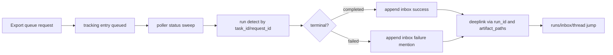
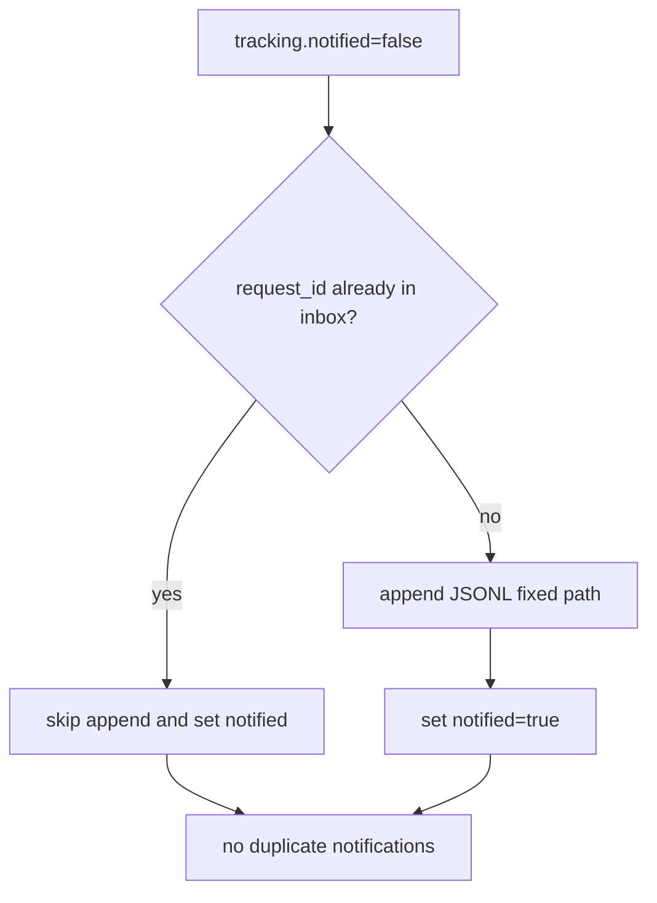

# Design: design_20260227_evidence_export_inbox_notify_v1

- Status: Approved
- Owner: Codex
- Created: 2026-02-27
- Updated: 2026-02-27
- Scope: Evidence export completion -> inbox notify v1

## Context
- Problem: Evidence export can complete/fail without guaranteed `#inbox` visibility, so users miss bundle readiness or failure escalation.
- Goal: append one completion notification per `request_id` into `workspace/ui/desktop/inbox.jsonl` with run/artifact deep-link context and failure mention priority.
- Non-goals: new desktop notifier engine, new deep-link format, or changing archive generation behavior.

## Design diagram

## Whiteboard impact
- Now: Before: export completion had no guaranteed inbox signal and users had to poll status manually. After: completion/failure emits a durable inbox entry with run/artifact link context.
- DoD: Before: duplicate or missing notifications were possible under retries. After: `request_id`-guarded single append and `notified=true` prevent duplicate notifications while keeping best-effort resilience.
- Blockers: none.
- Risks: inbox scan cost for duplicate guard on very large JSONL.

## Multi-AI participation plan
- Reviewer:
  - Request: validate tracker state transitions and duplicate guard correctness.
  - Expected output format: findings bullets with severity.
- QA:
  - Request: validate success/failure inbox payloads and flaky-safe e2e checks.
  - Expected output format: pass/fail matrix bullets.
- Researcher:
  - Request: validate best-effort polling and JSONL append safety tradeoffs.
  - Expected output format: concise notes.
- External AI:
  - Request: not required.
  - Expected output format: n/a
- external_participation: optional
- external_not_required: true

## Open Decisions
- [x] Decision 1
- [x] Decision 2

### Open Decisions checklist
- [x] Add "Decision 1 Final:" entry with final choice.
- [x] Add "Decision 2 Final:" entry with final choice.

## Final Decisions
- Decision 1 Final: store export tracker in `export_tracking.json` (legacy path if present, else `ui/taskify/export_tracking.json`) and expose `notified` via status API.
- Decision 2 Final: append inbox only at terminal states (`completed|failed`) with `request_id` duplicate guard and failure mention token from desktop settings.

## Discussion summary
- Change 1: add export tracking model (`queued|running|completed|failed`, run_id, bundle paths, notified).
- Change 2: add poller sweep to detect run completion/failure and append inbox entries best-effort.
- Change 3: add status endpoint integration and UI settings note for inbox notification behavior.

## Plan
1. Implement tracking extension and status integration in `ui_api.ts`.
2. Implement inbox append with cap and duplicate guard by `request_id`.
3. Add optional UI note and e2e best-effort notification probe.
4. Run gate, whiteboard update, e2e, smoke.

## Risks
- Risk: stale tracker entries if run detection never resolves.
  - Mitigation: keep best-effort non-fatal behavior and expose status for manual triage.

## Test Plan
- Unit: n/a (existing project pattern is integration-first).
- E2E: `task_e2e_recipe_evidence_export_bundle` plus existing smoke/gate flow.

## Reviewed-by
- Reviewer / Codex / 2026-02-27 / approved
- QA / Codex / 2026-02-27 / approved
- Researcher / Codex / 2026-02-27 / noted

## External Reviews
- n/a / skipped
