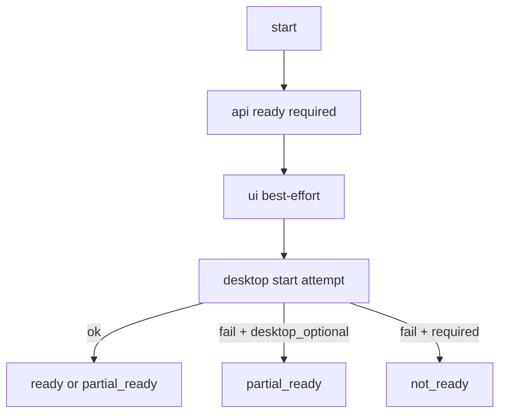
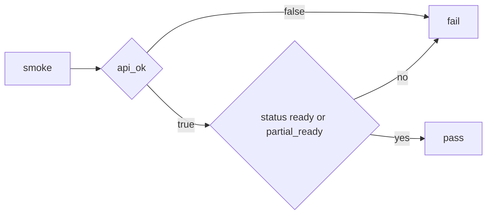

# Design: design_20260227_one_command_dev_launcher_desktop_optional_smoke

- Status: Approved
- Owner: Codex
- Created: 2026-02-27
- Updated: 2026-02-27
- Scope: desktop_dev_all_smoke desktop-optional fallback

## Context
- Problem: `desktop_dev_all_smoke` fails as `desktop_not_running` in environments without Electron runtime.
- Goal: Allow smoke to pass when API is ready even if desktop cannot start, while preserving full diagnostics.
- Non-goals: changing full dev behavior where desktop is required by default.

## Design diagram

## Whiteboard impact
- Now: Before: smoke is brittle when Electron runtime is missing. After: smoke can validate launcher readiness in constrained environments.
- DoD: Before: desktop missing caused immediate smoke failure with limited utility. After: smoke passes on API readiness and reports desktop startup errors in JSON.
- Blockers: none.
- Risks: false confidence if users misread partial readiness as full readiness.

## Multi-AI participation plan
- Reviewer:
  - Request: validate additive JSON fields and default behavior preservation.
  - Expected output format: bullets.
- QA:
  - Request: validate pass/fail matrix for optional vs required desktop.
  - Expected output format: bullets with expected exit codes.
- Researcher:
  - Request: validate env-flag semantics and compatibility.
  - Expected output format: concise notes.
- External AI:
  - Request: not required.
  - Expected output format: n/a
- external_participation: optional
- external_not_required: true

## Open Decisions
- [x] Decision 1
- [x] Decision 2

### Open Decisions checklist
- [x] Add "Decision 1 Final:" entry with final choice.
- [x] Add "Decision 2 Final:" entry with final choice.

## Final Decisions
- Decision 1 Final: introduce `REGION_AI_DESKTOP_OPTIONAL=1` for Start behavior fallback.
- Decision 2 Final: smoke defaults to desktop optional; `-RequireDesktop` forces strict mode.

## Discussion summary
- Change 1: keep API as hard requirement, treat desktop as optional only when explicitly enabled.

## Plan
1. Update launcher start/status JSON and optional desktop logic.
2. Update smoke default env and poll behavior.
3. Update runbook and run smoke/gate checks.

## Risks
- Risk: lingering API/UI processes in optional mode.
  - Mitigation: stop step still runs and reports cleanup result.

## Test Plan
- Unit-ish: start with optional flag returns `partial_ready` when desktop fails.
- E2E: smoke JSON includes `desktop_optional`, `desktop_start_error`, and nested step results.

## Reviewed-by
- Reviewer / Codex / 2026-02-27 / approved
- QA / Codex / 2026-02-27 / approved
- Researcher / Codex / 2026-02-27 / noted

## External Reviews
- n/a / skipped
