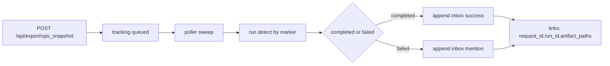
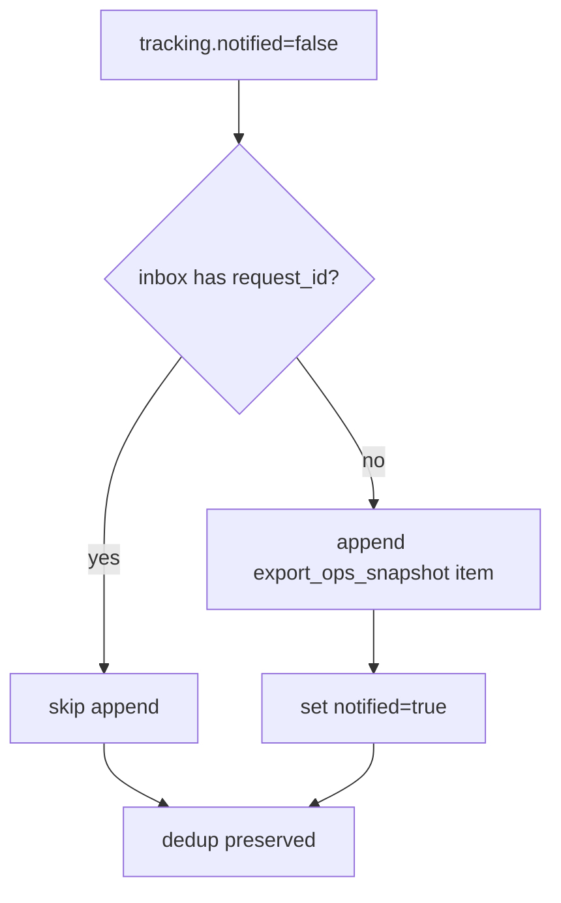

# Design: design_20260227_ops_snapshot_inbox_notify_v1

- Status: Approved
- Owner: Codex
- Created: 2026-02-27
- Updated: 2026-02-27
- Scope: Ops Snapshot completion to inbox notify v1

## Context
- Problem: Ops Snapshot queue completion can be missed because users must manually poll run/status.
- Goal: auto-append one inbox notification per ops snapshot request completion/failure with deeplink-ready run/artifact links.
- Non-goals: desktop notifier redesign or non-JSONL inbox storage.

## Design diagram

## Whiteboard impact
- Now: Before: ops snapshot completion had no durable inbox signal. After: completion/failure is visible in `#inbox` with link metadata.
- DoD: Before: retries could duplicate notifications. After: `request_id` + `tracking.notified` guards enforce one-shot notify best-effort.
- Blockers: none.
- Risks: best-effort run detection can remain queued when marker is unavailable.

## Multi-AI participation plan
- Reviewer:
  - Request: validate tracking state machine and dedup safety.
  - Expected output format: findings bullets.
- QA:
  - Request: validate e2e/smoke behavior with best-effort observer.
  - Expected output format: pass/fail bullets.
- Researcher:
  - Request: validate inbox append caps and failure-path mention handling.
  - Expected output format: concise notes.
- External AI:
  - Request: not required.
  - Expected output format: n/a
- external_participation: optional
- external_not_required: true

## Open Decisions
- [x] Decision 1
- [x] Decision 2

### Open Decisions checklist
- [x] Add "Decision 1 Final:" entry with final choice.
- [x] Add "Decision 2 Final:" entry with final choice.

## Final Decisions
- Decision 1 Final: keep tracking in `workspace/ui/taskify/ops_snapshot_tracking.json` and expose notified/run/snapshot in status API.
- Decision 2 Final: on terminal state append inbox entry (`source=export_ops_snapshot`) once per request_id, failure with mention token fallback `@shogun`.

## Discussion summary
- Change 1: add ops snapshot tracking load/save/sweep.
- Change 2: add ops snapshot inbox append and dedup guard.
- Change 3: extend e2e and smoke with best-effort notify/status checks.

## Plan
1. Add tracking and poller hooks in ui_api.
2. Add inbox append + status API expansion.
3. Add UI note and e2e/smoke checks.
4. Run gate, whiteboard, e2e, smoke.

## Risks
- Risk: snapshot_path may be absent on failures.
  - Mitigation: artifact_paths is optional and omitted when unavailable.

## Test Plan
- E2E: `recipe_ops_snapshot` still passes + best-effort notify probe line exists.
- Smoke: ops snapshot queue + status endpoint 200.
- Gate: `ci_smoke_gate -Json` passes.

## Reviewed-by
- Reviewer / Codex / 2026-02-27 / approved
- QA / Codex / 2026-02-27 / approved
- Researcher / Codex / 2026-02-27 / noted

## External Reviews
- n/a / skipped
