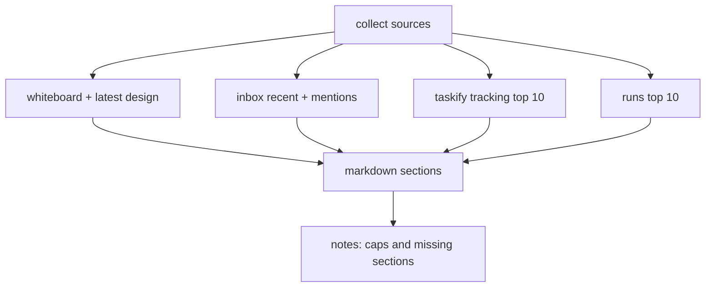

# Design: design_20260227_ops_snapshot_v1

- Status: Approved
- Owner: Codex
- Created: 2026-02-27
- Updated: 2026-02-27
- Scope: Ops Snapshot v1 one-file status report

## Context
- Problem: operations status is spread across whiteboard, inbox, taskify tracking, and runs, making quick triage slow.
- Goal: generate a single markdown ops snapshot artifact (`written/ops_snapshot_<YYYYMMDD_HHMMSS>.md`) via UI and API with machine-checkable acceptance.
- Non-goals: long-term metrics storage, cross-workspace federation, or replacing existing dashboards.

## Design diagram
```mermaid
flowchart LR
  A[#settings Generate Ops Snapshot] --> B[/api/export/ops_snapshot]
  B --> C[build snapshot markdown in ui_api]
  C --> D[queue recipe_ops_snapshot task]
  D --> E[file_write written/ops_snapshot_<stamp>.md]
  E --> F[acceptance artifact_file_*]
  F --> G[status API and run deeplink]
```



## Whiteboard impact
- Now: Before: operations summary required manual navigation across multiple files and UI tabs. After: one snapshot markdown summarizes key operational signals in a single artifact.
- DoD: Before: no deterministic one-file report for audits. After: `written/ops_snapshot_*.md` is generated via safe file_write and verified by artifact acceptance.
- Blockers: none.
- Risks: source files may be partially missing, requiring explicit missing-sections reporting.

## Multi-AI participation plan
- Reviewer:
  - Request: validate API shape, file_write safety, and acceptance coverage.
  - Expected output format: findings bullets.
- QA:
  - Request: validate UI trigger, e2e recipe, and smoke checks.
  - Expected output format: pass/fail bullets.
- Researcher:
  - Request: validate caps/missing-sections strategy for reliability.
  - Expected output format: concise notes.
- External AI:
  - Request: not required.
  - Expected output format: n/a
- external_participation: optional
- external_not_required: true

## Open Decisions
- [x] Decision 1
- [x] Decision 2

### Open Decisions checklist
- [x] Add "Decision 1 Final:" entry with final choice.
- [x] Add "Decision 2 Final:" entry with final choice.

## Final Decisions
- Decision 1 Final: snapshot markdown is generated in ui_api and embedded as safe text into queued `recipe_ops_snapshot` task YAML.
- Decision 2 Final: smoke validates dry-run endpoint success; E2E validates required markdown headers and artifact existence.

## Discussion summary
- Change 1: add `recipe_ops_snapshot.yaml` and `task_e2e_recipe_ops_snapshot.yaml`.
- Change 2: add POST/GET ops snapshot export endpoints and request status tracking file.
- Change 3: add settings UI trigger and status panel for run jump.

## Plan
1. Add recipe and e2e templates plus run_e2e mode/scripts.
2. Add ui_api ops snapshot generation/queue/status endpoints.
3. Add UI settings controls and status display.
4. Run gate, e2e, smoke and SSOT dry-run checks.

## Risks
- Risk: oversized markdown if sections grow unexpectedly.
  - Mitigation: section caps and clipped lines with explicit caps note.

## Test Plan
- E2E: `recipe_ops_snapshot` template acceptance verifies headings/artifacts.
- Smoke: `ui_smoke.ps1` dry-run check for `/api/export/ops_snapshot`.
- Gate: `ci_smoke_gate.ps1 -Json` must be green.

## Reviewed-by
- Reviewer / Codex / 2026-02-27 / approved
- QA / Codex / 2026-02-27 / approved
- Researcher / Codex / 2026-02-27 / noted

## External Reviews
- n/a / skipped
