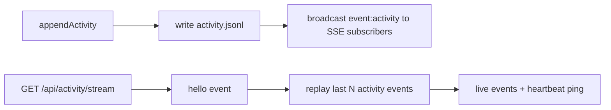
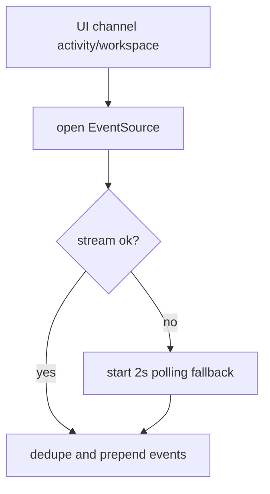

# Design: design_20260228_activity_sse_v1

- Status: Approved
- Owner: Codex
- Created: 2026-02-28
- Updated: 2026-02-28
- Scope: Activity SSE v1 with polling fallback

## Context
- Problem: activity updates rely on polling and are not truly realtime.
- Goal: provide SSE stream endpoint and wire UI to prefer SSE with polling fallback.
- Non-goals: replacing existing `/api/activity` REST path or removing polling logic entirely.

## Design diagram

## Whiteboard impact
- Now: Before: activity updates depended on periodic polling only. After: activity is delivered in realtime via SSE with polling fallback.
- DoD: Before: no SSE feed for activity existed. After: SSE endpoint + UI wiring + ui_smoke green.
- Blockers: none.
- Risks: long-lived SSE connections increase open socket count.

## Multi-AI participation plan
- Reviewer:
  - Request: validate SSE endpoint and broadcast safety do not break existing API behavior.
  - Expected output format: severity-ordered bullet findings.
- QA:
  - Request: validate SSE-first + polling fallback behavior for activity/workspace channels.
  - Expected output format: pass/fail bullets.
- Researcher:
  - Request: validate replay/heartbeat/subscriber cap strategy for v1.
  - Expected output format: concise notes.
- External AI:
  - Request: not required.
  - Expected output format: n/a
- external_participation: optional
- external_not_required: true

## Open Decisions
- [x] Decision 1
- [x] Decision 2

## Final Decisions
- Decision 1 Final: add `GET /api/activity/stream` with hello + replay + heartbeat.
- Decision 2 Final: UI opens SSE in `#アクティビティ/#ワークスペース`, and falls back to 2s polling on stream error.

## Discussion summary
- Change 1: add in-memory SSE subscriber set and best-effort broadcast in `appendActivity`.
- Change 2: add UI EventSource wiring with dedupe and cleanup on channel switch.
- Change 3: keep `/api/activity` polling path as compatibility fallback.

## Plan
1. Implement SSE endpoint and broadcast path.
2. Wire UI SSE + fallback for activity/workspace.
3. Update smoke and docs.
4. Run design gate and smoke/gate checks.

## Risks
- Risk: SSE client leaks if channel cleanup fails.
  - Mitigation: close EventSource and clear fallback timers in effect cleanup.

## Test Plan
- `npm.cmd run docs:check:json`
- `powershell -NoProfile -ExecutionPolicy Bypass -File tools/design_gate.ps1 -DesignPath docs/design/design_20260228_activity_sse_v1.md`
- `powershell -NoProfile -ExecutionPolicy Bypass -File tools/ui_smoke.ps1 -Json`
- `npm.cmd run ui:build:smoke:json`
- `npm.cmd run ci:smoke:gate:json`

## Reviewed-by
- Reviewer / Codex / 2026-02-28 / approved
- QA / Codex / 2026-02-28 / approved
- Researcher / Codex / 2026-02-28 / noted

## External Reviews
- n/a / skipped
