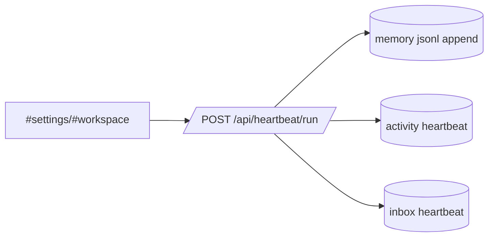
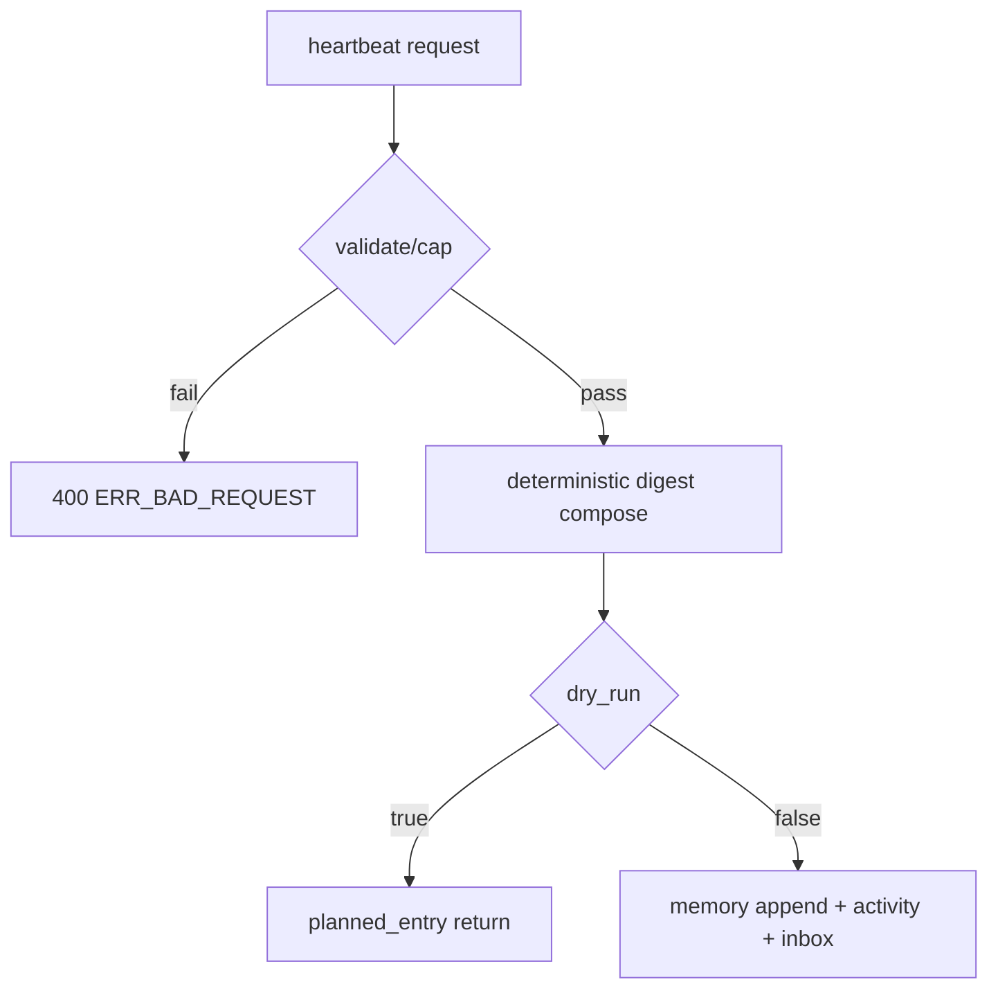

# Design: design_20260228_agent_heartbeat_v0_one_click

- Status: Ready
- Owner: Codex
- Created: 2026-02-28
- Updated: 2026-02-28
- Scope: Agent Heartbeat v0: manual digest + one-click launch + UI layout hardening

## Context
- Problem: Members have memory, but no one-click deterministic heartbeat digest from current runtime signals.
- Goal: Add manual heartbeat run endpoint + UI execution path + overflow-safe layout hardening.
- Non-goals: scheduler/automatic heartbeat, LLM summarization.

## Design diagram

## Whiteboard impact
- Now: Before: memory is manual free-form append only. After: deterministic heartbeat digest can be kicked manually from settings/workspace.
- DoD: Before: no heartbeat API and one-click route. After: `/api/heartbeat/run` + UI panel + workspace one-click + smoke booleans.
- Blockers: none.
- Risks: long JSON output/layout overflow.

## Multi-AI participation plan
- Reviewer:
  - Request: Check additive safety and endpoint behavior.
  - Expected output format: short bullet findings.
- QA:
  - Request: Verify smoke checks and UI jump flow determinism.
  - Expected output format: short bullet findings.
- Researcher:
  - Request: Validate deterministic digest structure and cap strategy.
  - Expected output format: short bullet findings.
- External AI:
  - Request: optional.
  - Expected output format: n/a.
- external_participation: optional
- external_not_required: true

## Open Decisions
- [x] heartbeat actor_id behavior for `agent_id=all`
- [x] digest target memory agent for `all`

### Open Decisions checklist
- [x] Add "Decision 1 Final:" entry with final choice.
- [x] Add "Decision 2 Final:" entry with final choice.

## Final Decisions
- Decision 1 Final: when `agent_id=all`, activity actor is `system`.
- Decision 2 Final: v0 writes to facilitator memory for `all` to keep single target deterministic.

## Discussion summary
- Change 1: Added heartbeat API with deterministic digest, dry-run, caps, and best-effort notifications.
- Change 2: Added one-click heartbeat in workspace seats and auto-jump to member memory episodes.
- Change 3: Hardened JSON/layout rendering by dedicated scrollable output class and wrap-anywhere helpers.

## Plan
1. Design + review files
2. API + UI + smoke implementation
3. docs/smoke/build/gate verification

## Risks
- Risk: very long strings still produced by nested payloads.
  - Mitigation: json output area constrained (`max-width`, `overflow:auto`, `max-height`).

## Test Plan
- Unit: TS compile via build/smoke pipeline.
- E2E: ui_smoke heartbeat dry-run/run/persist booleans.

## Reviewed-by
- Reviewer / Codex / 2026-02-28 / approved
- QA / Codex / 2026-02-28 / approved
- Researcher / Codex / 2026-02-28 / noted

## External Reviews
- n/a / skipped
